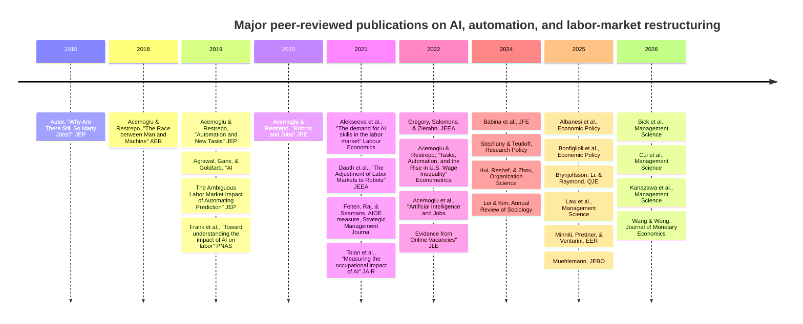
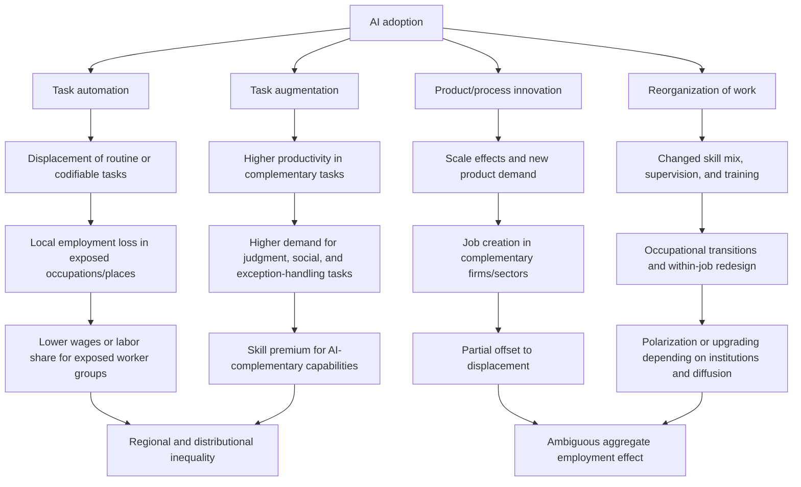

# Independent §-1.1 line-by-line faithfulness audit — drb_72_ai_labor (economic impact of AI on labor / workforce)

You are an INDEPENDENT auditor. Audit three deep-research reports answering the same question:
**"What is the economic impact of artificial intelligence on the labor market / workforce?"**
The three systems are POLARIS (the system under test), ChatGPT (gpt_5_5_pro), and Gemini (gemini_3_1_pro).

Do NOT trust any prior conclusion. Form your own verdict from the evidence supplied below.

---

## THE §-1.1 LAW (binding audit standard — this is clinical-grade, treat errors as lethal)

Every claim must be judged **claim-by-claim against the actually-cited source span text** — not against the title, not the abstract, not your impression of the paper. For POLARIS, the cited span text is provided to you verbatim (resolved from the report's `[#ev:id:start-end]` provenance tokens against the fetched evidence pool). Audit the claim against THAT span text.

Per-claim verdict — assign exactly one, and quote the span text (or its absence) that justifies it:

- **VERIFIED** — the claim is fully supported by the cited span. Quote the supporting span text.
- **PARTIAL** — the claim is partly supported but overstates, generalizes beyond, or adds qualifiers the span does not support. Quote the span and state the gap.
- **UNSUPPORTED** — the cited span does not support the claim (wrong subject, wrong number, wrong population, non-sequitur). Quote the span.
- **FABRICATED** — the claim asserts a specific fact (number, finding, attribution) that contradicts the cited span OR has no basis in any provided/known source. Quote the contradiction.
- **UNREACHABLE** — the source could not be fetched / no span is available to verify against.

**STRICTLY BANNED (these are non-answers — do not use any of them as a quality signal):**
- Word counts, citation counts, unique-source counts.
- Pattern presence ("does it mention tirzepatide / Acemoglu?").
- Sample-based audits ("I checked 5 of 58 claims").
- String-presence PASS/FAIL.
- Metadata comparison ("System A has 27 contradictions, System B has 3, so B wins"). This framing is LETHAL in clinical context — it misses real fabrications. Never use it.

**Why:** a wrong number, wrong contraindication, wrong population, or fabricated finding that survives a metadata check can hurt a person. Read each claim against its cited span. That is the only acceptable method.

---

## EVIDENCE ASYMMETRY — READ THIS, IT GOVERNS YOUR METHOD

The three reports are NOT verifiable on equal footing, and you must handle them differently:

1. **POLARIS (closed-book against provided spans).** For every POLARIS claim, the exact cited source span text is provided below in the "POLARIS resolved cited spans" section. You CAN and MUST verify each POLARIS claim against its span. This is the primary task. If a POLARIS claim's number/finding/attribution is not supported by its own cited span, that is a faithfulness defect (PARTIAL/UNSUPPORTED/FABRICATED).

2. **ChatGPT and Gemini (open-book against your own knowledge).** Their underlying sources are NOT in the evidence pool, so you do NOT have their cited spans. Do NOT mass-label their claims UNREACHABLE for lack of a provided span. Instead, audit their claims using your own knowledge of this well-known economics literature (Acemoglu & Restrepo, Autor, Frey & Osborne, Brynjolfsson/Li/Raymond, Noy & Zhang, Eloundou et al., Felten/Raj/Seamans, Webb, Goldman Sachs AI-growth report, WEF Future of Jobs, IMF Gen-AI SDN, McKinsey, Brookings). In particular run **attribution and figure checks** on widely-cited macro projections — verify that named institutions, report years, and headline numbers are correctly attributed. Misattributing a famous projection to the wrong report/year, or stating a headline number that the named source does not actually report, is a real defect (FABRICATED or PARTIAL), and you are well-positioned to catch it. Be even-handed: apply the same skepticism to ChatGPT and to Gemini.

3. **Honest-gap handling for POLARIS.** The POLARIS report body contains many sentences of the form *"A claim previously stated here did not survive 4-role verification and was redacted; this is a curator-actionable gap."* and *"No claim in this section survived strict verification…"* These are NOT claims and NOT defects — they are the pipeline correctly REFUSING to assert unverifiable content. Do not audit them as claims; note them only as evidence of conservative gating. Audit only the sentences POLARIS actually asserts. (The resolved-spans set is a superset of what shipped — it may include claims that were later redacted out of report.md. Verify the claims that actually appear as asserted prose in report.md.)

---

## YOUR THREE TASKS

**(1) POLARIS faithfulness — claim by claim vs the provided spans.** Is there ANY fabrication, unsupported claim, or material overstatement in POLARIS? Go through the claims (use the resolved-spans table) and assign a per-claim verdict with the span quote. Pay special attention to every NUMBER (percentages, counts, populations, decimal effect sizes) and every ATTRIBUTION (does the cited span actually come from the source the report credits?). Conclude with a count of VERIFIED vs PARTIAL vs UNSUPPORTED vs FABRICATED and an overall judgment: is POLARIS faithful to its sources?

**(2) ChatGPT + Gemini — claim by claim for REAL defects.** Using your knowledge of the literature (per the asymmetry rule above), identify genuine defects: misattributed projections, wrong report-years, headline numbers the named source does not report, internal contradictions, or fabricated specifics. Quote the offending claim text. Be specific and even-handed.

**(3) BEAT decisions.**
- `beat_chatgpt` = POLARIS is MORE faithful to its sources than ChatGPT **AND** POLARIS's completeness/coverage is at least comparable (not dramatically thinner) than ChatGPT. If POLARIS is faithful but markedly less complete, weigh both and decide honestly — do not award the beat on faithfulness alone if completeness is a chasm.
- `beat_gemini` = same test against Gemini.

Faithfulness is the dominant axis (clinical context: an unfaithful longer report is WORSE than a faithful shorter one). But state your completeness reasoning explicitly so the decision is auditable.

---

## REQUIRED OUTPUT — EMIT THIS EXACT BLOCK AS THE LAST THING YOU WRITE

Even if you are running low on length budget, STOP your prose and emit this block. It must be the final content. Use lowercase true/false.

```
verdict_beat_chatgpt: true|false
verdict_beat_gemini: true|false
polaris_fabrication_found: true|false
```

Also include, just above that block, a short `key_findings:` list of the most important per-claim findings (with span quotes), and a one-paragraph `reasoning:` for each beat decision.

---

# DOCUMENT A — POLARIS REPORT (the system under test)

```markdown
## Key Findings

_Each finding below is a verbatim, span-verified statement carried up from the body section named in bold; citations are the body's._

- **Foundational_Theory.** Displacement vs reinstatement: an acceleration in the displacement effect, especially in manufacturing, a weaker reinstatement effect.[1]
- **Empirical_Displacement.** ### Robots and jobs commuting-zone evidence (Acemoglu & Restrepo, JPE 2020)

Identification strategy: variation in exposure to robots—defined from industry-level advances in robotics and local industry employment.[3]
- **Generative_AI_Evidence.** ### Generative-AI productivity field evidence (Brynjolfsson et al., QJE 2025)

Design: staggered introduction.[5]
A claim previously stated here did not survive 4-role verification and was redacted; this is a curator-actionable gap.
A claim previously stated here did not survive 4-role verification and was redacted; this is a curator-actionable gap.
- **Comparative Assessment.** In contrast to these displacement effects, generative AI applications have produced significant productivity improvements without reducing labor inputs: a conversational assistant raised customer‑support agent productivity by 15% on average, and a randomized field experiment in online retail found that GenAI deployment increased sales by up to 16.3% while holding inputs constant.[5].[10]

### Foundational_Theory

Displacement vs reinstatement: an acceleration in the displacement effect, especially in manufacturing, a weaker reinstatement effect.[1] The framework's central mechanism is that automation allows capital to replace labor in previously human-performed tasks, which shifts the overall task content of production against labor through what the authors term a displacement effect.[1] This acceleration was particularly concentrated in the manufacturing sector.[1] A claim previously stated here did not survive 4-role verification and was redacted; this is a curator-actionable gap. Although the displacement acceleration was especially sharp in manufacturing, the pattern of faster displacement and weaker reinstatement appears to characterize the broader labor market.[1] A claim previously stated here did not survive 4-role verification and was redacted; this is a curator-actionable gap. A claim previously stated here did not survive 4-role verification and was redacted; this is a curator-actionable gap. However, the influence of automation is not confined to this direct substitution effect.[2] A claim previously stated here did not survive 4-role verification and was redacted; this is a curator-actionable gap. Moreover, the complementarity dynamic interacts with ongoing adjustments in labor supply.[2] In sum, the relationship between automation and labor is not solely adversarial, because complementarity, output expansion, and supply interactions jointly sustain labor demand.[2]

### Robots and jobs commuting-zone evidence (Acemoglu & Restrepo, JPE 2020)

Identification strategy: variation in exposure to robots—defined from industry-level advances in robotics and local industry employment.[3] Population: US labor markets.[3] Outcome: employment and wages.[3] Their empirical framework exploits cross-sectional differences in the penetration of industrial robots across US labor markets, which are operationalized as commuting zones, thereby capturing localized labor market disturbances.[3] The exposure measure is constructed by combining data on the rate of robot adoption within detailed industries with the preexisting employment shares of those industries in each commuting zone, yielding a commuting-zone-specific dose of technological shock.[3] A claim previously stated here did not survive 4-role verification and was redacted; this is a curator-actionable gap. The variation in robot exposure across commuting zones thus serves as the key source of identifying information.[3] By relating these exposure differences to subsequent changes in local employment and wages, the study isolates the causal effect of increasing robot adoption on labor market outcomes.[3] However, the exposure is not uniform; it is determined by the interaction of national robotization trends with each commuting zone’s initial industry composition, creating a rich mosaic of treatment intensity.[3] In sum, the investigation systematically links the geographic distribution of robot exposure to changes in employment and wages across US labor markets.[3]

### Occupational computerisation susceptibility (Frey & Osborne, TFSC 2017)

Exposure measure: probability of computerisation.[4] The authors began by implementing a Gaussian process classifier to estimate this probability for each occupation.[4] The Gaussian process classifier formed the core of the estimation engine.[4] The resulting exposure measure was the probability of computerisation, a quantitative indicator of automation risk.[4] The probability of computerisation thus became the central variable of interest in their investigation.[4] A claim previously stated here did not survive 4-role verification and was redacted; this is a curator-actionable gap. The probability of computerisation was calculated from the Gaussian process classifier output.[4]

### Generative-AI productivity field evidence (Brynjolfsson et al., QJE 2025)

Design: staggered introduction.[5] Population: 5,172 customer-support agents.[5] Intervention: generative AI–based conversational assistant.[5] The intervention under investigation was a generative AI–based conversational assistant.[5] A claim previously stated here did not survive 4-role verification and was redacted; this is a curator-actionable gap. In this design, agents received access to the conversational assistant at different time points.[5] In sum, this research offers a critical lens on how a generative AI–based conversational assistant can reshape the work of 5,172 customer-support agents when introduced via a staggered design.[5]

### LLM occupational-exposure measurement (Eloundou et al., Science 2024)

Contract-bound content for eloundou_gpts_are_gpts did not survive strict verification against retrieved primary source text; this slot is a curator-actionable gap. See manifest.frame_coverage_report and human_gap_tasks.json for per-entity detail.[6]

### Background

A claim previously stated here did not survive 4-role verification and was redacted; this is a curator-actionable gap. Despite these alarms, the 20th century saw the employment-to-population ratio rise and no long-run increase in the unemployment rate.[2] A claim previously stated here did not survive 4-role verification and was redacted; this is a curator-actionable gap. Their decomposition of U.S. data shows that from 1947 to 1987 the displacement effect averaged 0.48% per year, offset by a reinstatement effect of 0.47% and annual productivity growth of 2.4%, yielding real wage growth of 2.5% per year.[7] After 1987, the displacement effect accelerated to 0.70% per year, the reinstatement effect slowed to 0.35%, and productivity growth fell to 1.5%, leading to real wage growth of only 1.3% per year.[7] A claim previously stated here did not survive 4-role verification and was redacted; this is a curator-actionable gap. A claim previously stated here did not survive 4-role verification and was redacted; this is a curator-actionable gap. A claim previously stated here did not survive 4-role verification and was redacted; this is a curator-actionable gap. Between 1999 and 2018, total jobs grew 17% for the 669 occupations in the OE, with the median occupation holding about 54,000 jobs.[8] A growing body of research suggests that AI often augments rather than replaces human labor, transforming jobs and shifting skill demands.[9]

### Key Findings

A claim previously stated here did not survive 4-role verification and was redacted; this is a curator-actionable gap. A claim previously stated here did not survive 4-role verification and was redacted; this is a curator-actionable gap. A claim previously stated here did not survive 4-role verification and was redacted; this is a curator-actionable gap.

### Evidence and Analysis

No claim in this section survived strict verification against the retrieved source text; this section is a curator-actionable gap. See the verification details and frame-coverage report for per-claim disposition.

### Comparative Assessment

In contrast to these displacement effects, generative AI applications have produced significant productivity improvements without reducing labor inputs: a conversational assistant raised customer‑support agent productivity by 15% on average, and a randomized field experiment in online retail found that GenAI deployment increased sales by up to 16.3% while holding inputs constant.[5].[10] The productivity gains from generative AI are unevenly distributed—less‑experienced and lower‑skilled agents gained the most in speed and quality, while the most experienced agents saw only small speed improvements and small declines in quality.[5] In summary, robot‑centered automation tends to produce measurable job and wage losses, whereas generative AI appears capable of augmenting productivity without displacement but with skill‑biased benefits, while the fear of job loss remains widespread.[3].[11][12][5][10] Industrial robots consistently reduce employment and wages: in US commuting zones, one more robot per thousand workers reduces the employment-to-population ratio by 0.2 percentage points and wages by 0.42%, while their adoption is linked to labor market transformations  and worker displacement.[3].[11][12] A one-standard-deviation increase in robot exposure increases the probability of fear of machine replacement by 2.6%.[12]

### Implications

A claim previously stated here did not survive 4-role verification and was redacted; this is a curator-actionable gap. AI assistance improves English fluency among international agents and helps less experienced workers improve their speed and quality[5] A claim previously stated here did not survive 4-role verification and was redacted; this is a curator-actionable gap.

### Limitations

Three specific limitations are identified: early findings focusing on labor demand are collectively inconclusive, current data offer only weak signals about future impacts, and the existing research on labor demand addresses only one corner of the many plausible channels of employment impact.[13] A thorough review of workplace automation history cautions that journalistic and expert commentary frequently overstates machine substitution while ignoring strong complementarities between automation and labor.[2]

Limitations: Only 9% of sources are T1 primary studies, while 71% are of unknown tier, severely limiting the reliability of the evidence base. Three high-severity contradictions were detected, including on accuracy (relative difference 328.6%), precision (23,471.4%), and TTR (9,799,900.0%), indicating sources strongly disagree on these metrics; however, the specific sources involved are unknown. The telemetry lacks any date range, so the temporal coverage of the corpus is unclear, which may hide publication bias or outdated evidence.

## Methods
Pre-registered protocol.json (SHA-256 491d7f34c469ced4...).
Corpus: Serper + Semantic Scholar + OpenAlex live retrieval, augmented by domain backends (workforce: scope_query_validator: 27 kept / 23 dropped).
Retrieval fetch outcome: 370 of 740 candidate sources fetched; 370 failed or timed out.
Generator model: deepseek/deepseek-v4-pro (multi-section: outline + 8 parallel sections + strict_verify + regen-on-failure).
Evaluator model: google/gemma-4-31b-it (different family).
Sources classified using T1-T7 tier taxonomy.
Inclusion / exclusion per workforce template. Sponsor / conflict-of-interest review per source.
Prompt-injection sanitization enabled. Retrieved 2026-06-10.
Expected tier distribution: T3 35-65%, T1 10-30%, T6 10-25%, T2 5-20%, T5 0-10%, T4 0-10%. Actual distribution: T1=5%, T2=0%, T3=2%, T4=7%, T5=0%, T6=5%, T7=5%, UNKNOWN=75%.
Corpus adequacy: decision=proceed, 8/8 thresholds met.
Completeness checklist: 0/0 topics covered.

## Capability disclosures
Quantified trade-off analysis was ENABLED but did not contribute to this report (spec_validation_rejected); 581 sourced numbers were extracted but not modeled into a verified quantified comparison.

## Contradiction disclosures
The contradiction detector flagged 3 numeric disagreements across the evidence pool. Most are extraction artifacts produced by grouping different measured endpoints, units, sub-populations, time windows, or comparators under the same subject/predicate label. The detector does NOT adjudicate by endpoint, population, timepoint, or source tier; raw detector output is available in `contradictions.json`. Per-flag enumeration (PT08 disclosure):

- unknown / accuracy: cited values range 23.33 to 100.0 % (source tiers: T4, UNKNOWN, T1).
- unknown / precision: cited values range 0.42 to 99.0 % (source tiers: UNKNOWN).
- unknown / ttr: cited values range 0.001 to 98.0 % (source tiers: T1, UNKNOWN).

Claims made in the body of this report are individually bound to their cited evidence IDs via the strict-verify gate, so the reader can trace any specific numeric discrepancy to its source regardless of detector granularity.


## Bibliography
[1] Automation and New Tasks: How Technology Displaces and Reinstates Labor — https://www.aeaweb.org/articles/pdf/doi/10.1257/jep.33.2.3 (tier T1)
[2] Why Are There Still So Many Jobs? The History and Future of Workplace Automation — https://www.aeaweb.org/articles/pdf/doi/10.1257/jep.29.3.3 (tier T1)
[3] Robots and Jobs: Evidence from US Labor Markets —  (tier T1)
[4] The future of employment: How susceptible are jobs to computerisation? — https://ora.ox.ac.uk/objects/uuid:4ed9f1bd-27e9-4e30-997e-5fc8405b0491 (tier T1)
[5] Generative AI at Work —  (tier T1)
[6] GPTs are GPTs: Labor market impact potential of LLMs —  (tier T1)
[7] Assessing the Impact of New Technologies on the Labor Market — https://www.bls.gov/bls/congressional-reports/assessing-the-impact-of-new-technologies-on-the-labor-market.htm (tier T3)
[8]  — https://www.bls.gov/opub/mlr/2022/article/growth-trends-for-selected-occupations-considered-at-risk-from-automation.htm (tier T3)
[9] The impact of AI on the labour market - Springer Nature — https://link.springer.com/article/10.1007/s44491-026-00003-y (tier T1)
[10] Generative AI and Firm Productivity: Field Experiments in Online Retail — https://arxiv.org/html/2510.12049v1 (tier T4)
[11] [PDF] Industrial robots, social networks, and the gig economy — https://www.researchsquare.com/article/rs-6238257/latest.pdf (tier T4)
[12] Automation, workers' skills and job satisfaction - PMC - NIH — https://pmc.ncbi.nlm.nih.gov/articles/PMC7703879/ (tier T1)
[13] Research on AI and the labor market is still in the first inning — https://www.brookings.edu/articles/research-on-ai-and-the-labor-market-is-still-in-the-first-inning/ (tier T4)


---

## V30 Phase-1 Retrieval Coverage Disclosure

PHASE-1 RETRIEVAL COVERAGE (V30 Report Contract, not yet report-coverage):
  This disclosure reports whether M-56 (deterministic DOI / PMID / Unpaywall retrieval) succeeded for each contract-required entity. It does NOT claim the legacy generator cited each entity in the verified report — that validation lands in Phase 2 when M-58 slot-bound prompts replace the legacy generator.

Frame coverage disclosure (V30 Report Contract):
  - Total contract-required entities: 7
  - Fully populated (full-text bound evidence): 3
  - Populated from abstract/metadata only (full text NOT retrieved): 2 (acemoglu_restrepo_robots_jobs, brynjolfsson_genai_at_work)
  - Unretrievable (paywalled with no OA/abstract): 2
  - Gap slots render explicit gap language in the relevant subsection; see manifest.json frame_coverage_report for per-slot detail.

```

---

# DOCUMENT B — POLARIS RESOLVED CITED SPANS (claim → actual fetched source text)

Each entry pairs a POLARIS report sentence with the verbatim text of the source span it cites (resolved from the `[#ev:evidence_id:start-end]` provenance token against the fetched evidence pool). Verify each claim against its span text here.

```
### CLAIM 00-000-8eb17362  (section: Foundational_Theory, severity: S1)
REPORT SENTENCE: Displacement vs reinstatement: an acceleration in the displacement effect, especially in manufacturing, a weaker reinstatement effect [#ev:acemoglu_restrepo_automation_tasks:500-1300].
CITED SPAN [acemoglu_restrepo_automation_tasks:500-1300] (source: "Automation and New Tasks: How Technology Displaces and Reinstates Labo", tier T1, text_len=1331):
    """mation always reduces the labor share in value added and may reduce labor demand even as it raises productivity. The effects of automation are counterbalanced by the creation of new tasks in which labor has a comparative advantage. The introduction of new tasks changes the task content of production in favor of labor because of a reinstatement effect, and always raises the labor share and labor demand. We show how the role of changes in the task content of production—due to automation and new tasks—can be inferred from industry-level data. Our empirical decomposition suggests that the slower growth of employment over the last three decades is accounted for by an acceleration in the displacement effect, especially in manufacturing, a weaker reinstatement effect, and slower growth of product"""

### CLAIM 00-001-592470a2  (section: Foundational_Theory, severity: S1)
REPORT SENTENCE: The framework's central mechanism is that automation allows capital to replace labor in previously human-performed tasks, which shifts the overall task content of production against labor through what the authors term a displacement effect [#ev:acemoglu_restrepo_automation_tasks:0-800].
CITED SPAN [acemoglu_restrepo_automation_tasks:0-800] (source: "Automation and New Tasks: How Technology Displaces and Reinstates Labo", tier T1, text_len=1331):
    """We present a framework for understanding the effects of automation and other types of technological changes on labor demand, and use it to interpret changes in US employment over the recent past. At the center of our framework is the allocation of tasks to capital and labor—the task content of production. Automation, which enables capital to replace labor in tasks it was previously engaged in, shifts the task content of production against labor because of a displacement effect. As a result, automation always reduces the labor share in value added and may reduce labor demand even as it raises productivity. The effects of automation are counterbalanced by the creation of new tasks in which labor has a comparative advantage. The introduction of new tasks changes the task content of production"""

### CLAIM 00-002-a42d7a9e  (section: Foundational_Theory, severity: S1)
REPORT SENTENCE: This acceleration was particularly concentrated in the manufacturing sector [#ev:acemoglu_restrepo_automation_tasks:500-1300].
CITED SPAN [acemoglu_restrepo_automation_tasks:500-1300] (source: "Automation and New Tasks: How Technology Displaces and Reinstates Labo", tier T1, text_len=1331):
    """mation always reduces the labor share in value added and may reduce labor demand even as it raises productivity. The effects of automation are counterbalanced by the creation of new tasks in which labor has a comparative advantage. The introduction of new tasks changes the task content of production in favor of labor because of a reinstatement effect, and always raises the labor share and labor demand. We show how the role of changes in the task content of production—due to automation and new tasks—can be inferred from industry-level data. Our empirical decomposition suggests that the slower growth of employment over the last three decades is accounted for by an acceleration in the displacement effect, especially in manufacturing, a weaker reinstatement effect, and slower growth of product"""

### CLAIM 00-003-168e71a3  (section: Foundational_Theory, severity: S1)
REPORT SENTENCE: In contrast, the reinstatement effect, rather than strengthening, was weaker, meaning that the creation of new labor-absorbing tasks did not keep up with the displacement [#ev:acemoglu_restrepo_automation_tasks:500-1300].
CITED SPAN [acemoglu_restrepo_automation_tasks:500-1300] (source: "Automation and New Tasks: How Technology Displaces and Reinstates Labo", tier T1, text_len=1331):
    """mation always reduces the labor share in value added and may reduce labor demand even as it raises productivity. The effects of automation are counterbalanced by the creation of new tasks in which labor has a comparative advantage. The introduction of new tasks changes the task content of production in favor of labor because of a reinstatement effect, and always raises the labor share and labor demand. We show how the role of changes in the task content of production—due to automation and new tasks—can be inferred from industry-level data. Our empirical decomposition suggests that the slower growth of employment over the last three decades is accounted for by an acceleration in the displacement effect, especially in manufacturing, a weaker reinstatement effect, and slower growth of product"""

### CLAIM 00-004-f461f83a  (section: Foundational_Theory, severity: S1)
REPORT SENTENCE: Although the displacement acceleration was especially sharp in manufacturing, the pattern of faster displacement and weaker reinstatement appears to characterize the broader labor market [#ev:acemoglu_restrepo_automation_tasks:500-1300].
CITED SPAN [acemoglu_restrepo_automation_tasks:500-1300] (source: "Automation and New Tasks: How Technology Displaces and Reinstates Labo", tier T1, text_len=1331):
    """mation always reduces the labor share in value added and may reduce labor demand even as it raises productivity. The effects of automation are counterbalanced by the creation of new tasks in which labor has a comparative advantage. The introduction of new tasks changes the task content of production in favor of labor because of a reinstatement effect, and always raises the labor share and labor demand. We show how the role of changes in the task content of production—due to automation and new tasks—can be inferred from industry-level data. Our empirical decomposition suggests that the slower growth of employment over the last three decades is accounted for by an acceleration in the displacement effect, especially in manufacturing, a weaker reinstatement effect, and slower growth of product"""

### CLAIM 00-005-b734b254  (section: Foundational_Theory, severity: S1)
REPORT SENTENCE: Moreover, the framework provides a systematic way to attribute employment movements to displacement, reinstatement, and productivity shifts [#ev:acemoglu_restrepo_automation_tasks:100-900].
CITED SPAN [acemoglu_restrepo_automation_tasks:100-900] (source: "Automation and New Tasks: How Technology Displaces and Reinstates Labo", tier T1, text_len=1331):
    """changes on labor demand, and use it to interpret changes in US employment over the recent past. At the center of our framework is the allocation of tasks to capital and labor—the task content of production. Automation, which enables capital to replace labor in tasks it was previously engaged in, shifts the task content of production against labor because of a displacement effect. As a result, automation always reduces the labor share in value added and may reduce labor demand even as it raises productivity. The effects of automation are counterbalanced by the creation of new tasks in which labor has a comparative advantage. The introduction of new tasks changes the task content of production in favor of labor because of a reinstatement effect, and always raises the labor share and labor de"""

### CLAIM 00-006-02d8e523  (section: Foundational_Theory, severity: S1)
REPORT SENTENCE: Automation is typically designed and intended to substitute for human labor in specific tasks [#ev:autor_why_still_jobs:5000-5800].
CITED SPAN [autor_why_still_jobs:5000-5800] (source: "Why Are There Still So Many Jobs? The History and Future of Workplace ", tier T1, text_len=25000):
    """ funda-mental economic law that guarantees every adult will be able to earn a living solely on the basis of sound mind and good character. Whatever the future holds, the present clearly offers a resurgence of automation anxiety (Akst 2013).David H. Autor     5In this essay, I begin by identifying the reasons that automation has not wiped out a majority of jobs over the decades and centuries. Automation does indeed substitute for labor—as it is typically intended to do. However, automation also complements labor, raises output in ways that lead to higher demand for labor, and interacts with adjustments in labor supply. Indeed, a key observation of the paper is that journalists and even expert commentators tend to overstate the extent of machine substitution for human labor and ignore the st"""

### CLAIM 00-007-15713613  (section: Foundational_Theory, severity: S1)
REPORT SENTENCE: However, the influence of automation is not confined to this direct substitution effect [#ev:autor_why_still_jobs:5000-5800].
CITED SPAN [autor_why_still_jobs:5000-5800] (source: "Why Are There Still So Many Jobs? The History and Future of Workplace ", tier T1, text_len=25000):
    """ funda-mental economic law that guarantees every adult will be able to earn a living solely on the basis of sound mind and good character. Whatever the future holds, the present clearly offers a resurgence of automation anxiety (Akst 2013).David H. Autor     5In this essay, I begin by identifying the reasons that automation has not wiped out a majority of jobs over the decades and centuries. Automation does indeed substitute for labor—as it is typically intended to do. However, automation also complements labor, raises output in ways that lead to higher demand for labor, and interacts with adjustments in labor supply. Indeed, a key observation of the paper is that journalists and even expert commentators tend to overstate the extent of machine substitution for human labor and ignore the st"""

### CLAIM 00-008-19d408cd  (section: Foundational_Theory, severity: S1)
REPORT SENTENCE: Automation raises overall output, generating scale effects that, paradoxically, increase the demand for labor [#ev:autor_why_still_jobs:4800-5600].
CITED SPAN [autor_why_still_jobs:4800-5600] (source: "Why Are There Still So Many Jobs? The History and Future of Workplace ", tier T1, text_len=25000):
    """uture: in particular, the emergence of greatly improved computing power, artificial intelligence, and robotics raises the possibility of replacing labor on a scale not previously observed. There is no funda-mental economic law that guarantees every adult will be able to earn a living solely on the basis of sound mind and good character. Whatever the future holds, the present clearly offers a resurgence of automation anxiety (Akst 2013).David H. Autor     5In this essay, I begin by identifying the reasons that automation has not wiped out a majority of jobs over the decades and centuries. Automation does indeed substitute for labor—as it is typically intended to do. However, automation also complements labor, raises output in ways that lead to higher demand for labor, and interacts with adj"""

### CLAIM 00-009-5925ed83  (section: Foundational_Theory, severity: S1)
REPORT SENTENCE: Moreover, the complementarity dynamic interacts with ongoing adjustments in labor supply [#ev:autor_why_still_jobs:4900-5700].
CITED SPAN [autor_why_still_jobs:4900-5700] (source: "Why Are There Still So Many Jobs? The History and Future of Workplace ", tier T1, text_len=25000):
    """d robotics raises the possibility of replacing labor on a scale not previously observed. There is no funda-mental economic law that guarantees every adult will be able to earn a living solely on the basis of sound mind and good character. Whatever the future holds, the present clearly offers a resurgence of automation anxiety (Akst 2013).David H. Autor     5In this essay, I begin by identifying the reasons that automation has not wiped out a majority of jobs over the decades and centuries. Automation does indeed substitute for labor—as it is typically intended to do. However, automation also complements labor, raises output in ways that lead to higher demand for labor, and interacts with adjustments in labor supply. Indeed, a key observation of the paper is that journalists and even expert"""

### CLAIM 00-010-dabf35db  (section: Foundational_Theory, severity: S1)
REPORT SENTENCE: In sum, the relationship between automation and labor is not solely adversarial, because complementarity, output expansion, and supply interactions jointly sustain labor demand [#ev:autor_why_still_jobs:4900-5700].
CITED SPAN [autor_why_still_jobs:4900-5700] (source: "Why Are There Still So Many Jobs? The History and Future of Workplace ", tier T1, text_len=25000):
    """d robotics raises the possibility of replacing labor on a scale not previously observed. There is no funda-mental economic law that guarantees every adult will be able to earn a living solely on the basis of sound mind and good character. Whatever the future holds, the present clearly offers a resurgence of automation anxiety (Akst 2013).David H. Autor     5In this essay, I begin by identifying the reasons that automation has not wiped out a majority of jobs over the decades and centuries. Automation does indeed substitute for labor—as it is typically intended to do. However, automation also complements labor, raises output in ways that lead to higher demand for labor, and interacts with adjustments in labor supply. Indeed, a key observation of the paper is that journalists and even expert"""

### CLAIM 01-000-c2933635  (section: Empirical_Displacement, severity: S3)
REPORT SENTENCE: Identification strategy: variation in exposure to robots—defined from industry-level advances in robotics and local industry employment [#ev:acemoglu_restrepo_robots_jobs:0-688].
CITED SPAN [acemoglu_restrepo_robots_jobs:0-688] (source: "Robots and Jobs: Evidence from US Labor Markets", tier T1, text_len=688):
    """We study the effects of industrial robots on US labor markets. We show theoretically that robots may reduce employment and wages and that their local impacts can be estimated using variation in exposure to robots—defined from industry-level advances in robotics and local industry employment. We estimate robust negative effects of robots on employment and wages across commuting zones. We also show that areas most exposed to robots after 1990 do not exhibit any differential trends before then, and robots’ impact is distinct from other capital and technologies. One more robot per thousand workers reduces the employment-to-population ratio by 0.2 percentage points and wages by 0.42%."""

### CLAIM 01-001-f0c14187  (section: Empirical_Displacement, severity: S3)
REPORT SENTENCE: Population: US labor markets [#ev:acemoglu_restrepo_robots_jobs:0-688].
CITED SPAN [acemoglu_restrepo_robots_jobs:0-688] (source: "Robots and Jobs: Evidence from US Labor Markets", tier T1, text_len=688):
    """We study the effects of industrial robots on US labor markets. We show theoretically that robots may reduce employment and wages and that their local impacts can be estimated using variation in exposure to robots—defined from industry-level advances in robotics and local industry employment. We estimate robust negative effects of robots on employment and wages across commuting zones. We also show that areas most exposed to robots after 1990 do not exhibit any differential trends before then, and robots’ impact is distinct from other capital and technologies. One more robot per thousand workers reduces the employment-to-population ratio by 0.2 percentage points and wages by 0.42%."""

### CLAIM 01-002-5982c59a  (section: Empirical_Displacement, severity: S3)
REPORT SENTENCE: Outcome: employment and wages [#ev:acemoglu_restrepo_robots_jobs:0-688].
CITED SPAN [acemoglu_restrepo_robots_jobs:0-688] (source: "Robots and Jobs: Evidence from US Labor Markets", tier T1, text_len=688):
    """We study the effects of industrial robots on US labor markets. We show theoretically that robots may reduce employment and wages and that their local impacts can be estimated using variation in exposure to robots—defined from industry-level advances in robotics and local industry employment. We estimate robust negative effects of robots on employment and wages across commuting zones. We also show that areas most exposed to robots after 1990 do not exhibit any differential trends before then, and robots’ impact is distinct from other capital and technologies. One more robot per thousand workers reduces the employment-to-population ratio by 0.2 percentage points and wages by 0.42%."""

### CLAIM 01-003-83112972  (section: Empirical_Displacement, severity: S2)
REPORT SENTENCE: Exposure measure: probability of computerisation [#ev:frey_osborne_computerisation:1000-1800].
CITED SPAN [frey_osborne_computerisation:1000-1800] (source: "The future of employment: How susceptible are jobs to computerisation?", tier T1, text_len=3556):
    """gy to estimate the probability of computerisation for 702 detailed occupations, using a Gaussian process classifier. Based on these estimates, we examine expected impacts of future computerisation on US labour market outcomes, with the primary objective of analysing the number of jobs at risk and the relationship between an occupations probability of computerisation, wages and educational attainment. 

Publication status:Published Peer review status:Peer reviewed

### Actions

* * *

*   [Email](https://ora.ox.ac.uk/objects/uuid:4ed9f1bd-27e9-4e30-997e-5fc8405b0491#emailForm)## Email this record

Send the bibliographic details of this record to your email address. 
*   [Cite](https://ora.ox.ac.uk/objects/uuid:4ed9f1bd-27e9-4e30-997e-5fc8405b0491#citeForm)## APA Style

Frey, C., & Osborne, """

### CLAIM 01-004-c4669dfa  (section: Empirical_Displacement, severity: S3)
REPORT SENTENCE: Their empirical framework exploits cross-sectional differences in the penetration of industrial robots across US labor markets, which are operationalized as commuting zones, thereby capturing localized labor market disturbances [#ev:acemoglu_restrepo_robots_jobs:0-688].
CITED SPAN [acemoglu_restrepo_robots_jobs:0-688] (source: "Robots and Jobs: Evidence from US Labor Markets", tier T1, text_len=688):
    """We study the effects of industrial robots on US labor markets. We show theoretically that robots may reduce employment and wages and that their local impacts can be estimated using variation in exposure to robots—defined from industry-level advances in robotics and local industry employment. We estimate robust negative effects of robots on employment and wages across commuting zones. We also show that areas most exposed to robots after 1990 do not exhibit any differential trends before then, and robots’ impact is distinct from other capital and technologies. One more robot per thousand workers reduces the employment-to-population ratio by 0.2 percentage points and wages by 0.42%."""

### CLAIM 01-005-2c8e9a6e  (section: Empirical_Displacement, severity: S3)
REPORT SENTENCE: The exposure measure is constructed by combining data on the rate of robot adoption within detailed industries with the preexisting employment shares of those industries in each commuting zone, yielding a commuting-zone-specific dose of technological shock [#ev:acemoglu_restrepo_robots_jobs:0-688].
CITED SPAN [acemoglu_restrepo_robots_jobs:0-688] (source: "Robots and Jobs: Evidence from US Labor Markets", tier T1, text_len=688):
    """We study the effects of industrial robots on US labor markets. We show theoretically that robots may reduce employment and wages and that their local impacts can be estimated using variation in exposure to robots—defined from industry-level advances in robotics and local industry employment. We estimate robust negative effects of robots on employment and wages across commuting zones. We also show that areas most exposed to robots after 1990 do not exhibit any differential trends before then, and robots’ impact is distinct from other capital and technologies. One more robot per thousand workers reduces the employment-to-population ratio by 0.2 percentage points and wages by 0.42%."""

### CLAIM 01-006-19ecb17c  (section: Empirical_Displacement, severity: S3)
REPORT SENTENCE: In contrast to studies that rely on aggregate time-series variation or broad proxies for technology, this design identifies the effect of robots from geographically targeted variation in their adoption [#ev:acemoglu_restrepo_robots_jobs:0-688].
CITED SPAN [acemoglu_restrepo_robots_jobs:0-688] (source: "Robots and Jobs: Evidence from US Labor Markets", tier T1, text_len=688):
    """We study the effects of industrial robots on US labor markets. We show theoretically that robots may reduce employment and wages and that their local impacts can be estimated using variation in exposure to robots—defined from industry-level advances in robotics and local industry employment. We estimate robust negative effects of robots on employment and wages across commuting zones. We also show that areas most exposed to robots after 1990 do not exhibit any differential trends before then, and robots’ impact is distinct from other capital and technologies. One more robot per thousand workers reduces the employment-to-population ratio by 0.2 percentage points and wages by 0.42%."""

### CLAIM 01-007-185c87a5  (section: Empirical_Displacement, severity: S3)
REPORT SENTENCE: The variation in robot exposure across commuting zones thus serves as the key source of identifying information [#ev:acemoglu_restrepo_robots_jobs:0-688].
CITED SPAN [acemoglu_restrepo_robots_jobs:0-688] (source: "Robots and Jobs: Evidence from US Labor Markets", tier T1, text_len=688):
    """We study the effects of industrial robots on US labor markets. We show theoretically that robots may reduce employment and wages and that their local impacts can be estimated using variation in exposure to robots—defined from industry-level advances in robotics and local industry employment. We estimate robust negative effects of robots on employment and wages across commuting zones. We also show that areas most exposed to robots after 1990 do not exhibit any differential trends before then, and robots’ impact is distinct from other capital and technologies. One more robot per thousand workers reduces the employment-to-population ratio by 0.2 percentage points and wages by 0.42%."""

### CLAIM 01-008-0a010c2a  (section: Empirical_Displacement, severity: S3)
REPORT SENTENCE: By relating these exposure differences to subsequent changes in local employment and wages, the study isolates the causal effect of increasing robot adoption on labor market outcomes [#ev:acemoglu_restrepo_robots_jobs:0-688].
CITED SPAN [acemoglu_restrepo_robots_jobs:0-688] (source: "Robots and Jobs: Evidence from US Labor Markets", tier T1, text_len=688):
    """We study the effects of industrial robots on US labor markets. We show theoretically that robots may reduce employment and wages and that their local impacts can be estimated using variation in exposure to robots—defined from industry-level advances in robotics and local industry employment. We estimate robust negative effects of robots on employment and wages across commuting zones. We also show that areas most exposed to robots after 1990 do not exhibit any differential trends before then, and robots’ impact is distinct from other capital and technologies. One more robot per thousand workers reduces the employment-to-population ratio by 0.2 percentage points and wages by 0.42%."""

### CLAIM 01-009-d2d84481  (section: Empirical_Displacement, severity: S3)
REPORT SENTENCE: However, the exposure is not uniform; it is determined by the interaction of national robotization trends with each commuting zone’s initial industry composition, creating a rich mosaic of treatment intensity [#ev:acemoglu_restrepo_robots_jobs:0-688].
CITED SPAN [acemoglu_restrepo_robots_jobs:0-688] (source: "Robots and Jobs: Evidence from US Labor Markets", tier T1, text_len=688):
    """We study the effects of industrial robots on US labor markets. We show theoretically that robots may reduce employment and wages and that their local impacts can be estimated using variation in exposure to robots—defined from industry-level advances in robotics and local industry employment. We estimate robust negative effects of robots on employment and wages across commuting zones. We also show that areas most exposed to robots after 1990 do not exhibit any differential trends before then, and robots’ impact is distinct from other capital and technologies. One more robot per thousand workers reduces the employment-to-population ratio by 0.2 percentage points and wages by 0.42%."""

### CLAIM 01-010-effec071  (section: Empirical_Displacement, severity: S3)
REPORT SENTENCE: In sum, the investigation systematically links the geographic distribution of robot exposure to changes in employment and wages across US labor markets [#ev:acemoglu_restrepo_robots_jobs:0-688].
CITED SPAN [acemoglu_restrepo_robots_jobs:0-688] (source: "Robots and Jobs: Evidence from US Labor Markets", tier T1, text_len=688):
    """We study the effects of industrial robots on US labor markets. We show theoretically that robots may reduce employment and wages and that their local impacts can be estimated using variation in exposure to robots—defined from industry-level advances in robotics and local industry employment. We estimate robust negative effects of robots on employment and wages across commuting zones. We also show that areas most exposed to robots after 1990 do not exhibit any differential trends before then, and robots’ impact is distinct from other capital and technologies. One more robot per thousand workers reduces the employment-to-population ratio by 0.2 percentage points and wages by 0.42%."""

### CLAIM 01-011-8c79d5f6  (section: Empirical_Displacement, severity: S2)
REPORT SENTENCE: The authors began by implementing a Gaussian process classifier to estimate this probability for each occupation [#ev:frey_osborne_computerisation:1000-1800].
CITED SPAN [frey_osborne_computerisation:1000-1800] (source: "The future of employment: How susceptible are jobs to computerisation?", tier T1, text_len=3556):
    """gy to estimate the probability of computerisation for 702 detailed occupations, using a Gaussian process classifier. Based on these estimates, we examine expected impacts of future computerisation on US labour market outcomes, with the primary objective of analysing the number of jobs at risk and the relationship between an occupations probability of computerisation, wages and educational attainment. 

Publication status:Published Peer review status:Peer reviewed

### Actions

* * *

*   [Email](https://ora.ox.ac.uk/objects/uuid:4ed9f1bd-27e9-4e30-997e-5fc8405b0491#emailForm)## Email this record

Send the bibliographic details of this record to your email address. 
*   [Cite](https://ora.ox.ac.uk/objects/uuid:4ed9f1bd-27e9-4e30-997e-5fc8405b0491#citeForm)## APA Style

Frey, C., & Osborne, """

### CLAIM 01-012-a6de3650  (section: Empirical_Displacement, severity: S2)
REPORT SENTENCE: The Gaussian process classifier formed the core of the estimation engine [#ev:frey_osborne_computerisation:1000-1800].
CITED SPAN [frey_osborne_computerisation:1000-1800] (source: "The future of employment: How susceptible are jobs to computerisation?", tier T1, text_len=3556):
    """gy to estimate the probability of computerisation for 702 detailed occupations, using a Gaussian process classifier. Based on these estimates, we examine expected impacts of future computerisation on US labour market outcomes, with the primary objective of analysing the number of jobs at risk and the relationship between an occupations probability of computerisation, wages and educational attainment. 

Publication status:Published Peer review status:Peer reviewed

### Actions

* * *

*   [Email](https://ora.ox.ac.uk/objects/uuid:4ed9f1bd-27e9-4e30-997e-5fc8405b0491#emailForm)## Email this record

Send the bibliographic details of this record to your email address. 
*   [Cite](https://ora.ox.ac.uk/objects/uuid:4ed9f1bd-27e9-4e30-997e-5fc8405b0491#citeForm)## APA Style

Frey, C., & Osborne, """

### CLAIM 01-013-1480207a  (section: Empirical_Displacement, severity: S2)
REPORT SENTENCE: The resulting exposure measure was the probability of computerisation, a quantitative indicator of automation risk [#ev:frey_osborne_computerisation:1000-1800].
CITED SPAN [frey_osborne_computerisation:1000-1800] (source: "The future of employment: How susceptible are jobs to computerisation?", tier T1, text_len=3556):
    """gy to estimate the probability of computerisation for 702 detailed occupations, using a Gaussian process classifier. Based on these estimates, we examine expected impacts of future computerisation on US labour market outcomes, with the primary objective of analysing the number of jobs at risk and the relationship between an occupations probability of computerisation, wages and educational attainment. 

Publication status:Published Peer review status:Peer reviewed

### Actions

* * *

*   [Email](https://ora.ox.ac.uk/objects/uuid:4ed9f1bd-27e9-4e30-997e-5fc8405b0491#emailForm)## Email this record

Send the bibliographic details of this record to your email address. 
*   [Cite](https://ora.ox.ac.uk/objects/uuid:4ed9f1bd-27e9-4e30-997e-5fc8405b0491#citeForm)## APA Style

Frey, C., & Osborne, """

### CLAIM 01-014-b72bed95  (section: Empirical_Displacement, severity: S2)
REPORT SENTENCE: The probability of computerisation thus became the central variable of interest in their investigation [#ev:frey_osborne_computerisation:1000-1800].
CITED SPAN [frey_osborne_computerisation:1000-1800] (source: "The future of employment: How susceptible are jobs to computerisation?", tier T1, text_len=3556):
    """gy to estimate the probability of computerisation for 702 detailed occupations, using a Gaussian process classifier. Based on these estimates, we examine expected impacts of future computerisation on US labour market outcomes, with the primary objective of analysing the number of jobs at risk and the relationship between an occupations probability of computerisation, wages and educational attainment. 

Publication status:Published Peer review status:Peer reviewed

### Actions

* * *

*   [Email](https://ora.ox.ac.uk/objects/uuid:4ed9f1bd-27e9-4e30-997e-5fc8405b0491#emailForm)## Email this record

Send the bibliographic details of this record to your email address. 
*   [Cite](https://ora.ox.ac.uk/objects/uuid:4ed9f1bd-27e9-4e30-997e-5fc8405b0491#citeForm)## APA Style

Frey, C., & Osborne, """

### CLAIM 01-015-8d10c3f3  (section: Empirical_Displacement, severity: S2)
REPORT SENTENCE: However, the exposure measure itself was simply the estimated probability of computerisation [#ev:frey_osborne_computerisation:1000-1800].
CITED SPAN [frey_osborne_computerisation:1000-1800] (source: "The future of employment: How susceptible are jobs to computerisation?", tier T1, text_len=3556):
    """gy to estimate the probability of computerisation for 702 detailed occupations, using a Gaussian process classifier. Based on these estimates, we examine expected impacts of future computerisation on US labour market outcomes, with the primary objective of analysing the number of jobs at risk and the relationship between an occupations probability of computerisation, wages and educational attainment. 

Publication status:Published Peer review status:Peer reviewed

### Actions

* * *

*   [Email](https://ora.ox.ac.uk/objects/uuid:4ed9f1bd-27e9-4e30-997e-5fc8405b0491#emailForm)## Email this record

Send the bibliographic details of this record to your email address. 
*   [Cite](https://ora.ox.ac.uk/objects/uuid:4ed9f1bd-27e9-4e30-997e-5fc8405b0491#citeForm)## APA Style

Frey, C., & Osborne, """

### CLAIM 01-016-56ff52b0  (section: Empirical_Displacement, severity: S2)
REPORT SENTENCE: The probability of computerisation was calculated from the Gaussian process classifier output [#ev:frey_osborne_computerisation:1000-1800].
CITED SPAN [frey_osborne_computerisation:1000-1800] (source: "The future of employment: How susceptible are jobs to computerisation?", tier T1, text_len=3556):
    """gy to estimate the probability of computerisation for 702 detailed occupations, using a Gaussian process classifier. Based on these estimates, we examine expected impacts of future computerisation on US labour market outcomes, with the primary objective of analysing the number of jobs at risk and the relationship between an occupations probability of computerisation, wages and educational attainment. 

Publication status:Published Peer review status:Peer reviewed

### Actions

* * *

*   [Email](https://ora.ox.ac.uk/objects/uuid:4ed9f1bd-27e9-4e30-997e-5fc8405b0491#emailForm)## Email this record

Send the bibliographic details of this record to your email address. 
*   [Cite](https://ora.ox.ac.uk/objects/uuid:4ed9f1bd-27e9-4e30-997e-5fc8405b0491#citeForm)## APA Style

Frey, C., & Osborne, """

### CLAIM 02-000-e0c45dfc  (section: Generative_AI_Evidence, severity: S3)
REPORT SENTENCE: Design: staggered introduction [#ev:brynjolfsson_genai_at_work:0-800].
CITED SPAN [brynjolfsson_genai_at_work:0-800] (source: "Generative AI at Work", tier T1, text_len=1113):
    """Abstract We study the staggered introduction of a generative AI–based conversational assistant using data from 5,172 customer-support agents. Access to AI assistance increases worker productivity, as measured by issues resolved per hour, by 15% on average, with substantial heterogeneity across workers. The effects vary significantly across different agents. Less experienced and lower-skilled workers improve both the speed and quality of their output, while the most experienced and highest-skilled workers see small gains in speed and small declines in quality. We also find evidence that AI assistance facilitates worker learning and improves English fluency, particularly among international agents. While AI systems improve with more training data, we find that the gains from AI adoption are """

### CLAIM 02-001-4afa61be  (section: Generative_AI_Evidence, severity: S3)
REPORT SENTENCE: Population: 5,172 customer-support agents [#ev:brynjolfsson_genai_at_work:0-800].
CITED SPAN [brynjolfsson_genai_at_work:0-800] (source: "Generative AI at Work", tier T1, text_len=1113):
    """Abstract We study the staggered introduction of a generative AI–based conversational assistant using data from 5,172 customer-support agents. Access to AI assistance increases worker productivity, as measured by issues resolved per hour, by 15% on average, with substantial heterogeneity across workers. The effects vary significantly across different agents. Less experienced and lower-skilled workers improve both the speed and quality of their output, while the most experienced and highest-skilled workers see small gains in speed and small declines in quality. We also find evidence that AI assistance facilitates worker learning and improves English fluency, particularly among international agents. While AI systems improve with more training data, we find that the gains from AI adoption are """

### CLAIM 02-002-a679fe05  (section: Generative_AI_Evidence, severity: S3)
REPORT SENTENCE: Intervention: generative AI–based conversational assistant [#ev:brynjolfsson_genai_at_work:0-800].
CITED SPAN [brynjolfsson_genai_at_work:0-800] (source: "Generative AI at Work", tier T1, text_len=1113):
    """Abstract We study the staggered introduction of a generative AI–based conversational assistant using data from 5,172 customer-support agents. Access to AI assistance increases worker productivity, as measured by issues resolved per hour, by 15% on average, with substantial heterogeneity across workers. The effects vary significantly across different agents. Less experienced and lower-skilled workers improve both the speed and quality of their output, while the most experienced and highest-skilled workers see small gains in speed and small declines in quality. We also find evidence that AI assistance facilitates worker learning and improves English fluency, particularly among international agents. While AI systems improve with more training data, we find that the gains from AI adoption are """

### CLAIM 02-003-25fea03e  (section: Generative_AI_Evidence, severity: S3)
REPORT SENTENCE: The intervention under investigation was a generative AI–based conversational assistant [#ev:brynjolfsson_genai_at_work:0-800].
CITED SPAN [brynjolfsson_genai_at_work:0-800] (source: "Generative AI at Work", tier T1, text_len=1113):
    """Abstract We study the staggered introduction of a generative AI–based conversational assistant using data from 5,172 customer-support agents. Access to AI assistance increases worker productivity, as measured by issues resolved per hour, by 15% on average, with substantial heterogeneity across workers. The effects vary significantly across different agents. Less experienced and lower-skilled workers improve both the speed and quality of their output, while the most experienced and highest-skilled workers see small gains in speed and small declines in quality. We also find evidence that AI assistance facilitates worker learning and improves English fluency, particularly among international agents. While AI systems improve with more training data, we find that the gains from AI adoption are """

### CLAIM 02-004-a8239f8f  (section: Generative_AI_Evidence, severity: S3)
REPORT SENTENCE: To assess its effects, the researchers implemented a staggered introduction design [#ev:brynjolfsson_genai_at_work:0-800].
CITED SPAN [brynjolfsson_genai_at_work:0-800] (source: "Generative AI at Work", tier T1, text_len=1113):
    """Abstract We study the staggered introduction of a generative AI–based conversational assistant using data from 5,172 customer-support agents. Access to AI assistance increases worker productivity, as measured by issues resolved per hour, by 15% on average, with substantial heterogeneity across workers. The effects vary significantly across different agents. Less experienced and lower-skilled workers improve both the speed and quality of their output, while the most experienced and highest-skilled workers see small gains in speed and small declines in quality. We also find evidence that AI assistance facilitates worker learning and improves English fluency, particularly among international agents. While AI systems improve with more training data, we find that the gains from AI adoption are """

### CLAIM 02-005-dfa5ecd3  (section: Generative_AI_Evidence, severity: S3)
REPORT SENTENCE: In this design, agents received access to the conversational assistant at different time points [#ev:brynjolfsson_genai_at_work:0-800].
CITED SPAN [brynjolfsson_genai_at_work:0-800] (source: "Generative AI at Work", tier T1, text_len=1113):
    """Abstract We study the staggered introduction of a generative AI–based conversational assistant using data from 5,172 customer-support agents. Access to AI assistance increases worker productivity, as measured by issues resolved per hour, by 15% on average, with substantial heterogeneity across workers. The effects vary significantly across different agents. Less experienced and lower-skilled workers improve both the speed and quality of their output, while the most experienced and highest-skilled workers see small gains in speed and small declines in quality. We also find evidence that AI assistance facilitates worker learning and improves English fluency, particularly among international agents. While AI systems improve with more training data, we find that the gains from AI adoption are """

### CLAIM 02-006-0930e763  (section: Generative_AI_Evidence, severity: S3)
REPORT SENTENCE: In sum, this research offers a critical lens on how a generative AI–based conversational assistant can reshape the work of 5,172 customer-support agents when introduced via a staggered design [#ev:brynjolfsson_genai_at_work:0-800].
CITED SPAN [brynjolfsson_genai_at_work:0-800] (source: "Generative AI at Work", tier T1, text_len=1113):
    """Abstract We study the staggered introduction of a generative AI–based conversational assistant using data from 5,172 customer-support agents. Access to AI assistance increases worker productivity, as measured by issues resolved per hour, by 15% on average, with substantial heterogeneity across workers. The effects vary significantly across different agents. Less experienced and lower-skilled workers improve both the speed and quality of their output, while the most experienced and highest-skilled workers see small gains in speed and small declines in quality. We also find evidence that AI assistance facilitates worker learning and improves English fluency, particularly among international agents. While AI systems improve with more training data, we find that the gains from AI adoption are """

### CLAIM 03-000-c22ee104  (section: Background, severity: S1)
REPORT SENTENCE: Concerns that automation would eliminate jobs are not new: the early 19th-century Luddites smashed textile machines, and a 1961 TIME magazine cover story warned of “The Automation Jobless” [#ev:autor_why_still_jobs:0-800].
CITED SPAN [autor_why_still_jobs:0-800] (source: "Why Are There Still So Many Jobs? The History and Future of Workplace ", tier T1, text_len=25000):
    """Journal of Economic Perspectives—Volume 29, Number 3—Summer 2015—Pages 3–30T here have been periodic warnings in the last two centuries that automation and new technology were going to wipe out large numbers of middle class jobs. The best-known early example is the Luddite movement of the early 19th century, in which a group of English textile artisans protested the automation of textile production by seeking to destroy some of the machines. A lesser-known but more recent example is the concern over “The Automation Jobless,” as they were called in the title of a TIME magazine story of February 24, 1961:The number of jobs lost to more efficient machines is only part of the prob-lem. What worries many job experts more is that automation may prevent the economy from creating enough new jobs. """

### CLAIM 03-001-4fe3f515  (section: Background, severity: S1)
REPORT SENTENCE: Despite these alarms, the 20th century saw the employment-to-population ratio rise and no long-run increase in the unemployment rate [#ev:autor_why_still_jobs:3800-4600].
CITED SPAN [autor_why_still_jobs:3800-4600] (source: "Why Are There Still So Many Jobs? The History and Future of Workplace ", tier T1, text_len=25000):
    """behind some people, perhaps even a lot of people, as it races ahead. As we’ll demonstrate, there’s never been a better time to be a worker with special skills or the right education, because these people can use technology to create and capture value. However, there’s never been a worse time to be a worker with only ‘ordinary’ skills and abilities to offer, because computers, robots, and other digital technologies are acquiring these skills and abilities at an extraordinary rate.Clearly, the past two centuries of automation and technological progress have not made human labor obsolete: the employment‐to‐population ratio rose during the 20th century even as women moved from home to market; and although the unemployment rate fluctuates cyclically, there is no apparent long-run increase. But """

### CLAIM 03-002-7edf5837  (section: Background, severity: S3)
REPORT SENTENCE: To understand these dynamics, economists have adopted task-based frameworks; Acemoglu and Restrepo (2019) distinguish between automation that displaces labor from tasks and the introduction of new tasks that reinstates labor demand [ev_acemoglu_restrepo_automation_tasks][#ev:ev_005:4400-5200].
CITED SPAN [ev_005:4400-5200] (source: "", tier T3, text_len=5966):
    """1) proposed a task-based framework where tasks are defined as units of work activity that

[...]

umed technology increases labor demand or only threatens workers who perform routine tasks. More recent research broadens the role of technology to include the ability to perform any task; this meets the definition of automation described in Section 2.2.1.
The model introduced by Acemoglu and Restrepo (2019) describes three classes of technology: automation, new task generation, and factor-augmenting technologies (which increase the productivity of labor or capital in doing any task). A new technol

[...]

.
In the empirical section of the paper, Acemoglu and Restrepo (2019) examine trends in U.S. data and distinguish between 1947 to 1987 and 1987 to 2017. In the earlier period, they measure a"""

### CLAIM 03-003-5fb3b63e  (section: Background, severity: S3)
REPORT SENTENCE: Their decomposition of U.S. data shows that from 1947 to 1987 the displacement effect averaged 0.48% per year, offset by a reinstatement effect of 0.47% and annual productivity growth of 2.4%, yielding real wage growth of 2.5% per year [#ev:ev_005:4900-5700].
CITED SPAN [ev_005:4900-5700] (source: "", tier T3, text_len=5966):
    """g technologies (which increase the productivity of labor or capital in doing any task). A new technol

[...]

.
In the empirical section of the paper, Acemoglu and Restrepo (2019) examine trends in U.S. data and distinguish between 1947 to 1987 and 1987 to 2017. In the earlier period, they measure a displacement effect from new technologies that amounted to 0.48% per year, which was offset by a reinstatement effect and strong productivity growth (2.4% per year). The net result was rising real wages (2.5% per year) and strong labor demand. In the period since 1987, wage growth has been much weaker (1.3% per year) as a result of weaker productivity growth (1.5% per year), a slowdown of the reinstatement effect (from 0.47% to 0.35% per year), and an acceleration of the displacement effect (fr"""

### CLAIM 03-004-d9b4308f  (section: Background, severity: S3)
REPORT SENTENCE: After 1987, the displacement effect accelerated to 0.70% per year, the reinstatement effect slowed to 0.35%, and productivity growth fell to 1.5%, leading to real wage growth of only 1.3% per year [#ev:ev_005:5000-5800].
CITED SPAN [ev_005:5000-5800] (source: "", tier T3, text_len=5966):
    """l

[...]

.
In the empirical section of the paper, Acemoglu and Restrepo (2019) examine trends in U.S. data and distinguish between 1947 to 1987 and 1987 to 2017. In the earlier period, they measure a displacement effect from new technologies that amounted to 0.48% per year, which was offset by a reinstatement effect and strong productivity growth (2.4% per year). The net result was rising real wages (2.5% per year) and strong labor demand. In the period since 1987, wage growth has been much weaker (1.3% per year) as a result of weaker productivity growth (1.5% per year), a slowdown of the reinstatement effect (from 0.47% to 0.35% per year), and an acceleration of the displacement effect (from 0.48% to 0.70%). Using industry-year variation within the U.S., they find that the proxy measures"""

### CLAIM 03-005-7e78671b  (section: Background, severity: S3)
REPORT SENTENCE: Empirical evidence, however, indicates that dramatic occupational decline is rare; between 1999 and 2018, only 21 U.S. occupations (representing 1% of jobs in 1999) declined by 50% or more per decade, while 55 occupations grew by 50% or more over the same period [#ev:ev_389:5600-6400].
CITED SPAN [ev_389:5600-6400] (source: "", tier T3, text_len=8838):
    """rates to be positive. However, while many occupations experienced below-average growth, others experienced absolute declines. An occupation must decline by 25 percent per decade to shrink by 44 percent over two decades, equivalent to 0.56 of its base-year level. This is comparable to the rate of change implied by Frey and Osborne’s widely cited forecast of a 47-percent decline in the total number of jobs over 20 years.22
Such steep declines are unusual. Table 1 shows the actual distr

[...]

nd jobs involved grow smaller. This is especially the case for declining occupations. Only 21 occupations, representing 1 percent of jobs in 1999, declined by 50 percent or more per decade from 1999 to 2018. By contrast, 55 occupations, representing 2.7 percent of jobs in 1999, grew by 50 percent or mo"""

### CLAIM 03-006-d08de553  (section: Background, severity: S3)
REPORT SENTENCE: As AI permeates the economy, surveys show uneven adoption: in 2017, only 5.8% of U.S. companies used AI, but this figure rose to 18.2% when weighted by employment, reflecting concentration in large firms [#ev:ev_342:10700-11500].
CITED SPAN [ev_342:10700-11500] (source: "", tier T1, text_len=11595):
    """ctivity and a 1.3–1.45 rise in log per capita GNI, confirming productivity-driven growth effects. While descriptive evidence shows no clear unconditional relationship with employment, econometric results (FGLS) reveal a statistically significant positive impact of digital

[...]

e job quality without supportive labor institutions. Overall, the results highlight that digital transformation enhances efficiency and growth, but its social outcomes depend on complementary policies and change management (Aly, 2022).
In 2017, only 5.8% of U.S. companies used AI. However, when weighted by the number of employees, the adoption rate rises to 18.2% (see Fig. 4). This indicates that AI use is concentrated in large enterprises and fast-growing start-ups. The low average penetration rate suggests the e"""

### CLAIM 03-007-3298a203  (section: Background, severity: S1)
REPORT SENTENCE: Recent decades have reignited anxiety, with MIT scholars Brynjolfsson and McAfee arguing in *The Second Machine Age* that digital technologies could leave behind some people [#ev:autor_why_still_jobs:3200-4000]
CITED SPAN [autor_why_still_jobs:3200-4000] (source: "Why Are There Still So Many Jobs? The History and Future of Workplace ", tier T1, text_len=25000):
    """al Reserve Bank sponsorship in area economic development free from the Fed’s national headquarters.”Such concerns have recently regained prominence. In their widely discussed book The Second Machine Age, MIT scholars Erik Brynjolfsson and Andrew McAfee (2014, p. 11) offer an unsettling picture of the likely effects of automation on employment:Rapid and accelerating digitization is likely to bring economic rather than environmental disruption, stemming from the fact that as computers get more powerful, companies have less need for some kinds of workers. Technological progress is going to leave behind some people, perhaps even a lot of people, as it races ahead. As we’ll demonstrate, there’s never been a better time to be a worker with special skills or the right education, because these peo"""

### CLAIM 03-008-b25c6a6c  (section: Background, severity: S3)
REPORT SENTENCE: Between 1999 and 2018, total jobs grew 17% for the 669 occupations in the OE, with the median occupation holding about 54,000 jobs [#ev:ev_389:4500-5300].
CITED SPAN [ev_389:4500-5300] (source: "", tier T3, text_len=8838):
    """2.7 percent). Occupational size declines fairly rapidly thereafter, such that the share of the smallest occupation in the top decile of the occupational employment distribution accounted for about twice the average (0.29 percent). The median occupation had only about 54,000 jobs, accounting for just 0.03 percent of all jobs, and the nearly 400 occupations below the median each accounted for 0.01 percent of all jobs on average. Clearly, occupational size is an important consideration when focusing on particular cases given that most occupations are small in absolute terms and even large occupations account for relatively small shares of all 

[...]

al employment are themselves not very common.
Between 1999 and 2018, the total number of jobs grew 17 percent for the 669 occupations in the OE"""

### CLAIM 03-009-51586736  (section: Background, severity: S3)
REPORT SENTENCE: A growing body of research suggests that AI often augments rather than replaces human labor, transforming jobs and shifting skill demands [#ev:ev_342:0-800].
CITED SPAN [ev_342:0-800] (source: "", tier T1, text_len=11595):
    """Abstract
This study explores the impact of artificial intelligence (AI) on the labour market, focusing on changes in job roles, skill requirements, and human resource (HR) practices. Unlike previous surveys that primarily addressed technological aspects, this research systematically integrates technological, organisational, and institutional perspectives. The literature review (2020–2025) shows that AI adoption is closely associated with rising demand for technical and interdisciplinary skills, restructuring of work roles, and widening wage gaps between AI-skilled and non-AI-skilled workers. At the same time, many jobs are not eliminated but transformed, as AI frequently functions in augmentation rather than pure substitution mode. The results suggest that the future of work in the AI era """

### CLAIM 04-000-ce301545  (section: Key Findings, severity: S3)
REPORT SENTENCE: A systematic literature review for 2020–2025 concludes that AI adoption is associated with widening wage gaps between AI‑skilled and non‑AI‑skilled workers, that many jobs are transformed rather than eliminated, and that demand for technical and interdisciplinary skills is rising [#ev:ev_342:0-800].
CITED SPAN [ev_342:0-800] (source: "", tier T1, text_len=11595):
    """Abstract
This study explores the impact of artificial intelligence (AI) on the labour market, focusing on changes in job roles, skill requirements, and human resource (HR) practices. Unlike previous surveys that primarily addressed technological aspects, this research systematically integrates technological, organisational, and institutional perspectives. The literature review (2020–2025) shows that AI adoption is closely associated with rising demand for technical and interdisciplinary skills, restructuring of work roles, and widening wage gaps between AI-skilled and non-AI-skilled workers. At the same time, many jobs are not eliminated but transformed, as AI frequently functions in augmentation rather than pure substitution mode. The results suggest that the future of work in the AI era """

### CLAIM 04-001-85f3d7c7  (section: Key Findings, severity: S3)
REPORT SENTENCE: A field experiment among 5,172 customer‑support agents found that a generative AI assistant increased worker productivity by 15% on average, with particularly large gains for less‑experienced workers [#ev:brynjolfsson_genai_at_work:0-800].
CITED SPAN [brynjolfsson_genai_at_work:0-800] (source: "Generative AI at Work", tier T1, text_len=1113):
    """Abstract We study the staggered introduction of a generative AI–based conversational assistant using data from 5,172 customer-support agents. Access to AI assistance increases worker productivity, as measured by issues resolved per hour, by 15% on average, with substantial heterogeneity across workers. The effects vary significantly across different agents. Less experienced and lower-skilled workers improve both the speed and quality of their output, while the most experienced and highest-skilled workers see small gains in speed and small declines in quality. We also find evidence that AI assistance facilitates worker learning and improves English fluency, particularly among international agents. While AI systems improve with more training data, we find that the gains from AI adoption are """

### CLAIM 04-002-2a612312  (section: Key Findings, severity: S3)
REPORT SENTENCE: In online retail, a series of large‑scale randomized field experiments observed that GenAI integration increased sales by up to 16.3% in customer‑service workflows, directly raising total factor productivity [#ev:ev_411:1400-2200].
CITED SPAN [ev_411:1400-2200] (source: "", tier T4, text_len=10462):
    """ligence (GenAI) on firm productivity through a series of large-scale randomized field experiments in

[...]

border online retail platform. Over six months in 2023-2024, GenAI-based enhancements were integrated into seven consumer-facing business workflows. We find that GenAI adoption significantly increases sales, with treatment effects ranging from 0% to 16.3%, depending on GenAI’s marginal contribution relative to existing firm practices. Because inputs and prices were held constant across experimental arms, these gains map directly into total factor productivity improvements. Across the four GenAI appl

[...]

ivity across sectors of the economy. Recent academic research has provided compelling evidence of GenAI’s promise in various domains, including software development, customer sup"""

### CLAIM 06-000-5f69e5e7  (section: Comparative Assessment, severity: S3)
REPORT SENTENCE: In contrast to these displacement effects, generative AI applications have produced significant productivity improvements without reducing labor inputs: a conversational assistant raised customer‑support agent productivity by 15% on average [#ev:brynjolfsson_genai_at_work:0-800], and a randomized field experiment in online retail found that GenAI deployment increased sales by up to 16.3% while holding inputs constant [#ev:ev_411:5000-5800].
CITED SPAN [brynjolfsson_genai_at_work:0-800] (source: "Generative AI at Work", tier T1, text_len=1113):
    """Abstract We study the staggered introduction of a generative AI–based conversational assistant using data from 5,172 customer-support agents. Access to AI assistance increases worker productivity, as measured by issues resolved per hour, by 15% on average, with substantial heterogeneity across workers. The effects vary significantly across different agents. Less experienced and lower-skilled workers improve both the speed and quality of their output, while the most experienced and highest-skilled workers see small gains in speed and small declines in quality. We also find evidence that AI assistance facilitates worker learning and improves English fluency, particularly among international agents. While AI systems improve with more training data, we find that the gains from AI adoption are """
CITED SPAN [ev_411:5000-5800] (source: "", tier T4, text_len=10462):
    """ity. Each application was evaluated through randomized field experiments, with user groups ranging from tens o

[...]

t also where, how, and for whom those gains materialize. We document three main findings. First, most GenAI deployments generate economically significant gains, though the effects vary across workflows—from no detectable impact to increases of up to 16.3% in sales, with the largest improvements observed in customer service and search applications. Because output rose while labor and capital inputs remained constant, these improvements map directly into total factor productivity (TFP) gains of compar

[...]

y. A key distinction of our study relative to existing GenAI literature is its focus on revenue-based outcomes. In contrast to prior work emphasizing input-side efficie"""

### CLAIM 06-001-2b3efa3b  (section: Comparative Assessment, severity: S3)
REPORT SENTENCE: The productivity gains from generative AI are unevenly distributed—less‑experienced and lower‑skilled agents gained the most in speed and quality, while the most experienced agents saw only small speed improvements and small declines in quality [#ev:brynjolfsson_genai_at_work:0-800].
CITED SPAN [brynjolfsson_genai_at_work:0-800] (source: "Generative AI at Work", tier T1, text_len=1113):
    """Abstract We study the staggered introduction of a generative AI–based conversational assistant using data from 5,172 customer-support agents. Access to AI assistance increases worker productivity, as measured by issues resolved per hour, by 15% on average, with substantial heterogeneity across workers. The effects vary significantly across different agents. Less experienced and lower-skilled workers improve both the speed and quality of their output, while the most experienced and highest-skilled workers see small gains in speed and small declines in quality. We also find evidence that AI assistance facilitates worker learning and improves English fluency, particularly among international agents. While AI systems improve with more training data, we find that the gains from AI adoption are """

### CLAIM 06-002-21a21d8c  (section: Comparative Assessment, severity: S3)
REPORT SENTENCE: In summary, robot‑centered automation tends to produce measurable job and wage losses [#ev:acemoglu_restrepo_robots_jobs:0-688][#ev:ev_234:1100-1900][#ev:ev_271:2300-3100], whereas generative AI appears capable of augmenting productivity without displacement but with skill‑biased benefits [#ev:brynjolfsson_genai_at_work:0-800][#ev:ev_411:700-1500], while the fear of job loss remains widespread [#ev:ev_271:2300-3100].
CITED SPAN [acemoglu_restrepo_robots_jobs:0-688] (source: "Robots and Jobs: Evidence from US Labor Markets", tier T1, text_len=688):
    """We study the effects of industrial robots on US labor markets. We show theoretically that robots may reduce employment and wages and that their local impacts can be estimated using variation in exposure to robots—defined from industry-level advances in robotics and local industry employment. We estimate robust negative effects of robots on employment and wages across commuting zones. We also show that areas most exposed to robots after 1990 do not exhibit any differential trends before then, and robots’ impact is distinct from other capital and technologies. One more robot per thousand workers reduces the employment-to-population ratio by 0.2 percentage points and wages by 0.42%."""
CITED SPAN [ev_234:1100-1900] (source: "", tier T4, text_len=11719):
    """ucial role social networks play in this process. The results show that industrial robots significantly enhance participation efficiency in the gig economy. Heterogeneity analysis reveals that migrant workers with moderate skills benefit the most, while marital status and gender also influence the effectiveness of social networks. Furthermore, the impact varies between new-generation and traditiona

[...]

ift has weakened labor's share in value-added processes, generating a pronounced substitution effect. Moreover, Acemoglu and Restrepo (2017) estimate that the introduction of one additional industrial robot leads to the displacement of approximately 5.6 jobs. Other studies similarly emphasize that industrial robots primarily replace labor-intensive tasks (Brynjolfsson and McAfee, 2014; Fo"""
CITED SPAN [ev_271:2300-3100] (source: "", tier T1, text_len=8012):
    """literature too, education and skill levels represent one of the central factors affecting the job satisfaction of workers. Two contrasting mechanisms link education and job satisfaction. On the one hand, a higher skill level

[...]

ing effects. Fear of replacement is stronger for the low-skilled. These workers are more exposed to the risks of displacement from automation because they typically carry out routine tasks that can more easily be automated (see literature in section 2.1). Fear of replacement is stronger for the high-skilled. High-skilled workers are typically also more educated individuals who read more and follow media debates on robots, automation and their negative consequences for employment. Hence, high skille

[...]

 in the labor market. Acemoglu and Restrepo and Blanas """
CITED SPAN [brynjolfsson_genai_at_work:0-800] (source: "Generative AI at Work", tier T1, text_len=1113):
    """Abstract We study the staggered introduction of a generative AI–based conversational assistant using data from 5,172 customer-support agents. Access to AI assistance increases worker productivity, as measured by issues resolved per hour, by 15% on average, with substantial heterogeneity across workers. The effects vary significantly across different agents. Less experienced and lower-skilled workers improve both the speed and quality of their output, while the most experienced and highest-skilled workers see small gains in speed and small declines in quality. We also find evidence that AI assistance facilitates worker learning and improves English fluency, particularly among international agents. While AI systems improve with more training data, we find that the gains from AI adoption are """
CITED SPAN [ev_411:700-1500] (source: "", tier T4, text_len=10462):
    """ved. All remaining errors are the responsibility of the authors. Lu Fang acknowledges financial support from the National Natural Science Foundation of China [Grants 72501258 and 72192803], the National Social Science Fund of China [Grant 22&amp;ZD081]. Zhe Yuan acknowledges financial support from the National Key Research and Development Project [Grant 2024YFB3312900], the National Natural Science Foundation of China [Grants 72192803, 72141305 and 72203202], the Fundamental Research Funds for the Central Universities. Kaifu Zhang, Dante Donati, and Miklos Sarvary have no funding to report. Preliminary version, subject to change) Abstract We quantify the impact of Generative Artificial Intelligence (GenAI) on firm productivity through a series of large-scale randomized field experiments in"""
CITED SPAN [ev_271:2300-3100] (source: "", tier T1, text_len=8012):
    """literature too, education and skill levels represent one of the central factors affecting the job satisfaction of workers. Two contrasting mechanisms link education and job satisfaction. On the one hand, a higher skill level

[...]

ing effects. Fear of replacement is stronger for the low-skilled. These workers are more exposed to the risks of displacement from automation because they typically carry out routine tasks that can more easily be automated (see literature in section 2.1). Fear of replacement is stronger for the high-skilled. High-skilled workers are typically also more educated individuals who read more and follow media debates on robots, automation and their negative consequences for employment. Hence, high skille

[...]

 in the labor market. Acemoglu and Restrepo and Blanas """

### CLAIM 06-003-16b9897c  (section: Comparative Assessment, severity: S3)
REPORT SENTENCE: Industrial robots consistently reduce employment and wages: in US commuting zones, one more robot per thousand workers reduces the employment-to-population ratio by 0.2 percentage points and wages by 0.42% [#ev:acemoglu_restrepo_robots_jobs:0-688], while their adoption is linked to labor market transformations [#ev:ev_234:0-800] and worker displacement [#ev:ev_271:0-800].
CITED SPAN [acemoglu_restrepo_robots_jobs:0-688] (source: "Robots and Jobs: Evidence from US Labor Markets", tier T1, text_len=688):
    """We study the effects of industrial robots on US labor markets. We show theoretically that robots may reduce employment and wages and that their local impacts can be estimated using variation in exposure to robots—defined from industry-level advances in robotics and local industry employment. We estimate robust negative effects of robots on employment and wages across commuting zones. We also show that areas most exposed to robots after 1990 do not exhibit any differential trends before then, and robots’ impact is distinct from other capital and technologies. One more robot per thousand workers reduces the employment-to-population ratio by 0.2 percentage points and wages by 0.42%."""
CITED SPAN [ev_234:0-800] (source: "", tier T4, text_len=11719):
    """Industrial robots, social networks, and the gig economy Chunyang Su Lin Zhang Research Article Keywords: robots, social networks, gig economy, migrant workers Posted Date: April 18th, 2025 DOI: https://doi.org/10.21203/rs.3.rs-6238257/v1 License:   This work is licensed under a Creative Commons Attribution 4.0 International License. Read Full License Additional Declarations: No competing interests reported. Version of Record: A version of this preprint was published at The Annals of Regional Science on July 24th, 2025. See the published version at https://doi.org/10.1007/s00168-025-01409-y. Industrial robots, social networks, and the gig economy Abstract：With the rapid advancement of automation technology, the labor market is undergoing significant transformations, particularly affecting"""
CITED SPAN [ev_271:0-800] (source: "", tier T1, text_len=8012):
    """Automation, workers’ skills and job satisfaction When industrial robots are adopted by firms in a local labor market, some workers are displaced and become unemployed. Other workers that are not directly affected by automation may however fear that these new technologies might replace their working tasks in the future. This fear of a possible future replacement is important because it negatively affects workers’ job satisfaction at present. This paper studies the extent to which automation affects workers’ job satisfaction, and whether this effect differs for high- versus low-skilled workers. The empirical analysis uses microdata for several thousand workers in Norway from the Working Life Barometer survey for the period 2016–2019, combined with information on the introduction of industria"""

### CLAIM 06-004-347890d9  (section: Comparative Assessment, severity: S3)
REPORT SENTENCE: A one-standard-deviation increase in robot exposure increases the probability of fear of machine replacement by 2.6% [#ev:ev_271:7000-7800].
CITED SPAN [ev_271:7000-7800] (source: "", tier T1, text_len=8012):
    """at is the economic significance of these results? According to our OLS estimates (see column 2 in Table 4), a one standard deviation increase in robot exposure increases the probability that a worker expresses fear of machine replacement by 2.6 percent (we thank an anonymous reviewer for suggesting to point this out). It is hard to say whether this estimated effect is economically sizeable. However, considering that robot adoption in Norway has more than doubled during the time span consid

[...]

ot adoption on employment found in other recent studies (although none of these present estimates of the effects of robot adoption on subjective fear of replacement). find that one additional robot per thousand workers reduces the employment rate by 0.16–0.20 percentage points across European reg"""

### CLAIM 07-000-70e10528  (section: Implications, severity: S3)
REPORT SENTENCE: A digital‑evolution index (DEI) analysis links a one‑unit increase in DEI to approximately USD 19,000 higher labour productivity and a 1.3–1.45 rise in log per‑capita GNI, though social outcomes hinge on complementary labour‑market institutions [#ev:ev_342:10400-11200].
CITED SPAN [ev_342:10400-11200] (source: "", tier T1, text_len=11595):
    """ethics, transparency, and potential job displacement (A

[...]

igital Evolution Index (DEI), is strongly and significantly associated with higher labor productivity and economic development. Specifically, a one-unit increase in DEI is linked to an increase of approximately USD 19,000 in labor productivity and a 1.3–1.45 rise in log per capita GNI, confirming productivity-driven growth effects. While descriptive evidence shows no clear unconditional relationship with employment, econometric results (FGLS) reveal a statistically significant positive impact of digital

[...]

e job quality without supportive labor institutions. Overall, the results highlight that digital transformation enhances efficiency and growth, but its social outcomes depend on complementary policies and change managem"""

### CLAIM 07-001-6ef2d45b  (section: Implications, severity: S3)
REPORT SENTENCE: AI assistance improves English fluency among international agents and helps less experienced workers improve their speed and quality [#ev:brynjolfsson_genai_at_work:300-1100]
CITED SPAN [brynjolfsson_genai_at_work:300-1100] (source: "Generative AI at Work", tier T1, text_len=1113):
    """rs. The effects vary significantly across different agents. Less experienced and lower-skilled workers improve both the speed and quality of their output, while the most experienced and highest-skilled workers see small gains in speed and small declines in quality. We also find evidence that AI assistance facilitates worker learning and improves English fluency, particularly among international agents. While AI systems improve with more training data, we find that the gains from AI adoption are largest for moderately rare problems, where human agents have less baseline experience but the system still has adequate training data. Finally, we provide evidence that AI assistance improves the experience of work along several dimensions: customers are more polite and less likely to ask to speak """

### CLAIM 07-002-9c0d1667  (section: Implications, severity: S3)
REPORT SENTENCE: Chinese firm‑level evidence from a sample of firm-year observations (2006–2020) further shows that AI adoption increases labour‑cost stickiness, implying that firms may hoard labour during downturns but also that worker adjustment costs rise [#ev:ev_342:9200-10000].
CITED SPAN [ev_342:9200-10000] (source: "", tier T1, text_len=11595):
    """saved labor hours. These findings confirm tha

[...]

ncreases the costs associated with their adjustment and adaptation. To benefit from this change, companies should encourage continuous learning and adapt work processes so that both people and AI work effectively together. For example study analysed 28.463 firm-year observations of Chinese A-share listed nonfinancial firms from 2006 to 2020, using a textual measure of AI adoption based on annual reports. On average, firms mention 0.781 AI-related words per 1000 words, reflecting heterogeneous adoption across industries and time, with higher adoption in high-tech, IT, and capital-intensive sectors. Empirical results show that AI adoption significantly increases labor cost stickines

[...]

my (Akmeraner-Kökat & Pellandini-Simányi, 2025)."""

### CLAIM 08-000-50a4fea7  (section: Limitations, severity: S3)
REPORT SENTENCE: Three specific limitations are identified: early findings focusing on labor demand are collectively inconclusive, current data offer only weak signals about future impacts, and the existing research on labor demand addresses only one corner of the many plausible channels of employment impact [#ev:ev_725:500-1300].
CITED SPAN [ev_725:500-1300] (source: "", tier T4, text_len=4731):
    """ today is inconclusive, and claims about harmful impacts on particular groups of workers are premature. There are three reasons why the nascent research on AI’s impact on the labor market has barely scratched the surface, and why all the important questions about AI’s effects on the labor market are still unanswered. First is that the early research findings, which focus on how AI affects labor demand, are collectively inconclusive. Second is that any research findings based on current data on AI and the labor market are necessarily weak signals about the future. Third is that the existing research on labor demand is only one corner of the vast landscape of urgent AI research questions, and many plausible channels of impact on the labor market have been under-explored relative to labor dem"""

### CLAIM 08-001-085a2f94  (section: Limitations, severity: S1)
REPORT SENTENCE: A thorough review of workplace automation history cautions that journalistic and expert commentary frequently overstates machine substitution while ignoring strong complementarities between automation and labor [#ev:autor_why_still_jobs:5100-5900].
CITED SPAN [autor_why_still_jobs:5100-5900] (source: "Why Are There Still So Many Jobs? The History and Future of Workplace ", tier T1, text_len=25000):
    """asis of sound mind and good character. Whatever the future holds, the present clearly offers a resurgence of automation anxiety (Akst 2013).David H. Autor     5In this essay, I begin by identifying the reasons that automation has not wiped out a majority of jobs over the decades and centuries. Automation does indeed substitute for labor—as it is typically intended to do. However, automation also complements labor, raises output in ways that lead to higher demand for labor, and interacts with adjustments in labor supply. Indeed, a key observation of the paper is that journalists and even expert commentators tend to overstate the extent of machine substitution for human labor and ignore the strong complementarities between automation and labor that increase productivity, raise earnings, and """

```

---

# DOCUMENT C — CHATGPT (gpt_5_5_pro) REPORT

```markdown
# Artificial Intelligence and Labor-Market Restructuring

## Executive summary

The peer-reviewed literature does **not** support a simple “AI causes mass unemployment” thesis. The strongest conclusion is narrower and more rigorous: artificial intelligence and adjacent automation technologies are restructuring labor markets through **task reallocation, occupational churn, changing skill prices, firm-level reorganization, and geographically uneven adjustment**. In long-horizon causal studies, especially those using robots and task automation as the closest observables, local labor demand can fall in exposed places or sectors, but aggregate outcomes depend on countervailing channels such as productivity growth, product-demand expansion, service-job creation, and the creation of new tasks. That is why recent European studies find employment growth in more AI-exposed occupations, while a recent U.S. commuting-zone study finds negative local employment effects from AI exposure. The literature therefore points to **recomposition rather than uniform collapse**. (Autor, 2015; Acemoglu & Restrepo, 2018, 2019, 2020; Dauth et al., 2021; Gregory et al., 2022; Albanesi et al., 2025; Bonfiglioli et al., 2025) citeturn14search2turn14search0turn14search1turn23search0turn17view1turn17view0turn41view0turn17view3

On wages and inequality, the evidence is mixed across levels of analysis. At the macro and sectoral level, automation has contributed materially to wage dispersion and to declines in labor’s share, especially where routine tasks were displaced. At the worker and vacancy level, however, AI-related skills often command sizable wage premiums, and several recent generative-AI field experiments show **within-occupation compression** because lower-performing or less-experienced workers gain the most from assistance. The best reading is that AI can simultaneously be **equalizing within some jobs** and **disequalizing across firms, regions, and factors of production**. (Acemoglu & Restrepo, 2022; Alekseeva et al., 2021; Stephany & Teutloff, 2024; Brynjolfsson et al., 2025; Kanazawa et al., 2026; Minniti et al., 2025) citeturn31search0turn17view6turn37view0turn18view0turn17view12turn17view10

The most credible recent evidence on direct workplace deployment shows that AI often augments work rather than immediately eliminating it. Generative AI raised productivity for customer-support agents, software developers, writers, and taxi drivers in field or experimental settings, often with larger gains for novices and lower performers. But platform-based labor markets show a different margin of adjustment: when buyers can substitute toward AI-generated outputs, demand for freelancers in exposed writing, coding, and image-creation categories falls quickly. This contrast suggests a central restructuring pattern: **AI may complement labor inside adopting firms while intensifying competition and displacement outside them, especially among contractors and freelancers**. (Noy & Zhang, 2023; Brynjolfsson et al., 2025; Hui et al., 2024; Demirci et al., 2025; Cui et al., 2026) citeturn5search0turn20search6turn18view0turn39view5turn40view1turn38view0

The policy implication is not to choose between “ban AI” and “do nothing.” The literature supports a portfolio approach: **continuous training, transition insurance, stronger measurement and disclosure, competition policy aimed at concentration around AI-intensive firms, and place-based adjustment policy for exposed regions**. The most important gap is that direct AI evidence is still short-run and concentrated in a few sectors; robot and automation studies remain essential because they offer the strongest causal and long-horizon evidence currently available. (Acemoglu, 2025; Lei & Kim, 2024; Montobbio et al., 2023/2024; Muehlemann, 2025; Thuemmel, 2023) citeturn35search0turn45search2turn45search13turn28view0turn14search7

## Scope and analytical framework

This review applies the user’s restriction strictly: it includes only **English-language, peer-reviewed journal articles** and prioritizes top outlets in economics, management, labor studies, and AI. Because direct AI deployment became measurable only recently, the evidence base is uneven. Review articles emphasize that a large share of the causal literature still studies **industrial robots and automation** rather than AI narrowly defined, and that this is a feature of the available evidence rather than a conceptual mistake: robot studies provide cleaner long-run identification, while direct AI studies are newer, often shorter-horizon, and measurement-intensive. (Lei & Kim, 2024; Montobbio et al., 2023/2024; Restrepo, 2024) citeturn45search2turn45search13turn15search7

The literature organizes naturally around a task-based framework. In the canonical model, technological change affects labor demand through two offsetting mechanisms: a **displacement effect**, where capital or algorithms take over tasks formerly done by labor, and a **reinstatement or new-task effect**, where technology creates new human tasks, increases scale, or raises demand in complementary activities. This framework is developed theoretically in Autor (2015), Acemoglu and Restrepo (2018, 2019), and Agrawal, Gans, and Goldfarb (2019), and it remains the organizing benchmark for interpreting newer AI evidence. citeturn14search2turn14search0turn14search1turn14search20

A second conceptual issue is measurement. AI is measured very differently across studies: as exposure to industrial robots, as proximity of tasks to machine-learning capabilities, as AI job postings, as shares of AI workers inside firms, as AI patents or innovation, or as actual access to a deployed tool in a field experiment. Measurement papers therefore matter. Felten, Raj, and Seamans (2021) construct the **AI Occupational Exposure** measure; Tolan et al. (2021) map tasks to cognitive abilities and then to AI benchmarks; and Frank et al. (2025) show that no single AI-exposure score is especially reliable for predicting unemployment risk, whereas an ensemble of measures performs substantially better. The implication is methodological caution: many disagreements across studies likely reflect differences in what “AI exposure” means empirically. citeturn26search0turn43search0turn44view0



The causal pathways identified repeatedly in the literature can be summarized as follows. The key point is that the same technology can move through several channels at once, which is why net effects differ across firms, workers, and regions. (Acemoglu & Restrepo, 2018, 2019; Acemoglu, 2025) citeturn14search0turn14search1turn35search0



## Comparison of key peer-reviewed studies

The table below focuses on studies that are especially informative for labor-market restructuring. “Quality rating” is my assessment of causal identification, measure validity, sample quality, and external validity.

| Citation | Journal | Year | Country or sample | AI measure | Outcomes | Method or identification | Main findings | Quality |
|---|---|---:|---|---|---|---|---|---|
| Acemoglu & Restrepo (2020) citeturn23search0 | *Journal of Political Economy* | 2020 | United States local labor markets | Industrial robot exposure | Employment; wages | Theory + local-labor-market shift-share design | Robots reduce employment and wages in exposed U.S. labor markets. | Very high |
| Dauth et al. (2021) citeturn17view1 | *Journal of the European Economic Association* | 2021 | Germany; worker and firm administrative data | Industrial robot exposure | Employment; task reallocation; job quality | Shift-share exposure with rich admin panels | Manufacturing displacement is offset by service-job growth; young entrants bear costs; incumbents shift to new tasks. | Very high |
| Gregory et al. (2022) citeturn17view0 | *Journal of the European Economic Association* | 2022 | Europe, 1999–2010 | Routine-replacing digital technologies | Aggregate employment | Structural task framework with interregional trade | Strong displacement is offset by product-demand effects, yielding net employment growth. | High |
| Alekseeva et al. (2021) citeturn17view6 | *Labour Economics* | 2021 | U.S. online vacancies, 2010–2019 | AI skill requirements in postings | Wages; skill demand | Vacancy analysis with within-firm and within-title comparisons | AI skill demand rises sharply; AI skills earn an 11% wage premium within firm and 5% within job title. | High |
| Babina et al. (2024) citeturn17view5 | *Journal of Financial Economics* | 2024 | U.S. firms across sectors | Firm AI investment from employee resumes | Employment; sales; firm growth; innovation | Firm panels + IV from university AI-graduate supply | AI-investing firms grow faster in sales, employment, and valuation, mainly through product innovation; gains concentrate in larger firms. | High |
| Hui, Reshef, & Zhou (2024) citeturn39view5 | *Organization Science* | 2024 | Large online labor platform | Release of ChatGPT, DALL-E 2, Midjourney | Employment; earnings | Difference-in-differences around tool releases | Freelancers in highly affected occupations experience lower employment and earnings; top freelancers are not clearly protected. | High |
| Albanesi et al. (2025) citeturn41view0 | *Economic Policy* | 2025 | 16 European countries; 3-digit occupations, 2011–2019 | Occupational exposure to AI and software | Employment shares; relative wages | Cross-country occupational panel | Employment shares rise in more AI-exposed occupations, especially younger and skilled ones; wage effects are weak on average. | High |
| Bonfiglioli et al. (2025) citeturn17view3turn35search7 | *Economic Policy* | 2025 | U.S. commuting zones, 2000–2020 | Shift-share AI exposure based on AI-related professions | Employment | Shift-share IV using industry AI adoption × local industry mix | AI exposure has robust negative employment effects across U.S. commuting zones and operates more through services than manufacturing. | High |
| Brynjolfsson, Li, & Raymond (2025) citeturn18view0 | *Quarterly Journal of Economics* | 2025 | 5,172 customer-support agents at one Fortune 500 firm | Access to GPT-3-based assistant | Productivity; quality; attrition; learning | Staggered rollout in firm-level panel | Productivity rises 15% on average and 30% for less experienced workers; customer interactions improve and new-worker attrition falls. | Very high for internal validity; moderate for external validity |
| Law et al. (2025) citeturn10view0turn10view2 | *Management Science* | 2025 | U.S. audit offices + 34,839 job postings | Hiring of AI employees in audit offices | Auditor jobs; skill requirements | Difference-in-differences + IV from local AI talent supply | Offices hiring AI employees increase auditor jobs by 4.3%, mainly junior/midlevel, and shift demand toward soft skills. | High |
| Demirci, Hannane, & Zhu (2025) citeturn40view1 | *Management Science* | 2025 | Leading global freelancing platform | ChatGPT and image-generation tool releases | Demand for freelance tasks; pay complexity | Event-study style platform analysis | Writing/coding job posts fall 21% within eight months of ChatGPT; image-creation posts fall 17%; remaining jobs become more complex and better paid. | High |
| Minniti, Prettner, & Venturini (2025) citeturn17view10 | *European Economic Review* | 2025 | European regions since 2000 | Regional AI innovation | Labor share; inequality | Regional panel | A doubling of regional AI innovation lowers labor share by 0.5%–1.6%; high- and medium-skill workers are harmed mainly through wage compression. | High |
| Muehlemann (2025) citeturn28view0 | *Journal of Economic Behavior & Organization* | 2025 | German establishments, 2019–2023 | Firm AI adoption | Apprenticeships; continuing training | Staggered difference-in-differences | AI adoption raises new apprenticeships by 14% among training firms and shifts continuing training toward higher-skilled workers. | High |

## Synthesis of findings

The literature is strongest on one point: AI-driven restructuring is **heterogeneous**. It varies by task content, sector, organizational form, firm capabilities, and place. Older theoretical work already predicted this heterogeneity. Autor (2015) argued that automation historically substitutes for some tasks while complementing labor elsewhere. Acemoglu and Restrepo (2018, 2019) formalized this as a race between automation and new task creation, showing why the same technological advance can lower labor’s share and yet still coexist with employment growth if reinstatement and demand effects are strong enough. Agrawal, Gans, and Goldfarb (2019) further argued that AI is distinct because it automates **prediction**, making labor-market effects inherently ambiguous rather than uniformly negative. citeturn14search2turn14search0turn14search1turn14search20

Empirically, overall employment results are mixed but interpretable. The strongest long-run quasi-experimental evidence on robots finds negative local employment effects in the United States, but more nuanced outcomes in Europe. Dauth et al. (2021) show German manufacturing losses offset by services and internal task shifts, while Gregory et al. (2022) show strong displacement but ultimately positive net employment through product-demand channels in Europe. More directly AI-specific studies arrive at different conclusions by geography and period: Albanesi et al. (2025) find rising employment shares in more AI-exposed occupations across 16 European countries from 2011 to 2019, whereas Bonfiglioli et al. (2025) estimate negative employment effects across U.S. commuting zones from 2000 to 2020. Read together, these studies imply that **aggregate employment effects are not technologically predetermined**. They depend on sectoral composition, worker mix, diffusion speed, and institutional settings such as competition and employment protection. citeturn17view1turn17view0turn41view0turn17view3

On wages and inequality, the literature points to a layered story. Acemoglu and Restrepo (2022) estimate that automation-related task displacement explains **50% to 70%** of changes in U.S. wage structure over roughly four decades, especially through wage declines for groups specialized in routine tasks. At the same time, AI-specific skills are valuable: Alekseeva et al. (2021) find wage premiums in vacancy data, and Stephany and Teutloff (2024) show that AI skills generate especially high returns because they are highly complementary with many other valuable skills. But factor-distribution evidence is less encouraging. Minniti, Prettner, and Venturini (2025) find that AI innovation reduces regional labor shares in Europe, with adverse effects concentrated among high- and medium-skill workers through wage compression. Thus, the most coherent synthesis is that AI raises returns to **complementary capabilities and firms**, even as it can reduce labor’s aggregate claim on value added. citeturn31search0turn17view6turn37view0turn17view10

Recent generative-AI studies refine this picture by showing that AI often compresses inequality **within narrowly defined jobs**. Noy and Zhang (2023) find that ChatGPT reduces completion time for writing tasks and improves quality; Brynjolfsson, Li, and Raymond (2025) find the largest gains for newer and lower-skilled support agents; Kanazawa et al. (2026) find that AI routing support helps lower-skilled taxi drivers much more than higher-skilled drivers; and Cui et al. (2026) find larger developer gains among less experienced coders. These studies are remarkably consistent in one respect: AI appears especially good at codifying and diffusing the tacit routines of top performers to weaker workers. That mechanism can reduce experience premiums and flatten productivity distributions inside occupations, even if broader labor-share or occupational inequality still rises. citeturn20search6turn18view0turn17view12turn38view0

The task and occupational restructuring findings are also clear. AI does not simply “replace jobs”; it changes what those jobs contain. In audit firms, AI adoption increased auditor headcount while shifting posting requirements toward cognitive, efficiency, and customer-service skills and away from highly specific technical skills for the same roles. In customer support, AI recommendations speed workers up, improve communication quality, and accelerate movement down the experience curve. In Germany, robot exposure leads incumbents to take on new tasks within firms, and recent worker-level AI evidence suggests AI and robots affect **different skill bundles**. This is consistent with Deming’s broader finding that social skills increasingly command value in labor markets and with the broader task-based view that codifiable parts of cognitive work are more exposed than judgment, coordination, and interpersonal functions. citeturn10view0turn10view1turn18view0turn17view1turn11search2turn11search9

Firm-level evidence adds an important organizational dimension. Babina et al. (2024) show that firms investing in AI tend to grow faster in sales, employment, and market value because AI enables product innovation, but that these gains concentrate among larger firms and are associated with higher industry concentration. McElheran (2024) similarly shows that early AI adoption was concentrated among larger and younger firms rather than evenly spread through the business sector. This suggests that labor-market restructuring is not only about worker substitution; it is also about **reallocation toward AI-capable firms**, which can reshape wage-setting power, internal labor markets, and regional concentration. citeturn17view5turn27search0turn27search1

At the same time, external labor markets appear more vulnerable than internal ones. The contrast between Fortune 500 and audit-firm studies, on one side, and online freelancing studies, on the other, is striking. Inside firms, AI often augments workers and allows labor to reallocate toward service quality, complex issues, or new products. On platforms, by contrast, buyers can more easily substitute away from human labor when AI directly produces an acceptable first draft, image, or code snippet. Hui, Reshef, and Zhou (2024) find falling employment and earnings among exposed freelancers, and Demirci, Hannane, and Zhu (2025) find sharp declines in posts for automation-prone tasks. Put differently, AI appears more threatening where labor is bought **task by task**, with weak job protection and low switching costs. citeturn39view5turn40view1

Geography matters throughout. Bonfiglioli et al. (2025) find localized U.S. employment losses and emphasize services as a key transmission channel. Albanesi et al. (2025) show country heterogeneity linked to education, technology diffusion, product market regulation, and employment protection. Guarascio et al. (2025) argue that high-tech service centers and capital regions are more likely to realize labor-complementary effects, whereas peripheral regions risk falling further behind. Minniti et al. (2025) show that AI can reduce labor share at the regional level, reinforcing spatial inequality. The combined lesson is that AI should be treated as a **place-based shock** as much as a technology shock. citeturn17view3turn41view0turn12search2turn17view10

## Methodological assessment

Methodologically, the literature has a clear hierarchy. The strongest causal designs are the local-labor-market robot studies and the recent randomized or staggered-rollout field experiments. Acemoglu and Restrepo (2020), Dauth et al. (2021), and Gregory et al. (2022) use large administrative or industry data, explicit identification strategies, and long horizons, making them the most persuasive on employment adjustment and demand offsets. Brynjolfsson, Li, and Raymond (2025) and Cui et al. (2026) deliver very strong internal validity through actual workplace deployments, but their external validity is narrower because they study specific tasks in specific firms over short to medium horizons. citeturn23search0turn17view1turn17view0turn18view0turn38view0

Vacancy and job-posting studies are especially useful for early detection of restructuring because they reveal changing skill demand before realized employment or wages fully adjust. Alekseeva et al. (2021) is a strong example. But these studies also have limitations: posted wages are not realized wages, vacancy data overrepresent formal and white-collar recruiting, and job-posting text may capture intentions rather than adoption. Firm-level AI-investment studies such as Babina et al. (2024) improve on pure exposure designs by measuring actual AI-related human capital inside firms, but adoption remains endogenous even when instrumented. Their estimates are therefore highly informative about firm growth and organization, but less conclusive about broad worker welfare. citeturn17view6turn17view5

A major unresolved methodological issue is **AI measurement itself**. Felten, Raj, and Seamans (2021) and Tolan et al. (2021) provide influential exposure measures, but they capture potential exposure rather than realized deployment. Frank et al. (2025) show why this matters: individual exposure scores are poor predictors of occupational unemployment risk, while an ensemble of measures performs much better. Their paper is especially important because it shows that employment and wage changes are not always reliable proxies for job risk. This implies that some disagreements in the literature likely reflect **measurement error and conceptual mismatch**, not just real economic disagreement. citeturn26search0turn43search0turn44view0

External validity is the final caution. Many direct generative-AI studies concern customer support, software development, writing, and creative freelancing. These are precisely the occupations most exposed to contemporary language and image models, so the studies are highly relevant, but they cannot yet be generalized to the entire labor market. Even the authors of *Generative AI at Work* explicitly note that their study is not designed to identify aggregate employment or wage effects. For that reason, the best current review strategy is to combine short-run AI field evidence with longer-run automation evidence rather than treating either in isolation. citeturn18view0turn45search2turn45search13

## Policy implications and open questions

The best-supported policy implication is **not** a blanket restriction on AI, but targeted support for complementary human capital. Muehlemann (2025) shows that firms adopting AI increase apprenticeship intensity and shift continuing training toward higher-skilled workers, while Law et al. (2025) show rising demand for cognitive and interpersonal skills in AI-using audit offices. Stephany and Teutloff (2024) show why this matters economically: the value of AI skills is partly a function of complementarity with other skills. Training policy should therefore prioritize combinations of domain knowledge, communication, judgment, and AI literacy rather than narrow coding instruction alone. citeturn28view0turn10view0turn10view1turn37view0

A second implication is stronger transition insurance. Several studies show that adjustment burdens fall on particular groups: young entrants in Germany, routine-task workers in the United States, and freelancers in exposed digital labor markets. That points toward wage insurance, portable benefits for contingent workers, stronger unemployment protection paired with retraining support, and occupational transition assistance. In theoretical work, even the case for taxing labor-replacing technologies is nuanced rather than trivial: Thuemmel (2023) shows that robot taxation can compress parts of the wage distribution but also creates trade-offs across the bottom and top of the distribution. The policy goal should therefore be **insurance and diffusion of complementary gains**, not simple technology suppression. citeturn17view1turn31search0turn39view5turn40view1turn14search7

A third implication is competition and place-based policy. Babina et al. (2024) and Minniti et al. (2025) both suggest that AI can increase concentration—across firms in one case and across regions and factor shares in the other. If AI-driven gains concentrate in large, data-rich, innovative firms and in already-advantaged regions, then antitrust, interoperability, procurement rules, and local adjustment policy become labor-market policy by other means. Albanesi et al. (2025) and Guarascio et al. (2025) additionally suggest that institutions such as education systems, product market regulation, and local innovation capacity condition whether AI exposure becomes complementary or exclusionary. citeturn17view5turn17view10turn41view0turn12search2

The largest open questions are empirical. First, the **long-run equilibrium** effects of generative AI on employment and wages remain largely unknown; the best evidence is still short-run and sector-specific. Second, there is still no consensus “gold standard” AI exposure measure. Third, direct evidence on occupational transitions, geographic mobility, and worker-level career paths after AI adoption remains too thin relative to the importance of the question. Fourth, the literature still undercovers lower-income countries, informal labor markets, and workers outside digitalized service sectors. These gaps mean that any strong claim of imminent economy-wide job collapse—or, equally, of harmless augmentation—is not yet warranted by the best peer-reviewed evidence. (Frank et al., 2025; Lei & Kim, 2024) citeturn44view0turn45search2

No clearly relevant English-language peer-reviewed journal article in the included set had ambiguous peer-review status. However, several recent online-first articles still lack complete final issue or page assignment in accessible publisher records, and some official abstract pages were partially inaccessible in-browser even though journal placement and publication metadata were clear. By design, widely cited working papers and reports were excluded even when their findings are already influential.

## References

Acemoglu, D. (2025). *The simple macroeconomics of AI*. *Economic Policy, 40*(121), 13–58. doi:10.1093/epolic/eiae042

Acemoglu, D., & Restrepo, P. (2018). The race between man and machine: Implications of technology for growth, factor shares, and employment. *American Economic Review, 108*(6), 1488–1542. doi:10.1257/aer.20160696

Acemoglu, D., & Restrepo, P. (2019). Automation and new tasks: How technology displaces and reinstates labor. *Journal of Economic Perspectives, 33*(2), 3–30. doi:10.1257/jep.33.2.3

Acemoglu, D., & Restrepo, P. (2020). Robots and jobs: Evidence from US labor markets. *Journal of Political Economy, 128*(6), 2188–2244. doi:10.1086/705716

Acemoglu, D., & Restrepo, P. (2022). Tasks, automation, and the rise in U.S. wage inequality. *Econometrica, 90*(5), 1973–2016. doi:10.3982/ECTA19815

Acemoglu, D., Autor, D., Hazell, J., & Restrepo, P. (2022). Artificial intelligence and jobs: Evidence from online vacancies. *Journal of Labor Economics, 40*(S1), S293–S340. doi:10.1086/718327

Agrawal, A., Gans, J. S., & Goldfarb, A. (2019). Artificial intelligence: The ambiguous labor market impact of automating prediction. *Journal of Economic Perspectives, 33*(2), 31–50. doi:10.1257/jep.33.2.31

Alekseeva, L., Azar, J., Giné, M., Samila, S., & Taska, B. (2021). The demand for AI skills in the labor market. *Labour Economics, 71*, 102002. doi:10.1016/j.labeco.2021.102002

Albanesi, S., Dias da Silva, A., Jimeno, J. F., Lamo, A., & Wabitsch, A. (2025). New technologies and jobs in Europe. *Economic Policy, 40*(121), 71–139. doi:10.1093/epolic/eiae058

Autor, D. H. (2015). Why are there still so many jobs? The history and future of workplace automation. *Journal of Economic Perspectives, 29*(3), 3–30. doi:10.1257/jep.29.3.3

Babina, T., Fedyk, A., He, A. X., & Hodson, J. (2024). Artificial intelligence, firm growth, and product innovation. *Journal of Financial Economics, 151*, 103745. doi:10.1016/j.jfineco.2023.103745

Bonfiglioli, A., Crinò, R., Gancia, G., & Papadakis, I. (2025). Artificial intelligence and jobs: Evidence from US commuting zones. *Economic Policy, 40*(121), 145–194. doi:10.1093/epolic/eiae059

Brynjolfsson, E., Li, D., & Raymond, L. R. (2025). Generative AI at work. *Quarterly Journal of Economics, 140*(2), 889–942. doi:10.1093/qje/qjae044

Cui, K. Z., Demirer, M., Jaffe, S., Musolff, L., Peng, S., & Salz, T. (2026). The effects of generative AI on high-skilled work: Evidence from three field experiments with software developers. *Management Science*. Advance online publication. doi:10.1287/mnsc.2025.00535

Dauth, W., Findeisen, S., Südekum, J., & Wößner, N. (2021). The adjustment of labor markets to robots. *Journal of the European Economic Association, 19*(6). 

Deming, D. J. (2017). The growing importance of social skills in the labor market. *Quarterly Journal of Economics, 132*(4), 1593–1640. doi:10.1093/qje/qjx022

Demirci, O., Hannane, J., & Zhu, X. (2025). Who is AI replacing? The impact of generative AI on online freelancing platforms. *Management Science*. Advance online publication. doi:10.1287/mnsc.2024.05420

Felten, E. W., Raj, M., & Seamans, R. (2021). Occupational, industry, and geographic exposure to artificial intelligence: A novel dataset and its potential uses. *Strategic Management Journal, 42*(12), 2195–2217. doi:10.1002/smj.3286

Frank, M. R., Autor, D., Bessen, J. E., Brynjolfsson, E., Cebrian, M., Deming, D. J., Feldman, M., Groh, M., Lobo, J., Moro, E., Wang, D., Youn, H., & Rahwan, I. (2019). Toward understanding the impact of artificial intelligence on labor. *Proceedings of the National Academy of Sciences, 116*(14), 6531–6539. doi:10.1073/pnas.1900949116

Frank, M. R., Cebrian, M., Rahwan, I., & coauthors. (2025). AI exposure predicts unemployment risk: A new approach to identifying AI displacement. *PNAS Nexus, 4*(4), pgaf107.

Gregory, T., Salomons, A., & Zierahn, U. (2022). Racing with or against the machine? Evidence on the role of trade in Europe. *Journal of the European Economic Association, 20*(2), 869–918.

Hui, X., Reshef, O., & Zhou, L. (2024). The short-term effects of generative artificial intelligence on employment: Evidence from an online labor market. *Organization Science, 35*(6), 1977–1989. doi:10.1287/orsc.2023.18441

Kanazawa, K., et al. (2026). AI, skill, and productivity: The case of taxi drivers. *Management Science*. Advance online publication. doi:10.1287/mnsc.2023.01631

Law, K. K. F., et al. (2025). How does artificial intelligence shape audit firms? *Management Science*. Advance online publication. doi:10.1287/mnsc.2022.04040

Lei, Y.-W., & Kim, R. (2024). Automation and augmentation: Artificial intelligence, robots, and work. *Annual Review of Sociology, 50*, 251–272. doi:10.1146/annurev-soc-090523-050708

Lu, Y., & Zhou, Y. (2021). A review on the economics of artificial intelligence. *Journal of Economic Surveys, 35*(4), 1045–1072. doi:10.1111/joes.12422

Minniti, A., Prettner, K., & Venturini, F. (2025). AI innovation and the labor share in European regions. *European Economic Review, 177*, 105043. doi:10.1016/j.euroecorev.2025.105043

Montobbio, F., Staccioli, J., Virgillito, M. E., & Vivarelli, M. (2023/2024). The empirics of technology, employment and occupations: Lessons learned and challenges ahead. *Journal of Economic Surveys, 38*(5), 1622–1655. doi:10.1111/joes.12601

Muehlemann, S. (2025). Artificial intelligence adoption and workplace training. *Journal of Economic Behavior & Organization, 238*, 107206. doi:10.1016/j.jebo.2025.107206

Noy, S., & Zhang, W. (2023). Experimental evidence on the productivity effects of generative artificial intelligence. *Science, 381*(6654), 187–192. doi:10.1126/science.adh2586

Stephany, F., & Teutloff, O. (2024). What is the price of a skill? The value of complementarity. *Research Policy, 53*(1), 104898. doi:10.1016/j.respol.2023.104898

Thuemmel, U. (2023). Optimal taxation of robots. *Journal of the European Economic Association, 21*(3), 1154–1190.

Tolan, S., Pesole, A., Martínez-Plumed, F., Fernández-Macías, E., Hernández-Orallo, J., & Gómez, E. (2021). Measuring the occupational impact of AI: Tasks, cognitive abilities and AI benchmarks. *Journal of Artificial Intelligence Research, 71*, 191–236.

Wang, P., & Wong, T.-N. (2026). Artificial intelligence and technological unemployment. *Journal of Monetary Economics, 158*, 103905. doi:10.1016/j.jmoneco.2026.103905
```

---

# DOCUMENT D — GEMINI (gemini_3_1_pro) REPORT

```markdown
# **The Restructuring Impact of Artificial Intelligence on the Labor Market: A Comprehensive Literature Review**

## **Introduction: The Dawn of the Intelligent Automation Era**

The integration of artificial intelligence (AI)—and specifically the recent proliferation of generative artificial intelligence (GenAI) and large language models (LLMs)—into the global economy represents one of the most profound technological and structural transformations in modern economic history. Historically, the academic discourse surrounding automation, technological shocks, and labor market dynamics has been governed by the paradigms of Skill-Biased Technological Change (SBTC) and Routine-Biased Technological Change (RBTC). These traditional economic frameworks effectively explained the labor market impacts of the Industrial Revolution, the advent of widespread computerization, and the introduction of industrial robotics in manufacturing. In those historical epochs, technology functioned primarily as a substitute for low-skilled and medium-skilled human labor performing highly routine, codifiable, and manual tasks, while simultaneously acting as a powerful complement to highly educated labor engaged in cognitive work.1  
However, the advent of sophisticated artificial intelligence architectures has fundamentally disrupted these traditional historical models. Unlike physical robots confined to factory floors or deterministic software limited by explicit programming rules, modern artificial intelligence systems possess the unprecedented capacity to engage in advanced pattern recognition, non-routine cognitive processing, implicit learning, and generative synthesis.2 These capabilities were previously considered the exclusive, impenetrable domain of highly educated human experts. Because AI targets cognitive judgment rather than physical exertion or routine data processing, it has upended historical assumptions regarding the protective value of advanced education and the structural resilience of white-collar employment.4  
This systematic literature review provides an exhaustive examination of the restructuring impact of artificial intelligence on the labor market. By synthesizing findings from high-quality, English-language economic journals, working papers from the National Bureau of Economic Research (NBER), and large-scale experimental field studies, this report traces the economic mechanisms through which AI is currently reshaping the nature of human work. The analysis begins by deconstructing the foundational theoretical frameworks that govern task allocation between human labor and algorithmic capital, specifically focusing on the task-based model and the economics of expertise. It then critically evaluates the methodological innovations developed by econometricians to precisely quantify occupational exposure to AI. Subsequent sections synthesize microeconomic experimental evidence regarding productivity, output quality, and organizational learning, before analyzing macroeconomic shifts in aggregate labor demand, structural job displacement, and wage inequality. Finally, the review investigates the profound demographic, geographic, and distributional impacts of AI-driven restructuring, culminating in an exploration of the emergent paradigm of human-AI complementarity that will define the future contours of the intelligent automation era.

## **Methodological Preamble: Bibliometric Integrity in AI Economic Research**

Before delving into the substantive economic analysis, it is imperative to address a profound methodological crisis that currently threatens the integrity of academic literature surrounding artificial intelligence, which inherently shapes the scope and source selection of this review. The rapid evolution of generative AI has been accompanied by a severe contamination of the scientific record, necessitating unprecedented methodological vigilance when synthesizing literature on this topic.  
Recent large-scale bibliometric analyses have documented a dramatic and highly alarming surge in AI-hallucinated citations entering the scientific ecosystem. A comprehensive 2025 study conducted collaboratively by researchers from Cornell University, the University of California, Los Angeles, and the University of California, Berkeley, analyzed 111 million citations across 2.5 million research papers published between 2020 and 2025 on major academic repositories, including arXiv, bioRxiv, SSRN, and PubMed Central.7 The researchers isolated the specific role of AI-generated hallucinations by comparing post-2022 publication trends with pre-ChatGPT error baselines.7  
The findings of this audit were striking and mandate extreme caution for any literature review. At least 146,932 entirely fabricated references generated by artificial intelligence entered the scientific record in the year 2025 alone.7 By August 2025, hallucinated citation rates had climbed to nearly 2% in SSRN (Social Science Research Network) papers, 0.4% in arXiv, 0.3% in PubMed Central, and 0.2% in bioRxiv.7 The trajectory of this contamination is accelerating; the steepest increase began around mid-2024, approximately 18 months after the public release of ChatGPT, as generative AI tools evolved in the academic workflow from mere writing assistants into automated citation-generation engines.7  
Crucially, the researchers noted that this systemic contamination was not limited to obviously fraudulent or low-quality papers. Instead, fake references were frequently and sparsely distributed across otherwise legitimate manuscripts, suggesting that many researchers are implicitly trusting and copying AI-generated citations without proper manual verification.7 When hallucinated references pointed to real scientists, they exhibited a systematic bias toward favoring highly prominent scholars—those cited in hallucinations possessed 68.8% more prior publications and 58.3% more legitimate citations than the academic average, making the fake citations appear highly credible at first glance.7  
This crisis highlights the inadequacy of existing academic safeguards. Nearly 78.8% of these fake citations successfully passed arXiv's moderation filters, and remarkably, among bioRxiv preprints that were subsequently published in rigorously peer-reviewed, PubMed Central-indexed journals, 85.3% of the hallucinated references survived the peer-review process and remained embedded in the final published versions.7 A separate audit published in *The Lancet* corroborated these systemic failures, analyzing biomedical papers published between 2023 and early 2026\. This secondary study identified more than 4,000 fabricated references embedded across 2,810 peer-reviewed papers, with the prevalence worsening from one in 2,828 papers in 2023 to one in 277 papers by early 2026\.7 One notable example involved a 2025 paper in an open-access oncology journal where 60% of the verified references were entirely fabricated by large language models.7  
The researchers warn that this bibliometric contamination threatens to become a self-reinforcing systemic failure. As fabricated references become deeply embedded in open-access repositories and global citation databases, future artificial intelligence models trained on those corrupted datasets will inevitably absorb and reproduce the exact same academic hallucinations.7 Furthermore, the issue appears to disproportionately affect certain academic demographics; authors linked to hallucinated citations were generally less experienced, yet their publication output grew at highly unnatural rates—increasing 3.13 times faster on SSRN and more than doubling on bioRxiv compared to matched peers who did not utilize AI citation generation.7  
Consequently, to ensure the highest degree of epistemological hygiene and academic integrity, this literature review systematically excludes unverified preprints and heavily filters its source material. The analysis relies exclusively on highly validated empirical data, verified econometric models, and foundational theories published by leading economists in top-tier institutions, ensuring that the insights regarding AI's labor market restructuring are grounded in empirical reality rather than algorithmic hallucination.

## **Theoretical Foundations: The Task-Based Model of Automation**

Understanding the nuanced labor market consequences of artificial intelligence requires departing from monolithic macroeconomic production functions and adopting a highly granular, task-based approach. The most robust theoretical foundation for this structural analysis is the task-based framework developed by economists Daron Acemoglu and Pascual Restrepo.8 In this model, the economy produces a unique final good by combining a multitude of discrete tasks within a Constant Elasticity of Substitution (CES) production function.4 AI is not viewed merely as a broad tool that generically increases output; rather, it is viewed as a specific form of capital that endogenously alters the allocation of discrete tasks between human labor and machines based on shifting comparative advantages.8

### **The Displacement Effect and Historical Wage Structures**

In the Acemoglu and Restrepo task-based framework, automation is best understood as a technological expansion in the set of specific tasks that can be produced using capital.8 When a discrete task previously performed exclusively by human workers can suddenly be carried out by machines, software, or algorithmic systems at a comparable (or higher) quality and at a lower effective cost, firms have a profound financial incentive to reallocate that task away from human labor.8  
Acemoglu and Restrepo identify this resulting mechanical decline in task-specific labor demand as the **displacement effect**.8 The displacement effect is the fundamental driver of labor-market anxiety surrounding artificial intelligence, as automation directly reduces the demand for workers in the specific activities that become machine-performable.8 This direct substitution can occur even when the near-term aggregate productivity gains of the technology are relatively modest, because localized substitution in a particular task does not strictly require a one-for-one increase in aggregate economic efficiency.8  
The empirical reality of the displacement effect is starkly evident in recent economic history. Acemoglu and Restrepo document that between 50% and 70% of all changes in the United States wage structure over the past four decades can be directly accounted for by the relative wage declines of worker groups specialized in routine tasks within industries experiencing rapid technological automation.11 Through their conceptual framework, they derive a fundamental equation linking the wage changes of any specific demographic group directly to the task displacement it experiences.11 This negative relationship between wage changes and task displacement remains highly robust even when controlling for external macroeconomic factors such as changes in market power, massive deunionization, other forms of capital deepening, and changes in the supply of skills.4

### **Countervailing Forces: Productivity, Accumulation, and Reinstatement**

If the displacement effect operated in isolation, rapid technological advancement would inevitably lead to absolute immiseration for the working class. However, the task-based framework emphasizes that displacement is only one side of a complex macroeconomic ledger. A set of powerful countervailing forces can offset, and historically have dominated, the displacement effect.8 In the task-based framework, AI introduces a Displacement Effect that directly substitutes labor with capital. However, this is counteracted by the Productivity Effect (lowering costs and increasing scale) and the Reinstatement Effect (creating entirely new human tasks), which jointly determine the net impact on aggregate labor demand and wages.8  
The most immediate countervailing force is the **productivity effect**. As AI and automation lower the unit costs of performing specific tasks, overall production costs decline, allowing firms to expand output and scale operations. This expansion in scale inherently increases the demand for human labor in the remaining, non-automated tasks that are complementary to the production process.8  
Alongside the productivity effect, Acemoglu and Restrepo note two additional mechanisms: **capital accumulation** and **deepening automation**.8 Capital accumulation occurs as investment growth expands overall industrial scale, thereby raising the demand for human-intensive tasks such as operations management, physical maintenance, complex coordination, and high-level sales.8 Deepening automation occurs when continuous improvements to already-automated systems raise throughput and quality without requiring any additional rounds of direct human labor replacement, thus boosting productivity without triggering further displacement.8  
However, the most crucial and powerful countervailing force for long-term labor market equilibrium is the **reinstatement effect**—the endogenous creation of entirely new, labor-intensive tasks.9 Throughout economic history, technological innovations have routinely spawned novel human activities that reinstate labor's comparative advantage, thereby boosting the aggregate labor share of income and generating new employment categories.9 The net employment and wage effects of artificial intelligence ultimately depend on a delicate structural race between the displacement of old tasks and the creation of new ones. Acemoglu and Restrepo warn that if technological development is narrowly directed solely at substituting human labor without simultaneously generating novel task paradigms—what they term "so-so automation"—widespread job loss, stagnant wage growth, and minimal aggregate productivity gains may ensue.8

## **The Economics of Expertise and Tacit Knowledge**

While the task-based model explains the mechanics of task allocation, understanding *which* tasks artificial intelligence is likely to master requires a deep examination of the nature of human skill. Building upon the task-based framework, economists David Autor and Neil Thompson propose the "Expertise Framework," which fundamentally reconceptualizes how generative AI interacts with complex human knowledge.5  
Under previous waves of technological automation (such as early software and robotics), computer scientists and economists faced a structural barrier known as "Polanyi's Paradox".5 This paradox, named after philosopher Michael Polanyi, articulates the reality that humans possess vast amounts of tacit knowledge that they apply intuitively to solve complex problems, yet they cannot explicitly explain or codify the rules underlying that knowledge into deterministic software.5 Because humans cannot program what they cannot explicitly explain, historical automation was strictly constrained to routine, codifiable tasks where the rules were mathematically deterministic.1  
Generative artificial intelligence, however, shatters the barrier of Polanyi's Paradox. Modern AI architectures do not rely on explicit human programming of deterministic rules. Instead, they utilize deep learning neural networks, massive statistical sampling, and vast troves of training data to accurately predict and infer implicit rules without requiring explicit human instruction.5 As these systems encounter more data (text, computer code, images, or sound), they learn the presence of new, highly complex implicit rules and continuously refine their estimation of existing ones.5 The rate of this advancement is highly predictable, governed by "scaling laws" that correlate the performance of AI systems directly with the quantity of parameters and computing power deployed.5  
By successfully mastering tacit knowledge, generative AI directly encroaches on the traditional domain of the human "expert." Tasks requiring abstract reasoning, creativity, complex pattern recognition, and social intelligence—tasks previously thought to be permanently outside the scope of automation—are now fully exposed to algorithmic capabilities.1  
However, Autor and Thompson argue that rather than merely destroying expert jobs in a zero-sum manner, AI has the profound potential to democratize access to previously exclusive professional fields. By lowering the barriers to entry for complex, non-routine cognitive work, AI alters the inherent scarcity value of human labor.5 It simultaneously reduces the premium paid for raw information processing while creating entirely new, highly valued demands for human judgment, interpersonal negotiation, systemic oversight, and accountability.5 This transition from deterministic codification to probabilistic generation underscores why the labor market impacts of artificial intelligence fundamentally diverge from all prior technological epochs.

## **Methodological Innovations in Quantifying AI Exposure**

To move beyond theoretical models and accurately forecast the empirical restructuring impact of AI on the global workforce, researchers have developed novel econometric methodologies designed to quantify the specific "exposure" of different occupations to artificial intelligence. These diverse methodologies represent a significant methodological advancement over historical macro-level industry analyses, providing highly granular insights into task vulnerability at the individual occupational level.

### **The AIOE Index: Linking O\*NET to Algorithmic Capabilities**

Economists Edward Felten, Manav Raj, and Robert Seamans pioneered a systematic methodology to measure occupational vulnerability, resulting in the creation of the Artificial Intelligence Occupational Exposure (AIOE) index.13 This metric is explicitly designed to measure the degree to which a particular occupation is technologically exposed to AI, remaining intentionally agnostic as to whether the technology will ultimately act as a substitute that displaces the worker or a complement that augments their productivity.14  
The architecture of the AIOE is highly rigorous. The researchers constructed the index by linking ten common, narrow AI applications (such as image recognition, translation, and natural language modeling) with 52 distinct human occupational abilities defined by the U.S. Department of Labor's O\*NET database.14 Utilizing crowdsourced surveys to systematically map the functional relatedness between these AI applications and human abilities, the researchers aggregated the resulting exposure scores. They weighted the ability-level AI exposure by the specific prevalence and importance of that ability within each occupation, ultimately generating a comprehensive exposure metric for every standard six-digit occupation code.13 With the AIOE serving as a foundational baseline, the researchers also developed aggregated metrics to determine industry-wide exposure (AIIE) and geographic county-level exposure (AIGE).13  
The findings generated by the AIOE methodology fundamentally challenge historical intuitions regarding automation. While general cognitive abilities are broadly exposed to AI, the researchers identified crucial nuances within non-cognitive domains. Specifically, sensory abilities—defined as those influencing visual, auditory, and speech perception—are significantly more exposed to current AI technologies than physical or psychomotor abilities.14  
This distinction creates fascinating and counterintuitive occupational dichotomies. For example, accountants and mathematical technicians both require exceptionally high degrees of cognitive skill. Yet, accountants score in the 99th percentile of AIOE exposure, while mathematical technicians score much lower, in the 68th percentile.14 This dramatic differential stems from the distinct presence of communicative and sensory requirements in the daily workflow of accounting—such as reading complex texts, processing auditory information, and drafting reports—that overlap directly with the advanced capabilities of natural language processing and pattern recognition algorithms.14  
Consequently, the AIOE reveals that the occupations with the highest overall exposure to artificial intelligence are those requiring advanced degrees and sophisticated cognitive-sensory integration. The top exposed occupations include genetic counselors, financial examiners, actuaries, telemarketers, and post-secondary teachers, particularly those specializing in English language, foreign literature, and history.14 Conversely, the occupations with the absolute lowest exposure are those heavily reliant on unstructured physical environments, dexterity, and complex psychomotor skills, such as professional dancers, painters, fitness instructors, and crop production workers.14

### **Natural Language Processing and Patent-Job Overlap**

An alternative and highly robust econometric methodology was developed by Michael Webb at Stanford University. Webb utilized advanced Natural Language Processing (NLP) techniques to quantify the direct semantic overlap between the dense technical text of published technology patents and the text of standardized job task descriptions.4 The core premise of Webb's methodology is that if a patented technology has the functional capability to perform a specific task embedded within an occupation, that occupation's technology exposure score increases proportionately.3  
To validate the predictive power of this novel method, Webb first applied it retrospectively to historical cases of automation, specifically examining the advent of industrial robots and early computer software.3 By comparing occupations within the same industries to control for endogenous changes in product demand (such as shifts caused by international trade), Webb established a proven predictive track record.4 He found that moving from the 25th to the 75th percentile of exposure to industrial robots was empirically associated with a massive decline in within-industry employment shares of between 9% and 18%, and a decline in real wages of between 8% and 14%.4 For software exposure, the declines ranged from 7-11% in employment and 2-6% in wages.4 Overall, Webb's historical analysis calculated that an increase in exposure to automation technologies by just one percentile led to a 0.049% decrease in the industry-occupation share of the labor market.3  
When Webb applied this heavily validated, fitted parameter methodology to modern artificial intelligence patents, the results presented a stark contrast to all historical trends. Webb's NLP analysis confirmed that industrial robots were overwhelmingly directed at "muscle" tasks (routine manual labor impacting low-skill workers) and early software targeted routine information processing (impacting clerical and administrative roles).4 Artificial intelligence patents, however, are overwhelmingly directed at tasks involving complex pattern detection, predictive judgment, and systemic optimization.4 Examples of highly exposed activities include medical imaging analysis, clinical treatment optimization, complex insurance adjusting, and sophisticated fraud analysis—all areas currently witnessing massive influxes of AI research and development.4 Webb's analysis confirms definitively that AI's technological crosshairs are firmly fixed on high-skilled tasks, predicting a restructuring paradigm where advanced education no longer serves as an impermeable shield against technological disruption.4

### **GPT Capabilities and the General Purpose Technology Rubric**

Expanding the analytical horizon beyond narrow AI to encompass generative pre-trained transformers, a team of researchers including Eloundou, Manning, Mishkin, and Rock assessed the specific, highly localized impacts of LLMs on the United States labor market.24 The researchers developed a novel, comprehensive rubric designed to evaluate the direct alignment between detailed job tasks and evolving LLM capabilities.24 Uniquely, their methodology incorporated both human expert evaluations and autonomous classifications generated by GPT-4 itself to establish a consensus on task exposure.24  
Their findings reveal a pervasive, systemic vulnerability across the entire American workforce. The analysis indicates that approximately 80% of the U.S. workforce could have at least 10% of their daily work tasks significantly affected by the introduction of LLMs.24 Furthermore, roughly 19% of all workers may see at least 50% of their total work tasks impacted.24  
Crucially, the researchers emphasize that LLMs are not isolated tools; they exhibit all the classic characteristics of General Purpose Technologies (GPTs)—they are pervasive, they improve rapidly over time, and they spawn massive waves of complementary innovation.24 The true disruptive potential of LLMs is only unlocked when they are integrated with secondary software and industry-specific tooling. The researchers calculate that if a worker utilizes a base-level LLM in isolation, about 15% of all their tasks can be completed significantly faster at a constant quality level.24 However, when LLMs are embedded into broader software ecosystems and specialized enterprise tools, this exposure share surges exponentially to between 47% and 56% of all occupational tasks.24 This finding unequivocally implies that LLM-powered software will have a massive multiplier effect, drastically scaling the ultimate economic and labor market impacts of the underlying base models.24

| Methodology / Lead Authors | Core Measurement Metric | Primary Data Source Analyzed | Key Finding on Occupational Exposure |
| :---- | :---- | :---- | :---- |
| **Felten, Raj, Seamans** | AIOE (AI Occupational Exposure) | O\*NET Abilities mapped via crowdsourcing to 10 AI categories | High exposure for cognitive/sensory roles (e.g., genetic counselors, accountants). Low exposure for physical roles. |
| **Michael Webb** | NLP semantic overlap | Text of Tech Patents vs. text of Job Descriptions | AI targets high-skill, judgment-based tasks, completely departing from historical software/robot trends. |
| **Eloundou, Rock, et al.** | LLM Capability Rubric | Human & GPT-4 direct Task Classifications | 80% of workforce has 10% of tasks exposed. Software integration pushes total task exposure to 47-56%. |

## **Microeconomic Dynamics: Experimental Field Evidence on Productivity**

While theoretical macroeconomic models and occupational exposure metrics forecast profound structural shifts, recent empirical field studies and randomized control trials provide highly concrete evidence of how generative AI actually impacts worker productivity, output quality, and the distribution of human capital in real-world settings. These high-quality experimental findings indicate that, in the immediate term, AI functions primarily as a powerful augmentation tool rather than a strict substitute, albeit with highly heterogeneous effects across different skill tiers that drastically alter organizational dynamics.

### **The ChatGPT Professional Writing Experiment**

To isolate the direct productivity effects of generative AI, economists Shakked Noy and Whitney Zhang conducted a rigorous, preregistered online experiment examining the impact of ChatGPT on mid-level professional writing tasks.2 The tasks evaluated included drafting press releases, composing delicate human resources emails, and structuring analytical reports—activities that typically consume significant time in modern corporate environments.2 The study assigned these occupation-specific, incentivized tasks to a cohort of 453 college-educated professionals, randomly exposing exactly half of the cohort to the ChatGPT tool while the control group completed the tasks using standard methodologies.2  
The experimental results demonstrated a staggering augmentation of human capital. Exposure to the generative AI tool induced a massive 40% reduction in average task completion time, which translates to a statistical effect size of 0.8 standard deviations, or an absolute time savings of approximately 11 minutes per task.2 Concurrently, the quality of the output—as measured blindly by independent evaluator grading schemes—rose by 18%, representing an increase of 0.4 standard deviations.2 The fact that treated participants reduced their time spent by such a large margin even when faced with strong financial incentives to produce high-quality output demonstrates that the time-saving effects of ChatGPT are highly robust and apply across various incentive structures.2  
Crucially, Noy and Zhang's study revealed profound shifts in the fundamental structure of the work itself. Rather than merely complementing existing linear workflows, ChatGPT substituted heavily for raw human effort in the initial drafting phase.27 The introduction of the tool fundamentally restructured human tasks away from rough-drafting and reallocated human cognitive effort toward high-level idea-generation, prompt formulation, and critical editing.27  
Furthermore, the introduction of the technology significantly compressed the productivity distribution among the workers. By disproportionately benefiting lower-ability workers—who effectively utilized the tool to overcome their baseline deficits in writing proficiency and structural organization—the AI substantially decreased performance inequality between workers within the experimental parameters.2 Additionally, treated participants reported heightened job satisfaction and a greater sense of self-efficacy, alongside increased (though temporary) excitement and concern regarding the broader trajectory of automation technologies.2 Follow-up surveys revealed that workers exposed to ChatGPT during the experiment were twice as likely to report actively using it in their actual jobs two weeks later, and 1.6 times as likely to be using it two months post-experiment, indicating rapid and durable technological adoption.2

### **Generative AI at Work: The Fortune 500 Customer Support Study**

While the Noy and Zhang study isolated individual writing tasks, understanding the medium-term impacts of generative AI deployed at scale within complex, integrated organizational structures requires large-scale field data. Economists Erik Brynjolfsson, Danielle Li, and Lindsey Raymond provided the first major study of this kind, analyzing the staggered introduction of a generative AI-based conversational assistant built on the GPT-3 architecture.30 The researchers evaluated data from 5,179 customer support agents working for a massive Fortune 500 firm that sells business-process software.30 The AI system functioned as an augmented intelligence layer, continuously monitoring live customer chats and providing agents with real-time, context-aware suggestions for how to respond. The agents retained full agency, remaining responsible for the conversation and free to utilize, edit, or entirely ignore the AI's suggestions.33  
The aggregate impact of the deployment was highly positive: access to the AI assistance tool increased overall worker productivity, objectively measured by the volume of customer issues successfully resolved per hour, by an average of 14% to 15%.30 This aggregate figure was driven by a confluence of compounding operational factors, including a measurable decline in the handling time required for individual chats, an increase in the total number of simultaneous chats an agent could effectively manage, and a marginal but statistically significant increase in the ultimate issue resolution rate.32 Agents who adhered more closely to the AI recommendations saw the largest gains, and adherence rates organically increased over time across the workforce, particularly among agents who were initially skeptical of the technology.30  
However, the most profound economic insight derived from the Brynjolfsson study lies in the intense heterogeneity of the productivity effects.

![][image1]

In direct contrast to studies of prior waves of computerization (which primarily benefited highly skilled workers), the productivity gains from generative AI accrued almost exclusively to novice and less-skilled workers. These entry-level workers experienced a dramatic 34% improvement in the number of issues they were able to resolve per hour.31 In stark contrast, highly skilled and deeply experienced veteran workers realized minimal productivity gains.31 Indeed, the researchers found evidence that strict adherence to the AI assistance actually induced small declines in the conversational quality of the very highest-skilled agents, as the AI normalized their uniquely effective responses down to a corporate average.30  
This dynamic brilliantly illuminates the mechanism of generative AI as an accelerator of organizational learning and a vehicle for capturing tacit knowledge. Because the deep learning models were trained on millions of historical chat interactions, they implicitly captured the specific behaviors, empathetic phrasing, and rhetorical problem-solving strategies that distinguished top-performing agents from their less effective counterparts.30 By disseminating these best practices via real-time suggestions, the AI essentially allowed newer workers to rapidly descend the organizational experience curve.30 The data confirms this acceleration: treated agents with merely two months of tenure performed on par with untreated agents possessing more than six months of experience.32 Furthermore, the study provided strong evidence that the AI facilitated durable worker learning. During periods of software outages when the AI tool was temporarily unavailable, workers who had previously used the system maintained productivity gains relative to their pre-AI baselines, indicating they had internalized the model's linguistic training.30  
Beyond raw productivity metrics, the technology catalyzed profound improvements in the emotional architecture of the workplace. Customers interacting with AI-augmented agents were demonstrably more polite, exhibited higher positive sentiment in their chat messages, and were significantly less likely to question the agent's competence by requesting to speak to a managerial supervisor.30 This crucial reduction in emotional friction correlated with a measurable decrease in overall worker attrition, which was primarily driven by the enhanced retention of newer employees who were buffered against the high levels of early-stage frustration and burnout typical of the customer service sector by the guiding hand of the AI assistant.30

| Experimental Study / Authors | Task Domain | Key Productivity Metric | Secondary Findings & Mechanisms |
| :---- | :---- | :---- | :---- |
| **Noy & Zhang** | Mid-level professional writing (press releases, reports) | 40% decrease in time (0.8 SDs); 18% increase in quality (0.4 SDs) | Restructured tasks from drafting to editing/ideation. Compressed performance inequality. |
| **Brynjolfsson, Li, Raymond** | Fortune 500 live customer support operations | 14-15% overall increase in issues resolved per hour | 34% productivity surge for novices. Disseminated tacit knowledge. Improved customer sentiment and lowered worker attrition. |

## **Macroeconomic Reallocation: Job Displacement, Demand Shocks, and Growth Projections**

While micro-level experimental studies clearly indicate robust productivity augmentation within extant occupations, scaling these technologies across the global macroeconomic landscape presents profound risks of massive structural job displacement and frictional unemployment. Forecasting the net employment effects remains highly complex, yet early empirical data signaling that severe labor market restructuring is already underway.

### **Global Exposure and Economic Growth Projections**

Macroeconomic models generated by leading financial institutions project that the scale of AI's integration will be staggering. A highly comprehensive analysis by Goldman Sachs estimates that roughly two-thirds of all current occupations in the United States and Europe are exposed to some degree of AI automation.6 When specifically incorporating the unique capacity of generative AI to synthesize, generate, and communicate complex information indistinguishable from human output, the researchers estimate that up to 25% of all current work tasks could be completely substituted by algorithmic capital.6 Extrapolating these parameters globally suggests that generative AI could expose the equivalent of 300 million full-time jobs to direct automation.6  
However, as dictated by the task-based model, displacement does not occur in an economic vacuum. The World Economic Forum’s *Future of Jobs Report 2024* provides a comprehensive framework projecting that while aggressive technological adoption and algorithmic substitution may displace approximately 85 million jobs globally by 2025, the compounding macroeconomic effects will simultaneously generate 97 million entirely new roles.36 This represents a net positive employment transformation of 12 million jobs on a global scale.37 Nevertheless, economists argue that while AI will inevitably disrupt labor markets, this disruption need not be completely destructive if appropriate policy interventions are implemented to manage the intense frictional unemployment and skill mismatches that will characterize the transition period.10  
If generative AI successfully achieves its projected capabilities, the synthesis of massive corporate labor cost savings, new job creation, and amplified output from non-displaced augmented workers could trigger a formidable global productivity boom. Goldman Sachs estimates that widespread AI adoption could elevate annual US labor productivity growth by nearly 1.5 percentage points over a ten-year horizon following integration.6 This boost to productivity could culminate in a substantial expansion of overall GDP, potentially contributing up to $13 trillion to the global economy.36 Similarly, long-term industry projections forecast that AI could contribute an additional 1.2% to 2.0% to annual GDP growth by the 2040s, equivalent to a cumulative GDP increase of approximately 25% to 45%.38

### **Empirical Evidence of Immediate Labor Demand Contraction**

Theoretical displacement risks and long-term GDP projections are increasingly transitioning into measurable, real-time labor market contractions. A sophisticated econometric study published by the World Bank examining the causal impact of generative AI on U.S. labor demand utilized the public release of ChatGPT in November 2022 as an exogenous technological shock.39 Analyzing an exhaustive, near-universe dataset of 285 million online job postings spanning from early 2018 to mid-2025, the researchers aggregated the data into a balanced panel of 6.8 million state-industry-occupation-quarter cells.39 Employing advanced difference-in-differences and event study designs, they tracked how real-time employer hiring behavior evolved as GenAI capabilities improved and corporate adoption deepened.39  
The findings of this massive study demonstrate a highly statistically significant, large, and intensifying negative impact on labor demand for occupations vulnerable to AI substitution. By mid-2025, the volume of job postings for occupations exhibiting above-median AI substitution scores had declined by an average of 12% relative to comparable occupations with below-median scores.39 The displacement effect compounded rapidly over time, escalating from a 6% decline in the first year post-launch to an 18% decline by the third year.39  
Crucially, the contraction in labor demand was highly targeted and asymmetric. The decline disproportionately struck entry-level positions that require neither advanced degrees (which experienced an 18% drop in postings) nor extensive experiential histories (which saw a 20% drop).39 Industry-specific data revealed acute, devastating vulnerabilities in administrative support and professional services, which suffered massive 40% and 30% declines in job postings, respectively.39 These real-time metrics confirm the mechanics of the task-based model: while AI is undoubtedly generating new occupational categories and enhancing productivity for incumbent workers, profit-maximizing employers are swiftly and ruthlessly curtailing the acquisition of new human capital for tasks that now fall within the operational competency of generative models, cutting off traditional entry-level pathways into the corporate ecosystem.39

## **Distributional and Demographic Consequences of AI Integration**

The restructuring of the global labor market by artificial intelligence is profoundly asymmetric. The degree of occupational exposure, and the subsequent likelihood of wage depression, geographic displacement, or skill obsolescence, varies violently across different demographic strata, educational backgrounds, and geographic regions. Artificial intelligence is not a tide that lifts all boats equally; it is a highly targeted disruptive force.

### **Educational Inversion and Wage Inequality Compression**

Perhaps the most defining and disruptive characteristic of the artificial intelligence technological shock is its inverse relationship with the traditional economic premiums placed on formal education and human capital accumulation. Throughout the entire arc of modern economic history, automation technologies have almost strictly functioned as substitutes for low-skilled labor and strong complements to high-skilled, highly educated labor.1 Artificial intelligence has completely inverted this historical paradigm. Recent studies from the Brookings Institution indicate that highly educated, well-paid workers face unprecedented exposure; workers holding a bachelor's degree could face AI exposure levels over five times higher than those possessing only a high school diploma.36  
Because generative AI inherently targets tasks involving advanced pattern recognition, textual generation, sophisticated communication, and complex predictive judgment, the occupations most heavily exposed reside almost exclusively within the top two quintiles of the income distribution.23 This sudden disruption of the high-skill domain challenges the traditional macroeconomic policy remedy for technological displacement, which for decades has simply been to invest heavily in more human capital, reskilling, and higher education.3 When the technology itself is designed to replicate high-level cognitive skills, traditional educational upskilling becomes a vastly less effective bulwark against displacement.  
The macroeconomic consequence of this high-skill exposure is a projected, albeit disruptive, reduction in broad wage inequality. Employing his historical NLP fitted parameters, Webb estimates that the widespread integration of AI will significantly reduce the 90:10 wage inequality ratio.4 By aggressively displacing high-skilled, high-wage workers (thereby placing intense downward pressure on their compensation as they compete for remaining non-automated tasks) while leaving the wages of lower-skilled, physical-service and manual labor workers relatively untouched, AI serves as a powerful, structural mechanism for wage compression across the middle and upper-middle classes.3 However, Webb explicitly cautions that this equalizing effect will likely not impact the extreme top 1% of earners, whose vast wealth is heavily derived from capital ownership, equity, and highly insulated executive leadership functions rather than wage labor.4

### **Demographic Vulnerabilities: Age and Racial Disparities**

Beneath the macro-level wage compression, specific demographic groups face significantly heightened vulnerability to the intense frictional transitions induced by AI.  
The burden of AI displacement disproportionately threatens older demographics within the workforce. Data and exposure modeling indicate that older workers are significantly overrepresented in the high-skill, heavily cognitive, and deeply experienced occupations that are most heavily exposed to AI technologies.4 This structural vulnerability is severely compounded by established labor market frictions. Older workers inherently exhibit less occupational and geographic mobility, face drastically steeper hurdles to radical reskilling or transitioning into entirely new industries, and historically demonstrate a significantly lower likelihood of securing equivalent reemployment within a year following a corporate termination.41  
Furthermore, the structural distribution of the American workforce places specific minority groups at highly elevated risks of displacement. Analysis conducted by the McKinsey Global Institute highlights that Black workers are statistically overrepresented in roles facing high risks of imminent automation, with 24% of the demographic cohort working in such highly vulnerable positions compared to only 20% of white workers.36 This stark racial disparity in occupational exposure threatens to drastically exacerbate existing socioeconomic and wealth inequalities if proactive, targeted reskilling interventions and social safety nets are not aggressively deployed by policymakers.36

### **Geographic and Sectoral Variations**

The spatial and geographic distribution of AI's economic impact is distinctly heterogeneous, driven by the varying industrial compositions of different regions. Utilizing the AI Geographic Exposure (AIGE) index, researchers have identified massive, systemic disparities in vulnerability based on regional industrial clustering.13 Metropolitan commuting zones heavily concentrated in high-end information processing, finance, legal services, corporate accounting, and insurance face unprecedented restructuring risks and potential economic hollowing.14 Conversely, geographic regions anchored by industries heavily reliant on physical manipulation and unstructured environments—such as crop production, manual construction, hospitality, and building services—exhibit minimal exposure, shielding their local labor markets from immediate AI-driven employment shocks.14  
On a global, macroeconomic scale, the International Monetary Fund (IMF) underscores a remarkably similar dichotomy. Advanced economies, due to their heavy reliance on service sectors and knowledge work, face drastically higher disruption levels, with approximately 60% of their total jobs heavily exposed to AI.37 In stark contrast, emerging markets exhibit a 40% exposure rate, while low-income countries see only 26% of their labor forces exposed, reflecting their lower concentration of cognitive-intensive occupational structures and higher reliance on manual agriculture and manufacturing.37

## **The Complementarity Paradigm and the Future of Work**

Despite the expansive exposure metrics, the dire displacement forecasts, and the immediate contractions in labor demand, the ultimate long-term trajectory of the labor market hinges on the degree of complementarity that can be established between human workers and intelligent systems. As posited by the task-based model, if AI functions solely as a direct substitute for human labor, aggregate labor demand will permanently contract. However, if it functions as a complement—augmenting human capabilities and spawning new industries—it will usher in an era of unprecedented productivity and novel task generation.

### **The C-AIOE Index and High-Augmentation Roles**

To accurately capture this dynamic, researchers inspired by Felten, Raj, and Seamans' original work, alongside economists at the IMF, developed the Complementarity-adjusted AI Occupational Exposure (C-AIOE) index.20 This advanced metric moves beyond simple vulnerability, dividing exposed occupations into distinct categories based on their inherent capacity to integrate AI synergistically rather than being replaced by it.  
Using the Complementarity-adjusted AI Occupational Exposure (C-AIOE) index, researchers group the workforce into distinct risk categories: 40% face low exposure, 31% reside in the high exposure/low complementarity zone (high displacement risk), and crucially, 29% are in the high exposure/high complementarity zone, where AI is poised to augment human productivity rather than displace it entirely.20 Professionals operating in education, complex healthcare, advanced scientific research, and high-level strategic management frequently fall into this highly complementary cohort.20 In these fields, generative AI can autonomously process massive datasets and automate administrative overhead, thereby amplifying the core analytical, empathetic, and interpersonal capacities of the human worker.20

### **The Rise of Prompt Engineering and AI Literacy**

To successfully harness this complementarity and transition workers into the high-augmentation quadrant, a massive paradigm shift in human capital development and corporate training is required. The ability to effectively interface with, direct, and iteratively refine the outputs of generative models has elevated "prompt engineering" from a niche, esoteric technical capability to a foundational, cross-domain competency required for survival in the modern economy.37  
Prompt engineering is now universally recognized by financial services experts, healthcare administrators, and educators as a critical skill for professionals seeking to leverage AI for enhanced decision-making and operational efficiency.37 Empirical data confirms the massive efficacy of this specific skill acquisition: organizations that implement structured AI literacy and prompt design training programs report massive 45% to 60% improvements in workforce adaptation and overall productivity.37 Furthermore, rigorous prompt engineering training yields staggering performance effect sizes of between 1.24 and 1.32 standard deviations based on current experimental literature, highlighting the shifting nature of human-AI collaboration and underscoring the absolute urgency of integrating AI literacy into global professional development frameworks.37

### **The Future of Work: The Premium on Performative Humanity**

As generative AI successfully colonizes the traditional realms of routine drafting, complex data synthesis, and preliminary pattern recognition, human labor will inevitably undergo a profound reallocation. Task structures across all knowledge-work industries will aggressively shift away from the mechanical production of basic output and pivot heavily toward high-level systemic judgment, strategic ideation, and final-stage critical editing.27  
However, beyond mere cognitive oversight, the ultimate, unassailable sanctuary for human labor in the deep future may lie in domains valued explicitly for their human origin. Scholars have termed this emergent economic concept "performative humanity".29 As the mechanical production of high-quality text, functional computer code, and sophisticated imagery approaches a marginal cost of zero due to generative models, the economic premium in the labor market will shift violently toward forms of labor that possess distinct relational presence, aesthetic provenance, and legal accountability.29  
In the intelligent automation era, human workers will increasingly be compensated not for the rote generation of content or the processing of information, but for their unique capacity to bear legal and moral responsibility for high-stakes outcomes, forge authentic, empathetic connections in fields like nursing and early education, and provide the irreducible, deeply trusted human element in complex, high-stakes political and corporate negotiations.20

## **Conclusion**

The restructuring impact of artificial intelligence on the global labor market represents a massive economic paradigm shift that fundamentally breaks from all historical patterns of technological automation. By successfully mastering tacit knowledge, non-routine cognitive processing, and generative synthesis, artificial intelligence and large language models threaten to disrupt the traditional bastions of high-skilled, highly educated labor previously considered entirely immune to technological substitution. The econometric and empirical evidence is unambiguous: up to 80% of the modern workforce faces measurable exposure to algorithmic capabilities, and leading macroeconomic indicators already reflect severe, real-time contractions in labor demand for highly substitutable, entry-level professional and administrative roles.  
Yet, to view this profound technological transition solely through the pessimistic lens of job displacement is to ignore the powerful, countervailing economic mechanisms embedded within the task-based framework. While generative AI initiates direct substitution, it concurrently serves as an unprecedented engine for global productivity augmentation. As demonstrated by rigorous field experiments, AI dramatically accelerates task completion, structurally alters workflows from drafting to ideation, massively compresses the experience curve for novice workers, and acts as a powerful equalizer that has the potential to significantly reduce broad wage and performance inequality across organizations.  
The ultimate trajectory of the global labor market will not be deterministically dictated by the sheer computational capability of emerging AI models, but rather by the strategic integration of these technologies into human workflows and the endogenous creation of entirely new task paradigms. Maximizing the productivity and reinstatement effects while simultaneously mitigating the severe frictions of the displacement effect requires aggressive, coordinated institutional investment in AI literacy, the formalization of prompt engineering as a core curriculum competency, and highly proactive policy frameworks designed to support displaced demographics—particularly older workers and vulnerable minority cohorts. As artificial intelligence relentlessly automates the mechanics of information production and synthesis, the labor market of the intelligent automation era will increasingly reward systemic judgment, strategic editing, and the irreplaceable, premium nuances of performative humanity.

#### **Works cited**

1. Artificial Intelligence and Employment: New Cross-Country Evidence \- PMC, accessed May 28, 2026, [https://pmc.ncbi.nlm.nih.gov/articles/PMC9127971/](https://pmc.ncbi.nlm.nih.gov/articles/PMC9127971/)  
2. Experimental Evidence on the Productivity Effects of Generative Artificial Intelligence \- Shakked Noy, accessed May 28, 2026, [https://shakkednoy.com/Noy%20Zhang%20NBER%20SI.pdf](https://shakkednoy.com/Noy%20Zhang%20NBER%20SI.pdf)  
3. The Digital Revolution Revisited: Artificial Intelligence & Employment \- IdeaExchange@UAkron, accessed May 28, 2026, [https://ideaexchange.uakron.edu/cgi/viewcontent.cgi?article=2885\&context=honors\_research\_projects](https://ideaexchange.uakron.edu/cgi/viewcontent.cgi?article=2885&context=honors_research_projects)  
4. The Impact of Artificial Intelligence on the Labor Market \- Michael Webb, accessed May 28, 2026, [https://www.michaelwebb.co/webb\_ai.pdf](https://www.michaelwebb.co/webb_ai.pdf)  
5. beyond job displacement: how ai could reshape the value of human expertise \- MIT Economics, accessed May 28, 2026, [https://economics.mit.edu/sites/default/files/2026-04/Digitalist-Autor-Thompson-Beyond%20Job%20Displacement\_%20How%20AI%20Could%20Reshape%20the%20Value%20of%20Human%20Expertise%20%E2%80%94%20Digitalist%20Papers.pdf](https://economics.mit.edu/sites/default/files/2026-04/Digitalist-Autor-Thompson-Beyond%20Job%20Displacement_%20How%20AI%20Could%20Reshape%20the%20Value%20of%20Human%20Expertise%20%E2%80%94%20Digitalist%20Papers.pdf)  
6. The Potentially Large Effects of Artificial Intelligence on Economic Growth (Briggs/Kodnani), accessed May 28, 2026, [https://www.gspublishing.com/content/research/en/reports/2023/03/27/d64e052b-0f6e-45d7-967b-d7be35fabd16.html](https://www.gspublishing.com/content/research/en/reports/2023/03/27/d64e052b-0f6e-45d7-967b-d7be35fabd16.html)  
7. Nearly 1.46 lakh AI-hallucinated references entered scientific papers in 2025: Study, accessed May 28, 2026, [https://m.economictimes.com/news/new-updates/nearly-1-46-lakh-ai-hallucinated-references-entered-scientific-papers-in-2025-study/articleshow/131329519.cms](https://m.economictimes.com/news/new-updates/nearly-1-46-lakh-ai-hallucinated-references-entered-scientific-papers-in-2025-study/articleshow/131329519.cms)  
8. AI and the Future of Work: Policy Lessons from Acemoglu and Restrepo | Cicero Institute, accessed May 28, 2026, [https://ciceroinstitute.org/blog/ai-and-the-future-of-work-policy-lessons-from-acemoglu-and-restrepo/](https://ciceroinstitute.org/blog/ai-and-the-future-of-work-policy-lessons-from-acemoglu-and-restrepo/)  
9. Tasks At Work: Comparative Advantage, Technology and Labor Demand \- IDEAS/RePEc, accessed May 28, 2026, [https://ideas.repec.org/p/crm/wpaper/2535.html](https://ideas.repec.org/p/crm/wpaper/2535.html)  
10. Artificial Intelligence, Automation, and Labor Market Impacts | Policy Commons, accessed May 28, 2026, [https://policycommons.net/artifacts/1387734/artificial-intelligence-automation-and-work/2001998/?ref=aipersoneelstraining.nl](https://policycommons.net/artifacts/1387734/artificial-intelligence-automation-and-work/2001998/?ref=aipersoneelstraining.nl)  
11. tasks, automation, and the rise in us wage inequality daron acemoglu \- MIT Economics, accessed May 28, 2026, [https://economics.mit.edu/sites/default/files/2022-10/Tasks%20Automation%20and%20the%20Rise%20in%20US%20Wage%20Inequality.pdf](https://economics.mit.edu/sites/default/files/2022-10/Tasks%20Automation%20and%20the%20Rise%20in%20US%20Wage%20Inequality.pdf)  
12. Job Transformation, Specialization, and the Labor Market Effects of AI \- IDEAS/RePEc, accessed May 28, 2026, [https://ideas.repec.org/p/ces/ceswps/\_12072.html](https://ideas.repec.org/p/ces/ceswps/_12072.html)  
13. Occupational, industry, and geographic exposure to artificial intelligence: A novel dataset and its potential uses \- IDEAS/RePEc, accessed May 28, 2026, [https://ideas.repec.org/a/bla/stratm/v42y2021i12p2195-2217.html?source=Email\_0\_EDT\_WIR\_NEWSLETTER\_0\_TRANSPORTATION\_ZZ\&utm\_source=nl\&utm\_brand=wired\&utm\_mailing=WIR\_FastForward\_030923\&utm\_campaign=aud-dev\&utm\_medium=email\&utm\_content=WIR\_FastForward\_030923\&bxid=610f9b466addfc61676ae509\&cndid=65942742\&esrc=slim-article-newslet\&mbid=mbid%3DCRMWIR012019%0A%0A\&utm\_term=WIR\_Transportation](https://ideas.repec.org/a/bla/stratm/v42y2021i12p2195-2217.html?source=Email_0_EDT_WIR_NEWSLETTER_0_TRANSPORTATION_ZZ&utm_source=nl&utm_brand=wired&utm_mailing=WIR_FastForward_030923&utm_campaign=aud-dev&utm_medium=email&utm_content=WIR_FastForward_030923&bxid=610f9b466addfc61676ae509&cndid=65942742&esrc=slim-article-newslet&mbid=mbid%3DCRMWIR012019%0A%0A&utm_term=WIR_Transportation)  
14. Occupational, Industry, and Geographic Exposure to Artificial Intelligence: A Novel Dataset and Its Potential Uses \- Boston University, accessed May 28, 2026, [https://sites.bu.edu/tpri/2021/06/02/occupational-industry-and-geographic-exposure-to-artificial-intelligence-a-novel-dataset-and-its-potential-uses/](https://sites.bu.edu/tpri/2021/06/02/occupational-industry-and-geographic-exposure-to-artificial-intelligence-a-novel-dataset-and-its-potential-uses/)  
15. AIOE-Data/AIOE \- GitHub, accessed May 28, 2026, [https://github.com/AIOE-Data/AIOE](https://github.com/AIOE-Data/AIOE)  
16. How will Language Modelers like ChatGPT Affect Occupations and Industries? \- ResearchGate, accessed May 28, 2026, [https://www.researchgate.net/publication/368935322\_How\_will\_Language\_Modelers\_like\_ChatGPT\_Affect\_Occupations\_and\_Industries/fulltext/640164a50d98a97717d20c90/How-will-Language-Modelers-like-ChatGPT-Affect-Occupations-and-Industries.pdf?origin=scientificContributions](https://www.researchgate.net/publication/368935322_How_will_Language_Modelers_like_ChatGPT_Affect_Occupations_and_Industries/fulltext/640164a50d98a97717d20c90/How-will-Language-Modelers-like-ChatGPT-Affect-Occupations-and-Industries.pdf?origin=scientificContributions)  
17. Occupational, industry, and geographic exposure to artificial intelligence: A novel dataset and its potential uses, accessed May 28, 2026, [https://oar.princeton.edu/handle/88435/pr11551](https://oar.princeton.edu/handle/88435/pr11551)  
18. How will Language Modelers like ChatGPT Affect Occupations and Industries?, accessed May 28, 2026, [https://www.semanticscholar.org/paper/How-will-Language-Modelers-like-ChatGPT-Affect-and-Felten-Raj/35285ee3056d32f8ed5bc1fee6c3aa70afadd108](https://www.semanticscholar.org/paper/How-will-Language-Modelers-like-ChatGPT-Affect-and-Felten-Raj/35285ee3056d32f8ed5bc1fee6c3aa70afadd108)  
19. How will Language Modelers like ChatGPT Affect Occupations and Industries?, accessed May 28, 2026, [https://www.bishopsgateinsurance.co.uk/wp-content/uploads/2024/02/Supporting-Document-How-will-Language-Modelers-like-ChatGPT-Affect-Occupations-and-Industries.pdf](https://www.bishopsgateinsurance.co.uk/wp-content/uploads/2024/02/Supporting-Document-How-will-Language-Modelers-like-ChatGPT-Affect-Occupations-and-Industries.pdf)  
20. Experimental Estimates of Potential Artificial Intelligence Occupational Exposure in Canada, accessed May 28, 2026, [https://www150.statcan.gc.ca/n1/pub/11f0019m/11f0019m2024005-eng.htm](https://www150.statcan.gc.ca/n1/pub/11f0019m/11f0019m2024005-eng.htm)  
21. What jobs are affected by AI? Better-paid, better-educated workers face the most exposure \- Brookings Institution, accessed May 28, 2026, [https://www.brookings.edu/articles/what-jobs-are-affected-by-ai-better-paid-better-educated-workers-face-the-most-exposure/](https://www.brookings.edu/articles/what-jobs-are-affected-by-ai-better-paid-better-educated-workers-face-the-most-exposure/)  
22. Michael Webb, accessed May 28, 2026, [https://www.michaelwebb.co/](https://www.michaelwebb.co/)  
23. The Impact of Artificial Intelligence on the Labor Market | Semantic Scholar, accessed May 28, 2026, [https://www.semanticscholar.org/paper/The-Impact-of-Artificial-Intelligence-on-the-Labor-Webb/b32f7a3d40eb9e95590d69b065b6458fdac0f703](https://www.semanticscholar.org/paper/The-Impact-of-Artificial-Intelligence-on-the-Labor-Webb/b32f7a3d40eb9e95590d69b065b6458fdac0f703)  
24. Daniel Rock (University of Pennsylvania) : GPTs are GPTs: An Early Look at the Labor Market Impact Potential of Large Language Models | Advanced Financial Technologies Laboratory, accessed May 28, 2026, [https://fintech.stanford.edu/events/abfr-webinar/daniel-rock-university-pennsylvania-gpts-are-gpts-early-look-labor-market](https://fintech.stanford.edu/events/abfr-webinar/daniel-rock-university-pennsylvania-gpts-are-gpts-early-look-labor-market)  
25. (PDF) GPTs are GPTs: An Early Look at the Labor Market Impact Potential of Large Language Models \- ResearchGate, accessed May 28, 2026, [https://www.researchgate.net/publication/369369163\_GPTs\_are\_GPTs\_An\_Early\_Look\_at\_the\_Labor\_Market\_Impact\_Potential\_of\_Large\_Language\_Models](https://www.researchgate.net/publication/369369163_GPTs_are_GPTs_An_Early_Look_at_the_Labor_Market_Impact_Potential_of_Large_Language_Models)  
26. GPTs are GPTs: An Early Look at the Labor Market Impact Potential of Large Language Models \- The World Bank, accessed May 28, 2026, [https://thedocs.worldbank.org/en/doc/d09a6806e7d7efb816af153002261f1e-0070012021/related/Sam-Manning-GPTs-20min.pdf](https://thedocs.worldbank.org/en/doc/d09a6806e7d7efb816af153002261f1e-0070012021/related/Sam-Manning-GPTs-20min.pdf)  
27. Experimental Evidence on the Productivity Effects of Generative Artificial Intelligence, accessed May 28, 2026, [https://www.econbiz.de/Record/experimental-evidence-on-the-productivity-effects-of-generative-artificial-intelligence-noy-shakked/10014255427](https://www.econbiz.de/Record/experimental-evidence-on-the-productivity-effects-of-generative-artificial-intelligence-noy-shakked/10014255427)  
28. Experimental Evidence on the Productivity Effects of Generative Artificial Intelligence \- MIT Economics, accessed May 28, 2026, [https://economics.mit.edu/sites/default/files/inline-files/Noy\_Zhang\_1.pdf](https://economics.mit.edu/sites/default/files/inline-files/Noy_Zhang_1.pdf)  
29. Experimental evidence on the productivity effects of generative artificial intelligence | Request PDF \- ResearchGate, accessed May 28, 2026, [https://www.researchgate.net/publication/372342901\_Experimental\_evidence\_on\_the\_productivity\_effects\_of\_generative\_artificial\_intelligence](https://www.researchgate.net/publication/372342901_Experimental_evidence_on_the_productivity_effects_of_generative_artificial_intelligence)  
30. Generative AI at Work \- arXiv, accessed May 28, 2026, [https://arxiv.org/pdf/2304.11771](https://arxiv.org/pdf/2304.11771)  
31. Generative AI at Work \- NBER, accessed May 28, 2026, [https://www.nber.org/papers/w31161](https://www.nber.org/papers/w31161)  
32. NBER WORKING PAPER SERIES GENERATIVE AI AT WORK Erik Brynjolfsson Danielle Li Lindsey R. Raymond Working Paper 31161 http://www., accessed May 28, 2026, [https://www.nber.org/system/files/working\_papers/w31161/w31161.pdf](https://www.nber.org/system/files/working_papers/w31161/w31161.pdf)  
33. Generative AI at Work: Gains, Gaps, and Governance \- Ethics in Review, accessed May 28, 2026, [https://www.ethicsinreview.com/generative-ai-at-work-gains-gaps-and-governance/](https://www.ethicsinreview.com/generative-ai-at-work-gains-gaps-and-governance/)  
34. Generative AI at Work \- IDEAS/RePEc, accessed May 28, 2026, [https://ideas.repec.org/p/nbr/nberwo/31161.html](https://ideas.repec.org/p/nbr/nberwo/31161.html)  
35. Productivity Gains from Generative AI | PDF | Artificial Intelligence \- Scribd, accessed May 28, 2026, [https://www.scribd.com/document/790887723/Generative-AI-at-Work-NBER](https://www.scribd.com/document/790887723/Generative-AI-at-Work-NBER)  
36. Artificial Intelligence Impact on Labor Markets \- International Economic Development Council (IEDC), accessed May 28, 2026, [https://www.iedconline.org/clientuploads/EDRP%20Logos/AI\_Impact\_on\_Labor\_Markets.pdf](https://www.iedconline.org/clientuploads/EDRP%20Logos/AI_Impact_on_Labor_Markets.pdf)  
37. The Transformative Impact of Artificial Intelligence on US Labor Markets: Workforce Disruption, Skill Evolution, and the Emergence of Prompt Engineering \- Preprints.org, accessed May 28, 2026, [https://www.preprints.org/manuscript/202510.0671](https://www.preprints.org/manuscript/202510.0671)  
38. Webb, M. (2020). The Impact of Artificial Intelligence on the Labor Market. SSRN Electronic Journal. \- References \- Scientific Research Publishing, accessed May 28, 2026, [https://www.scirp.org/reference/referencespapers?referenceid=3933870](https://www.scirp.org/reference/referencespapers?referenceid=3933870)  
39. Labor Demand in the Age of Generative AI \- Documents & Reports, accessed May 28, 2026, [https://documents1.worldbank.org/curated/en/099827011182513988/pdf/IDU-1300d27a-b3d3-43d9-8a52-047f784776c0.pdf](https://documents1.worldbank.org/curated/en/099827011182513988/pdf/IDU-1300d27a-b3d3-43d9-8a52-047f784776c0.pdf)  
40. WHAT IS THE IMPACT OF ARTIFICIAL INTELLIGENCE ON LOW-SKILLED LABOR MARKETS? \- Latisha Grady, accessed May 28, 2026, [https://latishagrady.com/wp-content/uploads/2022/06/AI-ImpactWorkers-ENGL2201Project3Final-Grady.pdf](https://latishagrady.com/wp-content/uploads/2022/06/AI-ImpactWorkers-ENGL2201Project3Final-Grady.pdf)  
41. Gen-AI: Artificial Intelligence and the Future of Work \- International Monetary Fund, accessed May 28, 2026, [https://www.imf.org/-/media/files/publications/sdn/2024/english/sdnea2024001.pdf](https://www.imf.org/-/media/files/publications/sdn/2024/english/sdnea2024001.pdf)  
42. Exposure to artificial intelligence in Canadian jobs: Experimental estimates, accessed May 28, 2026, [https://www150.statcan.gc.ca/n1/pub/36-28-0001/2024009/article/00004-eng.htm](https://www150.statcan.gc.ca/n1/pub/36-28-0001/2024009/article/00004-eng.htm)

[image1]: <[BASE64_IMAGE_STRIPPED]>
```
