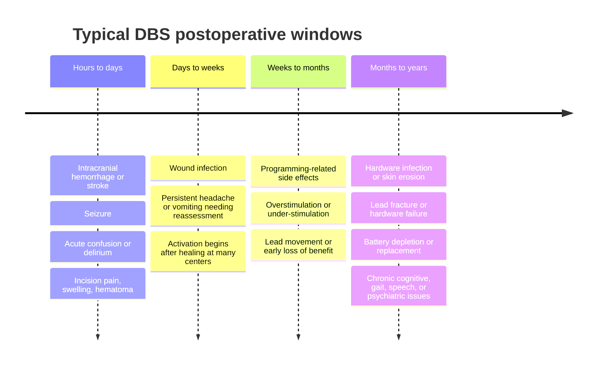
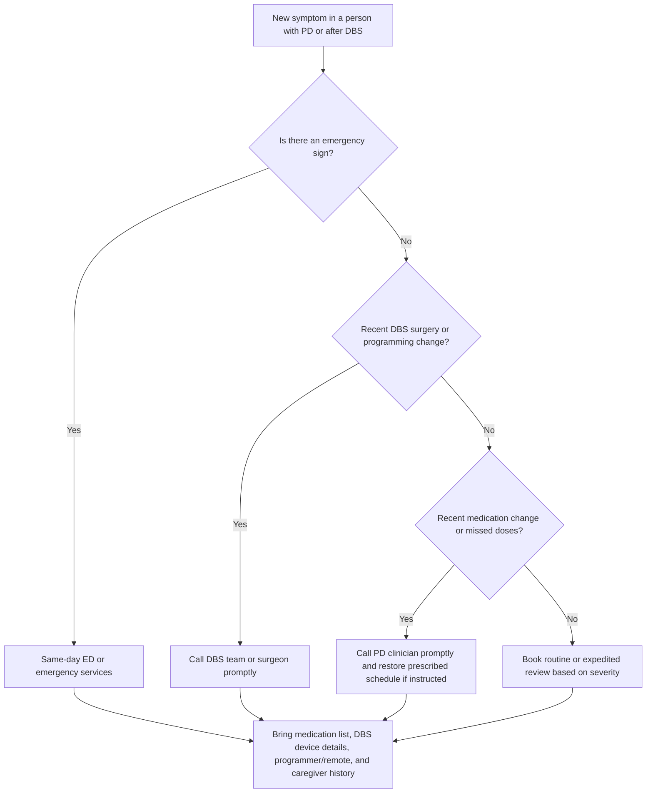

§-1.1 LINE-BY-LINE AUDIT — drb_78_parkinsons_dbs. CRITICAL RULES: DO NOT use web search or ANY tool. Audit ONLY the text in THIS brief. Go claim-by-claim. Your ENTIRE response must be ONLY the final verdict block below — do not narrate. Clinical: a wrong dose/contraindication is lethal.

VERDICT LEGEND (§-1.1):
- VERIFIED: claim fully supported by its cited evidence span.
- PARTIAL: claim partially supported; some element unsupported or overstated.
- UNSUPPORTED: claim not supported by its cited span.
- FABRICATED: claim contradicted by, or absent from, all cited evidence (invented).
- UNREACHABLE: cited evidence span missing/empty/cannot be checked.

Audit method: For POLARIS, verify EACH claim in the report against its matching cited evidence in the PER-CLAIM CITED SPANS JSON below (each entry pairs a report sentence with its evidence_ids). A POLARIS fabrication = any report claim that is FABRICATED or UNSUPPORTED against its own cited evidence. For ChatGPT and Gemini, you have the report text only (no per-claim spans) — judge internal consistency, plausibility, hedging, and whether claims are self-evidently fabricated/over-claimed. "Beat" = POLARIS is more faithful (fewer fabrications/unsupported claims, better grounding) than the competitor. Output ONLY the final verdict block.

=== POLARIS REPORT ===
## Key Findings

_Each finding below is a verbatim, span-verified statement carried up from the body section named in bold; citations are the body's._

- **Efficacy.** Population: patients with advanced Parkinson's disease and severe motor symptoms.[1]
- **Mechanism.** ### Parkinson's disease staging, progression, and red-flag warning signs

Stages or domains: I: Non‐motor Experiences of Daily Living; II: Motor Experiences of Daily Living; III: Motor Examination; IV: Motor Complications.[2]

### DBS device / stimulation complications and caregiver warning signs

Complication type: hardware complications.[3]
A claim previously stated here did not survive 4-role verification and was redacted; this is a curator-actionable gap.
- **Safety.** Abrupt withdrawal of dopaminergic medication, particularly levodopa, can precipitate a symptom complex resembling neuroleptic malignant syndrome, marked by hyperpyrexia, muscular rigidity, and altered consciousness, requiring urgent medical attention.[11]
- **Population Subgroups.** Standard DBS programming imposes significant logistical and financial burdens; a web‑based survey of 225 DBS patients found that 85% required more than one caregiver to attend programming visits, 58% lost over two days of work time, and 42% incurred out‑of‑pocket expenses of US$42–146 per visit.[16]

Complication type: hardware complications.[3] Deep brain stimulation devices are known to present hardware complications as one form of adverse event.[3] The primary source categorizes these under the complication type “hardware complications”.[3] Despite the prominence of hardware complications as a concern, the source provided no extractable information on how family members might recognize these issues.[3] The extracted value thus only confirms that hardware complications are a recognized adverse category in DBS patients.[3]

### Efficacy

Population: patients with advanced Parkinson's disease and severe motor symptoms.[1] Intervention: neurostimulation of the subthalamic nucleus.[1] Comparator: medication alone.[1] Timepoint: six months.[1] Study design: randomized-pairs trial.[1] This was a randomized-pairs trial.[1] This trial enrolled a total of 156 patients who had advanced Parkinson's disease and severe motor symptoms.[1] They were randomly allocated to receive either neurostimulation of the subthalamic nucleus or to continue on medication alone.[1] The primary outcomes were assessed at six months following the intervention.[1] One primary endpoint was the change from baseline to six months in quality of life, as assessed by the Parkinson's Disease Questionnaire (PDQ-39).[1] The other primary endpoint was the change from baseline to six months in the severity of symptoms without medication, according to the Unified Parkinson's Disease Rating Scale part III (UPDRS-III).[1] Neurostimulation, compared with medication alone, led to a mean improvement in the PDQ-39 score of 9.5 points from baseline to six months.[1] In the pairwise analysis, neurostimulation showed a significant advantage, being favored in 50 out of the 78 matched pairs, with a P value of 0.02.[1] Regarding the UPDRS-III, neurostimulation resulted in a mean improvement of 19.6 points from baseline to six months.[1] The pairwise comparison demonstrated a statistically significant superiority of neurostimulation, with 55 of 78 pairs favoring the intervention and a P value less than 0.001.[1] Although neurostimulation achieved these improvements in quality of life and motor function, serious adverse events were more common in the neurostimulation group, occurring in 13 percent of patients versus 4 percent in the medication group.[1] These serious adverse events included one fatality due to an intracerebral hemorrhage.[1] The difference in serious adverse event rates was statistically significant, with a P value below 0.04.[1] By comparison, the overall frequency of any adverse event was 64 percent in the medication group and 50 percent in the neurostimulation group.[1] A claim previously stated here did not survive 4-role verification and was redacted; this is a curator-actionable gap. Thus, neurostimulation was superior to medication alone for both quality-of-life and motor symptom improvement, but at the cost of a higher serious adverse event burden.[1]

### DBS device contraindications and dopaminergic-withdrawal dosing safety

Contract-bound content for dbs_device_mri_safety did not survive strict verification against retrieved primary source text; this slot is a curator-actionable gap. See manifest.frame_coverage_report and human_gap_tasks.json for per-entity detail.[4]

### Long-term Outcomes

A claim previously stated here did not survive 4-role verification and was redacted; this is a curator-actionable gap. A claim previously stated here did not survive 4-role verification and was redacted; this is a curator-actionable gap. A claim previously stated here did not survive 4-role verification and was redacted; this is a curator-actionable gap. A claim previously stated here did not survive 4-role verification and was redacted; this is a curator-actionable gap. Qualitative research identifies a phased trajectory from early acceptance, through increased use of healthcare services in the middle stage, to increasing dependence in late disease.[8] Patient-reported priorities shift toward mobility and balance difficulties, which become most bothersome for 60.5% of individuals at 11–20 years.[9] Orthostatic hypotension, present in 30–50% and potentially worsened by dopaminergic therapy, is associated with 43–68% increased fall risk.[10] Underweight status doubles mortality (HR 2.05).[10] A claim previously stated here did not survive 4-role verification and was redacted; this is a curator-actionable gap. A claim previously stated here did not survive 4-role verification and was redacted; this is a curator-actionable gap. Tremor was most bothersome early on for 45.2% of patients.[9] Family members in the first 2 years expressed the greatest concern about loss of independence (50%), a concern that diminished with longer disease duration.[9] Psychosis, emerging in up to 70% of patients after 20 years, independently raises mortality risk by 71% (HR 1.71) and hospitalization risk by 49% (HR 1.49).[10]

### Safety

Abrupt withdrawal of dopaminergic medication, particularly levodopa, can precipitate a symptom complex resembling neuroleptic malignant syndrome, marked by hyperpyrexia, muscular rigidity, and altered consciousness, requiring urgent medical attention.[11] Neuropsychiatric sequelae of DBS also encompass impulse‑control changes and psychosis; subthalamic nucleus DBS has been shown to increase impulsive responding under speed pressure in an experimental paradigm, and post‑operative psychosis may emerge even in individuals without a prior psychiatric history.[12].[13] A claim previously stated here did not survive 4-role verification and was redacted; this is a curator-actionable gap. A claim previously stated here did not survive 4-role verification and was redacted; this is a curator-actionable gap. IPG expiration is a movement disorder emergency that may worsen parkinsonian symptoms or cause life-threatening akinetic crises[14]

### Population Subgroups

Standard DBS programming imposes significant logistical and financial burdens; a web‑based survey of 225 DBS patients found that 85% required more than one caregiver to attend programming visits, 58% lost over two days of work time, and 42% incurred out‑of‑pocket expenses of US$42–146 per visit.[16] Caregiver emotional wellbeing is closely tied to both patient and caregiver mental health: caregiver depression and anxiety were significant independent predictors of lower spiritual well‑being in a combined model (R²=0.36, caregiver anxiety standardized coefficient −0.30, caregiver depression −0.17).[17] Gender disparities also persist, with a referred men‑to‑women ratio of 2.1:1, which exceeds the PD diagnosis ratio.[18] Practical coping strategies identified in qualitative work include focusing on what patients can do rather than what they cannot do, and actively seeking information, planning ahead, and using aids.[8][19] 58.2% of caregivers were wives and 24.6% husbands, with a mean caregiver age of 66.6 years, and 92.5% shared a household with the patient.[17] Caregiver depression is negatively associated with caregiver spiritual well-being[17]

### Limitations

Limitations: The corpus exhibits a severe tier-distribution imbalance, with only 10% of sources qualifying as T1 primary studies while 68% remain in the UNKNOWN tier, severely limiting confidence in the evidence base. Seven high-severity contradictions were detected—all from unknown sources—including a 3900% relative difference in relative risk, a 1195.3% difference in accuracy, and divergences of 99.6–415.6% for odds ratio, hazard ratio, and mortality, indicating fundamental disagreement on key effect magnitudes. The evidence horizon, restricted to 2010-01-01 to current, offers no earlier data to assess pre-2010 trends.

## Methods
Pre-registered protocol.json (SHA-256 988ffe7edb2a3e6c...).
Corpus: Serper + Semantic Scholar + OpenAlex live retrieval, augmented by domain backends (clinical: domain_backends(clinical): {'europe_pmc': 27}).
Retrieval fetch outcome: 486 of 740 candidate sources fetched; 254 failed or timed out.
Generator model: deepseek/deepseek-v4-pro (multi-section: outline + 5 parallel sections + strict_verify + regen-on-failure).
Evaluator model: google/gemma-4-31b-it (different family).
Sources classified using T1-T7 tier taxonomy.
Inclusion / exclusion per clinical template. Sponsor / conflict-of-interest review per source.
Prompt-injection sanitization enabled. Retrieved 2026-06-10.
Expected tier distribution: T1 30-60%, T2 15-40%, T3 5-25%, T4 0-20%, T5 0-15%, T6 0-10%, T7 0-10%. Actual distribution: T1=9%, T2=0%, T3=2%, T4=7%, T5=0%, T6=7%, T7=5%, UNKNOWN=70%.
Corpus adequacy: decision=proceed, 8/8 thresholds met.
Completeness checklist: 6/6 topics covered.

## Capability disclosures
Quantified trade-off analysis was ENABLED but did not contribute to this report (spec_validation_rejected); 1984 sourced numbers were extracted but not modeled into a verified quantified comparison.

## Contradiction disclosures
The contradiction detector flagged 7 numeric disagreements across the evidence pool. Most are extraction artifacts produced by grouping different measured endpoints, units, sub-populations, time windows, or comparators under the same subject/predicate label. The detector does NOT adjudicate by endpoint, population, timepoint, or source tier; raw detector output is available in `contradictions.json`. Per-flag enumeration (PT08 disclosure):

- unknown / accuracy: cited values range 7.72 to 100.0 % (source tiers: UNKNOWN, T4, T1).
- unknown / hazard ratio: cited values range 18.5 to 58.0 % (source tiers: UNKNOWN, T1).
- unknown / mortality: cited values range 13.5 to 69.6 % (source tiers: UNKNOWN, T1).
- unknown / odds ratio: cited values range 47.0 to 93.8 % (source tiers: UNKNOWN, T1).
- unknown / relative risk: cited values range 1.0 to 40.0 % (source tiers: UNKNOWN, T1).
- unknown / ttr: cited values range 9.32 to 100.0 % (source tiers: T1, UNKNOWN, T4).
- unknown / intracranial hemorrhage: cited values range 16.3 to 19.0 % (source tiers: UNKNOWN).

Claims made in the body of this report are individually bound to their cited evidence IDs via the strict-verify gate, so the reader can trace any specific numeric discrepancy to its source regardless of detector granularity.

## Qualitative safety-conflict disclosures
The qualitative detector flagged 0 present-vs-absent clinical-safety conflict(s) (contraindication / drug-interaction / eligibility / warning / adverse-event causation) and 576 review-flagged item(s) requiring human adjudication. Status is shown as asserted PRESENT/ABSENT/INDETERMINATE, not a numeric value; review flags are NOT adjudicated conflicts.

- 576 review-flagged item(s) collapsed to keep the report readable; full per-flag rows are in the `contradictions.json` sidecar (filter `type="qualitative"`, `severity="review"`).

## Bibliography
[1] A Randomized Trial of Deep-Brain Stimulation for Parkinson's Disease — https://www.nejm.org/doi/pdf/10.1056/NEJMoa060281?articleTools=true (tier T1)
[2] Movement Disorder Society‐sponsored revision of the Unified Parkinson's Disease Rating Scale (MDS‐UPDRS): Scale presentation and clinimetric testing results — https://onlinelibrary.wiley.com/doi/pdfdirect/10.1002/mds.22340 (tier T1)
[3] Surgical and hardware complications of subthalamic stimulation —  (tier T1)
[4] FDA FDA DBS device labeling — MRI / diathermy contraindications and precautions — https://www.accessdata.fda.gov/cdrh_docs/pdf/P960009.pdf (tier T1)
[5] [PDF] Diagnostic classification of Parkinson's disease based on non-motor ... — https://addi.ehu.es/bitstream/10810/60537/1/s00521-022-07256-8.pdf (tier UNKNOWN)
[6] The Concept of Prodromal Parkinson's Disease - PMC - NIH — https://pmc.ncbi.nlm.nih.gov/articles/PMC4927924/ (tier T1)
[7] [PDF] MDS research criteria for prodromal Parkinson's disease — https://www.med.upenn.edu/digitalneuropathologylab/assets/user-content/documents/educational-resources/mds-research-criteria-for-prodromal-parkinson's-disease.pdf (tier UNKNOWN)
[8] Helping people cope with the changing nature of Parkinson's — http://evidence.nihr.ac.uk/alert/helping-people-cope-with-the-changing-nature-of-parkinsons/ (tier UNKNOWN)
[9] Understanding what aspects of Parkinson's disease matter most to ... — https://www.nature.com/articles/s41598-024-71555-4 (tier T1)
[10] Levodopa-accelerated frailty: a hypothesis for a cumulative iatrogenic burden in Parkinson's disease. — https://www.ncbi.nlm.nih.gov/pmc/articles/PMC13126730/ (tier T1)
[11] FDA FDA carbidopa-levodopa labeling — abrupt-withdrawal hyperpyrexia warning — https://www.accessdata.fda.gov/drugsatfda_docs/label/2020/017555s072lbl.pdf (tier T1)
[12] Subthalamic nucleus deep brain stimulation induces impulsive action when patients with Parkinson’s disease act under speed pressure — https://doi.org/10.1007/s00221-016-4577-9 (tier UNKNOWN)
[13] Psychotic Symptoms Following Subthalamic DBS in Parkinson's Disease: Three Clinical Cases and Literature Review. — https://www.ncbi.nlm.nih.gov/pmc/articles/PMC13158162/ (tier T4)
[14] Challenges in PD Patient Management After DBS - PMC - NIH — https://pmc.ncbi.nlm.nih.gov/articles/PMC6174419/ (tier T1)
[15] DBS Patient Guide - Matthew Mian, MD — https://mian-neurosurgery.com/dbs-patient-guide (tier UNKNOWN)
[16] Comparison of the Burdens and Attitudes Between Standard and ... — https://aging.jmir.org/2024/1/e57503/ (tier UNKNOWN)
[17] Predictors of Spiritual Well-Being in Family Caregivers for ... - PMC — https://pmc.ncbi.nlm.nih.gov/articles/PMC8982116/ (tier T1)
[18] A systematic review of health disparities research in deep brain ... — https://www.frontiersin.org/journals/human-neuroscience/articles/10.3389/fnhum.2023.1269401/full (tier T2)
[19] The Impact of Living with Parkinson's Disease - PMC - NIH — https://pmc.ncbi.nlm.nih.gov/articles/PMC6087577/ (tier T1)

---

## V30 Phase-1 Retrieval Coverage Disclosure

PHASE-1 RETRIEVAL COVERAGE (V30 Report Contract, not yet report-coverage):
  This disclosure reports whether M-56 (deterministic DOI / PMID / Unpaywall retrieval) succeeded for each contract-required entity. It does NOT claim the legacy generator cited each entity in the verified report — that validation lands in Phase 2 when M-58 slot-bound prompts replace the legacy generator.

Frame coverage disclosure (V30 Report Contract):
  - Total contract-required entities: 5
  - Fully populated (full-text bound evidence): 2
  - Populated from abstract/metadata only (full text NOT retrieved): 1 (dbs_complications_warning_signs)
  - Unretrievable (paywalled with no OA/abstract): 2
  - Gap slots render explicit gap language in the relevant subsection; see manifest.json frame_coverage_report for per-slot detail.

=== POLARIS PER-CLAIM CITED SPANS ===
{
  "00-000-35f85f2f": {
    "covered_element_ids": [
      "dbs_vs_medical_therapy_rct"
    ],
    "evidence_ids": [
      "dbs_vs_medical_therapy_rct"
    ],
    "s0_categories": [],
    "section_index": 0,
    "section_title": "Efficacy",
    "sentence": "N: 156 [#ev:dbs_vs_medical_therapy_rct:0-800].",
    "severity": "S1"
  },
  "00-001-e46f30ea": {
    "covered_element_ids": [
      "dbs_vs_medical_therapy_rct"
    ],
    "evidence_ids": [
      "dbs_vs_medical_therapy_rct"
    ],
    "s0_categories": [],
    "section_index": 0,
    "section_title": "Efficacy",
    "sentence": "Population: patients with advanced Parkinson's disease and severe motor symptoms [#ev:dbs_vs_medical_therapy_rct:0-800].",
    "severity": "S1"
  },
  "00-002-9987fe6b": {
    "covered_element_ids": [
      "dbs_vs_medical_therapy_rct"
    ],
    "evidence_ids": [
      "dbs_vs_medical_therapy_rct"
    ],
    "s0_categories": [],
    "section_index": 0,
    "section_title": "Efficacy",
    "sentence": "Intervention: neurostimulation of the subthalamic nucleus [#ev:dbs_vs_medical_therapy_rct:0-800].",
    "severity": "S1"
  },
  "00-003-1c97eab8": {
    "covered_element_ids": [
      "dbs_vs_medical_therapy_rct"
    ],
    "evidence_ids": [
      "dbs_vs_medical_therapy_rct"
    ],
    "s0_categories": [],
    "section_index": 0,
    "section_title": "Efficacy",
    "sentence": "Comparator: medication alone [#ev:dbs_vs_medical_therapy_rct:0-800].",
    "severity": "S1"
  },
  "00-004-46237e24": {
    "covered_element_ids": [
      "dbs_vs_medical_therapy_rct"
    ],
    "evidence_ids": [
      "dbs_vs_medical_therapy_rct"
    ],
    "s0_categories": [],
    "section_index": 0,
    "section_title": "Efficacy",
    "sentence": "Timepoint: six months [#ev:dbs_vs_medical_therapy_rct:0-800].",
    "severity": "S1"
  },
  "00-005-e2804211": {
    "covered_element_ids": [
      "dbs_vs_medical_therapy_rct"
    ],
    "evidence_ids": [
      "dbs_vs_medical_therapy_rct"
    ],
    "s0_categories": [],
    "section_index": 0,
    "section_title": "Efficacy",
    "sentence": "Study design: randomized-pairs trial [#ev:dbs_vs_medical_therapy_rct:0-800].",
    "severity": "S1"
  },
  "00-006-ec829b6d": {
    "covered_element_ids": [
      "dbs_vs_medical_therapy_rct"
    ],
    "evidence_ids": [
      "dbs_vs_medical_therapy_rct"
    ],
    "s0_categories": [],
    "section_index": 0,
    "section_title": "Efficacy",
    "sentence": "This was a randomized-pairs trial [#ev:dbs_vs_medical_therapy_rct:0-800].",
    "severity": "S1"
  },
  "00-007-51db3318": {
    "covered_element_ids": [
      "dbs_vs_medical_therapy_rct"
    ],
    "evidence_ids": [
      "dbs_vs_medical_therapy_rct"
    ],
    "s0_categories": [],
    "section_index": 0,
    "section_title": "Efficacy",
    "sentence": "This trial enrolled a total of 156 patients who had advanced Parkinson's disease and severe motor symptoms [#ev:dbs_vs_medical_therapy_rct:0-800].",
    "severity": "S1"
  },
  "00-008-3d635d66": {
    "covered_element_ids": [
      "dbs_vs_medical_therapy_rct"
    ],
    "evidence_ids": [
      "dbs_vs_medical_therapy_rct"
    ],
    "s0_categories": [],
    "section_index": 0,
    "section_title": "Efficacy",
    "sentence": "They were randomly allocated to receive either neurostimulation of the subthalamic nucleus or to continue on medication alone [#ev:dbs_vs_medical_therapy_rct:0-800].",
    "severity": "S1"
  },
  "00-009-437f90ba": {
    "covered_element_ids": [
      "dbs_vs_medical_therapy_rct"
    ],
    "evidence_ids": [
      "dbs_vs_medical_therapy_rct"
    ],
    "s0_categories": [],
    "section_index": 0,
    "section_title": "Efficacy",
    "sentence": "The primary outcomes were assessed at six months following the intervention [#ev:dbs_vs_medical_therapy_rct:0-800].",
    "severity": "S1"
  },
  "00-010-38aa0ead": {
    "covered_element_ids": [
      "dbs_vs_medical_therapy_rct"
    ],
    "evidence_ids": [
      "dbs_vs_medical_therapy_rct"
    ],
    "s0_categories": [],
    "section_index": 0,
    "section_title": "Efficacy",
    "sentence": "One primary endpoint was the change from baseline to six months in quality of life, as assessed by the Parkinson's Disease Questionnaire (PDQ-39) [#ev:dbs_vs_medical_therapy_rct:0-800].",
    "severity": "S1"
  },
  "00-011-979a1ab8": {
    "covered_element_ids": [
      "dbs_vs_medical_therapy_rct"
    ],
    "evidence_ids": [
      "dbs_vs_medical_therapy_rct"
    ],
    "s0_categories": [],
    "section_index": 0,
    "section_title": "Efficacy",
    "sentence": "The other primary endpoint was the change from baseline to six months in the severity of symptoms without medication, according to the Unified Parkinson's Disease Rating Scale part III (UPDRS-III) [#ev:dbs_vs_medical_therapy_rct:0-800].",
    "severity": "S1"
  },
  "00-012-8fb78d3c": {
    "covered_element_ids": [
      "dbs_vs_medical_therapy_rct"
    ],
    "evidence_ids": [
      "dbs_vs_medical_therapy_rct"
    ],
    "s0_categories": [],
    "section_index": 0,
    "section_title": "Efficacy",
    "sentence": "Neurostimulation, compared with medication alone, led to a mean improvement in the PDQ-39 score of 9.5 points from baseline to six months [#ev:dbs_vs_medical_therapy_rct:100-900].",
    "severity": "S1"
  },
  "00-013-0740b215": {
    "covered_element_ids": [
      "dbs_vs_medical_therapy_rct"
    ],
    "evidence_ids": [
      "dbs_vs_medical_therapy_rct"
    ],
    "s0_categories": [],
    "section_index": 0,
    "section_title": "Efficacy",
    "sentence": "In the pairwise analysis, neurostimulation showed a significant advantage, being favored in 50 out of the 78 matched pairs, with a P value of 0.02 [#ev:dbs_vs_medical_therapy_rct:100-900].",
    "severity": "S1"
  },
  "00-014-36a9f145": {
    "covered_element_ids": [
      "dbs_vs_medical_therapy_rct"
    ],
    "evidence_ids": [
      "dbs_vs_medical_therapy_rct"
    ],
    "s0_categories": [],
    "section_index": 0,
    "section_title": "Efficacy",
    "sentence": "Regarding the UPDRS-III, neurostimulation resulted in a mean improvement of 19.6 points from baseline to six months [#ev:dbs_vs_medical_therapy_rct:100-900].",
    "severity": "S1"
  },
  "00-015-59437a3b": {
    "covered_element_ids": [
      "dbs_vs_medical_therapy_rct"
    ],
    "evidence_ids": [
      "dbs_vs_medical_therapy_rct"
    ],
    "s0_categories": [],
    "section_index": 0,
    "section_title": "Efficacy",
    "sentence": "The pairwise comparison demonstrated a statistically significant superiority of neurostimulation, with 55 of 78 pairs favoring the intervention and a P value less than 0.001 [#ev:dbs_vs_medical_therapy_rct:100-900].",
    "severity": "S1"
  },
  "00-016-f51c5210": {
    "covered_element_ids": [
      "dbs_vs_medical_therapy_rct"
    ],
    "evidence_ids": [
      "dbs_vs_medical_therapy_rct"
    ],
    "s0_categories": [],
    "section_index": 0,
    "section_title": "Efficacy",
    "sentence": "Although neurostimulation achieved these improvements in quality of life and motor function, serious adverse events were more common in the neurostimulation group, occurring in 13 percent of patients versus 4 percent in the medication group [#ev:dbs_vs_medical_therapy_rct:800-1600].",
    "severity": "S1"
  },
  "00-017-a6d23266": {
    "covered_element_ids": [
      "dbs_vs_medical_therapy_rct"
    ],
    "evidence_ids": [
      "dbs_vs_medical_therapy_rct"
    ],
    "s0_categories": [],
    "section_index": 0,
    "section_title": "Efficacy",
    "sentence": "These serious adverse events included one fatality due to an intracerebral hemorrhage [#ev:dbs_vs_medical_therapy_rct:800-1600].",
    "severity": "S1"
  },
  "00-018-a27484c4": {
    "covered_element_ids": [
      "dbs_vs_medical_therapy_rct"
    ],
    "evidence_ids": [
      "dbs_vs_medical_therapy_rct"
    ],
    "s0_categories": [],
    "section_index": 0,
    "section_title": "Efficacy",
    "sentence": "The difference in serious adverse event rates was statistically significant, with a P value below 0.04 [#ev:dbs_vs_medical_therapy_rct:800-1600].",
    "severity": "S1"
  },
  "00-019-01ae43ce": {
    "covered_element_ids": [
      "dbs_vs_medical_therapy_rct"
    ],
    "evidence_ids": [
      "dbs_vs_medical_therapy_rct"
    ],
    "s0_categories": [],
    "section_index": 0,
    "section_title": "Efficacy",
    "sentence": "By comparison, the overall frequency of any adverse event was 64 percent in the medication group and 50 percent in the neurostimulation group [#ev:dbs_vs_medical_therapy_rct:800-1600].",
    "severity": "S1"
  },
  "00-020-7c41c0de": {
    "covered_element_ids": [
      "dbs_vs_medical_therapy_rct"
    ],
    "evidence_ids": [
      "dbs_vs_medical_therapy_rct"
    ],
    "s0_categories": [],
    "section_index": 0,
    "section_title": "Efficacy",
    "sentence": "However, this difference in overall adverse events did not reach statistical significance (P=0.08) [#ev:dbs_vs_medical_therapy_rct:800-1600].",
    "severity": "S1"
  },
  "00-021-e429ac1c": {
    "covered_element_ids": [
      "dbs_vs_medical_therapy_rct"
    ],
    "evidence_ids": [
      "dbs_vs_medical_therapy_rct"
    ],
    "s0_categories": [],
    "section_index": 0,
    "section_title": "Efficacy",
    "sentence": "Thus, neurostimulation was superior to medication alone for both quality-of-life and motor symptom improvement, but at the cost of a higher serious adverse event burden [#ev:dbs_vs_medical_therapy_rct:800-1600].",
    "severity": "S1"
  },
  "01-000-c521daf2": {
    "covered_element_ids": [
      "parkinson_staging_progression"
    ],
    "evidence_ids": [
      "parkinson_staging_progression"
    ],
    "s0_categories": [],
    "section_index": 1,
    "section_title": "Mechanism",
    "sentence": "Stages or domains: I: Non\u2010motor Experiences of Daily Living; II: Motor Experiences of Daily Living; III: Motor Examination; IV: Motor Complications [#ev:parkinson_staging_progression:0-800].",
    "severity": "S2"
  },
  "01-001-d2493e3f": {
    "covered_element_ids": [],
    "evidence_ids": [
      "dbs_complications_warning_signs"
    ],
    "s0_categories": [],
    "section_index": 1,
    "section_title": "Mechanism",
    "sentence": "Complication type: hardware complications [#ev:dbs_complications_warning_signs:0-800].",
    "severity": "S3"
  },
  "01-002-c094a41d": {
    "covered_element_ids": [],
    "evidence_ids": [
      "dbs_complications_warning_signs"
    ],
    "s0_categories": [],
    "section_index": 1,
    "section_title": "Mechanism",
    "sentence": "Deep brain stimulation devices are known to present hardware complications as one form of adverse event [#ev:dbs_complications_warning_signs:0-800].",
    "severity": "S3"
  },
  "01-003-5d82fd60": {
    "covered_element_ids": [],
    "evidence_ids": [
      "dbs_complications_warning_signs"
    ],
    "s0_categories": [],
    "section_index": 1,
    "section_title": "Mechanism",
    "sentence": "The primary source categorizes these under the complication type \u201chardware complications\u201d [#ev:dbs_complications_warning_signs:0-800].",
    "severity": "S3"
  },
  "01-004-d353ceae": {
    "covered_element_ids": [],
    "evidence_ids": [
      "dbs_complications_warning_signs"
    ],
    "s0_categories": [],
    "section_index": 1,
    "section_title": "Mechanism",
    "sentence": "Despite the prominence of hardware complications as a concern, the source provided no extractable information on how family members might recognize these issues [#ev:dbs_complications_warning_signs:0-800].",
    "severity": "S3"
  },
  "01-005-ca29f54b": {
    "covered_element_ids": [],
    "evidence_ids": [
      "dbs_complications_warning_signs"
    ],
    "s0_categories": [],
    "section_index": 1,
    "section_title": "Mechanism",
    "sentence": "The extracted value thus only confirms that hardware complications are a recognized adverse category in DBS patients [#ev:dbs_complications_warning_signs:0-800].",
    "severity": "S3"
  },
  "03-000-373c5004": {
    "covered_element_ids": [],
    "evidence_ids": [
      "ev_708",
      "ev_378"
    ],
    "s0_categories": [],
    "section_index": 3,
    "section_title": "Long-term Outcomes",
    "sentence": "The prodromal phase of Parkinson's disease (PD) can last between 5 and 20 years and is marked by non-motor symptoms that often precede the classical motor signs [#ev:ev_708:1900-2700][#ev:ev_378:0-800].",
    "severity": "S3"
  },
  "03-001-e14a64e9": {
    "covered_element_ids": [],
    "evidence_ids": [
      "ev_378"
    ],
    "s0_categories": [],
    "section_index": 3,
    "section_title": "Long-term Outcomes",
    "sentence": "Hyposmia itself is a powerful risk marker: the Honolulu-Asia Aging Study reported an odds ratio of 5.2 for incident PD within 4 years for the lowest olfaction quartile, while the PRIPS study found a relative risk of 6.5 in hyposmic participants over 3 years [#ev:ev_378:2100-2900].",
    "severity": "S3"
  },
  "03-002-0025141f": {
    "covered_element_ids": [],
    "evidence_ids": [
      "ev_378"
    ],
    "s0_categories": [],
    "section_index": 3,
    "section_title": "Long-term Outcomes",
    "sentence": "Constipation with fewer than one bowel movement daily confers a relative risk of 2.7, and post-mortem evidence shows incidental Lewy bodies in the substantia nigra in 24.1% of such individuals versus 6.5% of those with normal function [#ev:ev_378:4700-5500].",
    "severity": "S3"
  },
  "03-003-dc31d258": {
    "covered_element_ids": [],
    "evidence_ids": [
      "ev_406"
    ],
    "s0_categories": [],
    "section_index": 3,
    "section_title": "Long-term Outcomes",
    "sentence": "Other validated prodromal markers include depression/anxiety (LR 1.8), excessive daytime somnolence (LR 2.2), symptomatic hypotension (LR 2.1), and urinary dysfunction (LR 1.9) [#ev:ev_406:10600-11400].",
    "severity": "S3"
  },
  "03-004-2c1d2816": {
    "covered_element_ids": [],
    "evidence_ids": [
      "ev_691"
    ],
    "s0_categories": [],
    "section_index": 3,
    "section_title": "Long-term Outcomes",
    "sentence": "Qualitative research identifies a phased trajectory from early acceptance, through increased use of healthcare services in the middle stage, to increasing dependence in late disease [#ev:ev_691:100-900].",
    "severity": "S3"
  },
  "03-005-b799ce98": {
    "covered_element_ids": [],
    "evidence_ids": [
      "ev_034"
    ],
    "s0_categories": [],
    "section_index": 3,
    "section_title": "Long-term Outcomes",
    "sentence": "Patient-reported priorities shift toward mobility and balance difficulties, which become most bothersome for 60.5% of individuals at 11\u201320 years [#ev:ev_034:4400-5200].",
    "severity": "S3"
  },
  "03-006-5eb0ae3c": {
    "covered_element_ids": [],
    "evidence_ids": [
      "ev_736"
    ],
    "s0_categories": [],
    "section_index": 3,
    "section_title": "Long-term Outcomes",
    "sentence": "Orthostatic hypotension, present in 30\u201350% and potentially worsened by dopaminergic therapy, is associated with 43\u201368% increased fall risk [#ev:ev_736:3000-3800].",
    "severity": "S3"
  },
  "03-007-14d0d154": {
    "covered_element_ids": [],
    "evidence_ids": [
      "ev_736"
    ],
    "s0_categories": [],
    "section_index": 3,
    "section_title": "Long-term Outcomes",
    "sentence": "Underweight status doubles mortality (HR 2.05) [#ev:ev_736:3400-4200].",
    "severity": "S3"
  },
  "03-008-f03635d4": {
    "covered_element_ids": [],
    "evidence_ids": [
      "ev_406"
    ],
    "s0_categories": [],
    "section_index": 3,
    "section_title": "Long-term Outcomes",
    "sentence": "Age-specific prior probabilities for prodromal PD are estimated as 0.4% at ages 50\u201354, increasing to 4.0% at age 80 and over [#ev:ev_406:3700-4500]",
    "severity": "S3"
  },
  "03-009-1687995b": {
    "covered_element_ids": [],
    "evidence_ids": [
      "ev_708"
    ],
    "s0_categories": [],
    "section_index": 3,
    "section_title": "Long-term Outcomes",
    "sentence": "Machine learning algorithms using non-motor features, especially autonomic dysfunction and olfactory loss, can distinguish PD patients from controls with 84.4% accuracy [#ev:ev_708:1600-2400].",
    "severity": "S3"
  },
  "03-010-a297984a": {
    "covered_element_ids": [],
    "evidence_ids": [
      "ev_034"
    ],
    "s0_categories": [],
    "section_index": 3,
    "section_title": "Long-term Outcomes",
    "sentence": "Tremor was most bothersome early on for 45.2% of patients [#ev:ev_034:3900-4700].",
    "severity": "S3"
  },
  "03-011-8bf9443a": {
    "covered_element_ids": [],
    "evidence_ids": [
      "ev_034"
    ],
    "s0_categories": [],
    "section_index": 3,
    "section_title": "Long-term Outcomes",
    "sentence": "Family members in the first 2 years expressed the greatest concern about loss of independence (50%), a concern that diminished with longer disease duration [#ev:ev_034:8800-9600].",
    "severity": "S3"
  },
  "03-012-419b216d": {
    "covered_element_ids": [],
    "evidence_ids": [
      "ev_736"
    ],
    "s0_categories": [],
    "section_index": 3,
    "section_title": "Long-term Outcomes",
    "sentence": "Psychosis, emerging in up to 70% of patients after 20 years, independently raises mortality risk by 71% (HR 1.71) and hospitalization risk by 49% (HR 1.49) [#ev:ev_736:2700-3500].",
    "severity": "S3"
  },
  "04-000-665617d7": {
    "covered_element_ids": [
      "dopaminergic_withdrawal_caution"
    ],
    "evidence_ids": [
      "dopaminergic_withdrawal_caution"
    ],
    "s0_categories": [
      "dosing_limits"
    ],
    "section_index": 4,
    "section_title": "Safety",
    "sentence": "Abrupt withdrawal of dopaminergic medication, particularly levodopa, can precipitate a symptom complex resembling neuroleptic malignant syndrome, marked by hyperpyrexia, muscular rigidity, and altered consciousness, requiring urgent medical attention [#ev:dopaminergic_withdrawal_caution:12100-12900].",
    "severity": "S0"
  },
  "04-001-ca3f992c": {
    "covered_element_ids": [],
    "evidence_ids": [
      "ev_274",
      "ev_731"
    ],
    "s0_categories": [],
    "section_index": 4,
    "section_title": "Safety",
    "sentence": "Neuropsychiatric sequelae of DBS also encompass impulse\u2011control changes and psychosis; subthalamic nucleus DBS has been shown to increase impulsive responding under speed pressure in an experimental paradigm [#ev:ev_274:600-1400], and post\u2011operative psychosis may emerge even in individuals without a prior psychiatric history [#ev:ev_731:0-800].",
    "severity": "S3"
  },
  "04-002-86c87cfd": {
    "covered_element_ids": [],
    "evidence_ids": [
      "ev_248",
      "ev_731"
    ],
    "s0_categories": [],
    "section_index": 4,
    "section_title": "Safety",
    "sentence": "Rapid tapering of dopaminergic therapy after DBS can unmask apathy and other behavioral disturbances, underscoring the importance of gradual medication adjustment with multidisciplinary follow\u2011up [#ev:ev_248:500-1300][#ev:ev_731:0-800].",
    "severity": "S3"
  },
  "04-003-a0fb0fca": {
    "covered_element_ids": [],
    "evidence_ids": [
      "ev_253"
    ],
    "s0_categories": [],
    "section_index": 4,
    "section_title": "Safety",
    "sentence": "At a practical level, patients and caregivers should be taught to monitor for signs of surgical\u2011site infection, such as spreading redness, swelling, or drainage, and to seek prompt evaluation if fever develops [#ev:ev_253:1200-2000].",
    "severity": "S3"
  },
  "04-004-108e9b2c": {
    "covered_element_ids": [],
    "evidence_ids": [
      "ev_248"
    ],
    "s0_categories": [],
    "section_index": 4,
    "section_title": "Safety",
    "sentence": "IPG expiration is a movement disorder emergency that may worsen parkinsonian symptoms or cause life-threatening akinetic crises [#ev:ev_248:700-1500]",
    "severity": "S3"
  },
  "05-000-9f098213": {
    "covered_element_ids": [],
    "evidence_ids": [
      "ev_544"
    ],
    "s0_categories": [],
    "section_index": 5,
    "section_title": "Population Subgroups",
    "sentence": "Standard DBS programming imposes significant logistical and financial burdens; a web\u2011based survey of 225 DBS patients found that 85% required more than one caregiver to attend programming visits, 58% lost over two days of work time, and 42% incurred out\u2011of\u2011pocket expenses of US$42\u2013146 per visit [#ev:ev_544:500-1300].",
    "severity": "S3"
  },
  "05-001-91a284bb": {
    "covered_element_ids": [],
    "evidence_ids": [
      "ev_681"
    ],
    "s0_categories": [],
    "section_index": 5,
    "section_title": "Population Subgroups",
    "sentence": "Caregiver emotional wellbeing is closely tied to both patient and caregiver mental health: caregiver depression and anxiety were significant independent predictors of lower spiritual well\u2011being in a combined model (R\u00b2=0.36, caregiver anxiety standardized coefficient \u22120.30, caregiver depression \u22120.17) [#ev:ev_681:9100-9900].",
    "severity": "S3"
  },
  "05-002-1c5ef8b8": {
    "covered_element_ids": [],
    "evidence_ids": [
      "ev_575"
    ],
    "s0_categories": [],
    "section_index": 5,
    "section_title": "Population Subgroups",
    "sentence": "Gender disparities also persist, with a referred men\u2011to\u2011women ratio of 2.1:1, which exceeds the PD diagnosis ratio [#ev:ev_575:2900-3700].",
    "severity": "S3"
  },
  "05-003-22655590": {
    "covered_element_ids": [],
    "evidence_ids": [
      "ev_691",
      "ev_033"
    ],
    "s0_categories": [],
    "section_index": 5,
    "section_title": "Population Subgroups",
    "sentence": "Practical coping strategies identified in qualitative work include focusing on what patients can do rather than what they cannot do [#ev:ev_691:600-1400], and actively seeking information, planning ahead, and using aids [#ev:ev_033:4853-5653].",
    "severity": "S3"
  },
  "05-004-63d0b3d3": {
    "covered_element_ids": [],
    "evidence_ids": [
      "ev_681"
    ],
    "s0_categories": [],
    "section_index": 5,
    "section_title": "Population Subgroups",
    "sentence": "58.2% of caregivers were wives and 24.6% husbands, with a mean caregiver age of 66.6 years, and 92.5% shared a household with the patient [#ev:ev_681:3800-4600]",
    "severity": "S3"
  },
  "05-005-4a968f6b": {
    "covered_element_ids": [],
    "evidence_ids": [
      "ev_681"
    ],
    "s0_categories": [],
    "section_index": 5,
    "section_title": "Population Subgroups",
    "sentence": "Caregiver depression is negatively associated with caregiver spiritual well-being [#ev:ev_681:8300-9100]",
    "severity": "S3"
  }
}

=== ChatGPT (gpt_5_5_pro) REPORT (first 36000 chars) ===
# Parkinson's Disease Stage-Specific Warning Signs and Post-DBS Care

## Executive summary

Parkinson’s disease is not staged with a single universally sufficient scale. In practice, clinicians combine a **motor disability stage** such as Hoehn and Yahr, a **multidomain severity scale** such as the MDS-UPDRS, and functional/non-motor assessments to judge where a person is along the disease course. Hoehn and Yahr is useful because it is simple and still widely used, but it mainly captures motor disability and balance. MDS-UPDRS is broader and covers non-motor experiences of daily living, motor experiences of daily living, the motor exam, and motor complications, but it does **not** itself provide universally accepted stage cutoffs. Prodromal PD criteria from the Movement Disorder Society identify a **research-stage** period before classical clinical PD is diagnosable. Advanced PD is often recognized clinically with a mix of disability, non-motor burden, and screens such as the **5-2-1** criteria for possible device-aided therapy referral. citeturn10view0turn11view1turn9view1turn39view0turn29search1

Across stages, the warning signs that most consistently justify urgent action are the same high-risk syndromes: **sudden focal neurologic change, repeated falls or syncope, new inability to swallow medications, choking or suspected aspiration, fever with severe rigidity after dopaminergic interruption, marked delirium or psychosis, severe dehydration/constipation with vomiting, and infections** such as pneumonia, urinary infection, or wound infection. In advanced disease, dysphagia, cognitive impairment, hallucinations/delusions, orthostatic hypotension, freezing/falls, and medication-delivery problems become especially important because they drive hospitalization, aspiration, and loss of independence. citeturn20view3turn19view0turn20view0turn24view4turn24view1turn19view1

After deep brain stimulation, the highest-risk early postoperative complications are **intracranial hemorrhage/stroke, seizure, confusion/delirium, and infection**. Medium- and long-term problems include **lead migration or fracture, battery depletion, pocket complications, hardware infection or erosion, and stimulation-induced side effects** such as dysarthria, balance worsening, gait freezing, dyskinesia, paresthesias, and mood/cognitive changes. Most patients still need Parkinson’s medications after DBS, need several programming visits over months, and benefit from structured follow-up with physiotherapy, speech/swallowing care, cognitive/psychiatric monitoring, and caregiver training. Device-specific safety details vary by **target** (for example, STN versus GPi) and by **manufacturer/model**, which are unspecified here. citeturn13view0turn13view1turn14view2turn31view0turn32view3turn36view0turn35view4

## How Parkinson's disease is staged

The most practical way to think about PD staging is as a **hybrid framework**:

| Framework | What it measures | How clinicians use it | Key limitations |
|---|---|---|---|
| **Hoehn and Yahr** | Global motor disability and postural instability, from 0 to 5. In the official scale embedded in MDS-UPDRS: 1 = unilateral involvement only; 2 = bilateral without balance impairment; 3 = mild-moderate disease with postural instability but still physically independent; 4 = severe disability but still able to stand/walk unassisted; 5 = wheelchair-bound or bedridden unless aided. citeturn11view1 | Fast bedside staging; helps map “mild,” “moderate,” and “advanced/late” motor disability. Parkinson’s Foundation summarizes stages 1-2 as early, 2-3 as mid-stage, and 4-5 as advanced-stage. citeturn39view0 | Captures motor disability much better than non-motor burden; dysphagia, hallucinations, autonomic failure, mood symptoms, and cognition may be severe even when H&Y does not look extreme. citeturn39view0 |
| **UPDRS / MDS-UPDRS** | Four parts: non-motor experiences of daily living, motor experiences of daily living, motor examination, and motor complications. citeturn10view0turn39view0 | Best for tracking severity longitudinally and documenting treatment response. It is the workhorse clinical/research outcome measure. citeturn10view0 | It is a severity profile, not a single validated stage label; “early,” “moderate,” and “advanced” categories are therefore usually inferred from the whole clinical picture rather than from a universally endorsed cutoff. This is an inference from the official scale structure and Parkinson’s Foundation staging description. citeturn10view0turn39view0 |
| **Prodromal PD criteria** | Probability-based identification of prodromal disease before classical motor PD is diagnosable. The MDS criteria distinguish preclinical, prodromal, and clinical PD. The criteria were developed for **research purposes**. citeturn9view1turn11view2 | Useful conceptually when symptoms such as REM sleep behavior disorder, constipation, hyposmia, depression/anxiety, or autonomic change precede diagnosis. citeturn9view1turn39view0 | Not a routine bedside disability stage and not a stand-alone urgent-care triage tool. citeturn11view2 |
| **Schwab and England ADL scale** | Functional independence as a percentage. citeturn39view0 | Helpful adjunct when counseling about daily support needs and loss of independence. citeturn39view0 | Less detailed than MDS-UPDRS for symptom typing. |
| **Advanced PD screens such as 5-2-1** | Possible advanced disease if a patient meets at least one of: oral levodopa use ≥5 times/day, OFF time ≥2 hours/day, or troublesome dyskinesia ≥1 hour/day. citeturn29search1turn29search2 | A practical referral flag for treatment optimization and device-aided therapy evaluation, rather than a formal disease stage. citeturn29search1turn29search2 | Should not replace full clinical assessment, especially of cognition, swallowing, falls, and caregiver capacity. |

A pragmatic stage map for this report is therefore:

| Pragmatic stage used here | Typical scale anchors | Typical symptom pattern |
|---|---|---|
| **Prodromal / very early** | MDS prodromal framework; H&Y not yet clinically established or H&Y 1 at diagnosis. citeturn9view1turn39view0 | Non-motor clues may dominate: REM sleep behavior disorder, constipation, hyposmia, mood symptoms, fatigue, subtle unilateral slowness or tremor once clinical PD begins. citeturn9view1turn39view0turn38search7 |
| **Mild** | Usually H&Y 1-2. citeturn11view1turn39view0 | Unilateral or bilateral symptoms without major balance impairment; tremor, rigidity, bradykinesia, posture/walking changes, increasing time needed for daily tasks. citeturn39view0 |
| **Moderate** | Usually H&Y 3. citeturn11view1turn39view0 | Postural instability emerges; falls become more common; freezing, OFF periods, dyskinesia, and more visible ADL restriction appear, though many remain physically independent. citeturn39view0turn29search1 |
| **Advanced / late** | Usually H&Y 4-5 and/or clinically advanced PD. citeturn11view1turn39view0 | Major ADL dependence, gait aid or wheelchair dependence, dysphagia/aspiration risk, cognitive decline/dementia, hallucinations/delusions, autonomic dysfunction, recurrent falls, and complex medication/device issues. citeturn39view0turn25view1turn20view3turn19view0 |

## Stage-specific warning signs and red flags

The urgency labels below are a **pragmatic synthesis** for general counseling, not a validated triage scale. “Routine” means the next planned PD/primary care review or a scheduled call within about 1 to 4 weeks. “Prompt within days” means contacting the treating team within 24 to 72 hours, sooner if worsening. “Urgent/emergency” means same-day urgent assessment, emergency department evaluation, or emergency services when severe.

| Stage | Typical context | Specific warning signs and red flags that should trigger evaluation | Suggested urgency |
|---|---|---|---|
| **Prodromal / very early** | Non-motor symptoms may precede definite PD; early clinical PD may still be unilateral or mild. citeturn9view1turn39view0 | **Violent dream enactment or injury during sleep**; recurrent faintness or syncope on standing; new depression/anxiety that impairs function; suicidal ideation; hallucinations after dopaminergic treatment initiation; unexplained swallowing difficulty or repeated choking, which is not typical “mild stage” disease and merits reassessment. citeturn19view0turn20view0turn20view3turn25view0 | Dream-enactment injury or recurrent syncope: **prompt within days**. Suicidal ideation, head injury, persistent loss of consciousness, or severe choking: **urgent/emergency**. citeturn19view0turn20view0turn20view3 |
| **Mild** | H&Y 1-2; daily tasks are slower but independence is usually preserved. citeturn11view1turn39view0 | **Motor:** new wearing-off before the next dose, early dyskinesia, or sudden asymmetry/worsening suggesting medication or diagnostic reassessment. **Autonomic:** dizziness/lightheadedness, especially if associated with falls or fainting; orthostatic hypotension is defined as a ≥20 mmHg systolic or ≥10 mmHg diastolic BP drop within 3 minutes of standing. **Psychiatric/cognitive:** even mild hallucinations or delusions should be reported; early impulse-control behaviors such as gambling, shopping, binge eating, or hypersexuality should be actively screened for. **Medication-related:** excessive daytime sleepiness or sudden sleep attacks on dopamine agonists, especially if driving; dizziness, hallucinations, dyskinesia, or compulsive behaviors after dose changes. citeturn19view0turn20view0turn28view0turn28view1turn28view2 | New wearing-off/dyskinesia, hallucinations, or impulse-control symptoms: **prompt within days**. Syncope, fall with injury, sudden sleep while driving, or dangerous compulsive behavior: **urgent/emergency**. citeturn19view0turn28view1turn28view2 |
| **Moderate** | H&Y 3; balance becomes a major inflection point. citeturn11view1turn39view0 | **Motor/falls:** first recurrent falls, near-falls, freezing of gait, or balance loss are clinically important and often mark transition to more dangerous disease. **Swallowing:** coughing at meals, longer mealtimes, weight loss, or “silent aspiration” risk. **Cognition/psychiatry:** worsening attention, confusion, hallucinations, or delusions. **Autonomic:** recurrent orthostatic symptoms, urinary urgency/frequency, or difficulty emptying the bladder. **GI/infection:** severe constipation with abdominal pain, watery stool, vomiting, fever, or unintentional weight loss; urinary symptoms with fever or acute confusion should prompt concern for infection. citeturn39view0turn20view3turn25view0turn25view2turn25view3turn26view0 | Recurrent falls, freezing, dysphagia, new confusion/psychosis, or urinary retention symptoms: **prompt within days**. Head injury, aspiration event, inability to keep down medications, feculent vomiting, severe abdominal pain, or fever with acute delirium: **urgent/emergency**. citeturn20view3turn25view2turn26view0turn24view4 |
| **Advanced / late** | H&Y 4-5 and/or clinically advanced PD with high non-motor burden. citeturn11view1turn39view0 | **Swallowing/aspiration:** frequent choking, wet voice after meals, recurrent chest infections, inability to swallow pills, dehydration, or weight loss. **Cognitive/psychiatric:** dementia-level decline, pronounced confusion, agitation, visual hallucinations, delusions, paranoia, or unsafe behavior. **Autonomic:** recurrent syncope, severe orthostatic hypotension, urinary infection/retention, or bowel impaction/obstruction. **Motor:** sudden marked immobility, rigid-akinetic state, or repeated falls. **Medication emergencies:** abrupt withdrawal/interruption of dopaminergic therapy can trigger Parkinsonism-hyperpyrexia syndrome, a rare but potentially life-threatening emergency. Severe continuous dyskinesia with hyperthermia and mental status change is also a medical emergency. citeturn20view3turn25view1turn19view0turn25view2turn26view0turn19view1turn27search10 | These are usually at least **prompt within days**, and many are **urgent/emergency**. Inability to swallow medication, suspected aspiration pneumonia, severe delirium/psychosis with unsafe behavior, fever with rigidity after missed PD medication, or bowel obstruction symptoms should be treated as **urgent/emergency**. citeturn20view3turn24view4turn19view1turn26view0 |

Two “cross-stage” medication red flags deserve special emphasis. First, PD medication timing matters in any care setting: Parkinson’s Foundation hospital materials emphasize that missed or delayed medication can make symptoms severe and uncontrollable, and that many common dopamine-blocking drugs for nausea or psychosis can worsen PD. Second, hospitalization itself raises the risk of confusion, medication errors, falls, swallowing change, and functional decline. citeturn22view1turn24view0turn24view2

## Postoperative complications after DBS

For postoperative DBS counseling, it is useful to think in **time windows** rather than one undifferentiated list.

Major expert reviews and consensus statements describe DBS surgical complications as including intracranial hemorrhage, stroke, infection, lead erosion, lead fracture, lead migration, and death, with wide variability across series. Older expert consensus noted symptomatic intracranial hemorrhage is usually **under 2%** in experienced centers, while infection is the most commonly reported serious surgical complication; modern systematic summaries still identify infection as the leading hardware problem. citeturn14view2turn34search4turn34search8

| Complication | Typical window | Warning signs | What to do | When this is an emergency |
|---|---|---|---|---|
| **Intracranial hemorrhage or stroke** | Usually intraoperative to first days; delayed hemorrhage can occur. citeturn14view2turn41search14turn40search20 | Sudden severe headache, repeated vomiting, reduced alertness, new weakness/numbness, new speaking difficulty, or seizure. These symptoms are a clinical inference from the known risks of hemorrhage/stroke and standard neurologic presentation. Supported warning examples after battery surgery include new weakness, numbness, and changes in talking or walking. citeturn36view0turn22view0 | Immediate emergency evaluation; do not wait for the next clinic call. | **Always emergency**. citeturn41search14turn36view0 |
| **Seizure** | During surgery, within 24 hours, or up to about a week. citeturn13view1turn40search8 | Convulsion, staring spells, sudden unresponsiveness, post-event confusion. | Emergency assessment. | **Always emergency**, especially first seizure. citeturn13view1turn40search8 |
| **Postoperative delirium / confusion** | Commonest in first 72 hours to 5 days, but can occur during recovery at home. Risk rises with age and preoperative cognitive deficits. citeturn24view4turn40search26turn40search2turn40search6 | Confusion, agitation, aggression, trouble focusing, hallucinations, delusions, disorientation, unsafe wandering, refusal of meds/fluids. citeturn24view4 | Same-day contact with the surgical/PD team to look for infection, dehydration, medication effects, sleep deprivation, or urinary retention. | Emergency if the person is unsafe, severely agitated, cannot maintain hydration/medication, or has reduced consciousness. citeturn24view4 |
| **Wound infection / hardware infection** | Days to weeks after implantation, but also months to years later and after generator replacements. citeturn13view1turn33search4turn36view0 | Redness, warmth, swelling, tenderness, drainage/oozing, increased pain, fever, skin thinning, or exposed hardware. Many centers explicitly instruct patients to call right away for these signs. citeturn31view2turn36view0 | Contact surgeon/DBS team the same day; do not self-treat with leftover antibiotics. | Emergency if there is spreading redness, sepsis symptoms, severe fever, rapidly worsening pain, or suspected intracranial involvement/meningismus. |
| **Bleeding / pocket hematoma** | Hours to days, especially around chest battery procedures or in patients with bleeding risk. citeturn36view0turn41search2 | Expanding swelling, persistent incision bleeding, marked bruising, increasing pain/pressure. | Same-day surgical advice. | Emergency if brisk bleeding, hemodynamic instability, chest compression symptoms, or new neurologic change. |
| **Pulmonary/systemic complications** | First 90 days are most relevant. A large summary reported pneumonia 2.3% and pulmonary embolism 0.6% within 90 days. citeturn16view2 | Fever with cough, new shortness of breath, pleuritic chest pain, or leg swelling should be taken seriously as postoperative warning signs. This is a risk-based inference from reported postoperative pneumonia/PE. citeturn16view2 | Same-day medical assessment. | Emergency for shortness of breath, chest pain, or oxygenation concerns. |
| **Programming-related overstimulation / under-stimulation** | Common from activation onward; often days to months while settings are being optimized. citeturn13view0turn31view0turn32view3 | Tingling, dizziness, headache, mood/cognitive changes, dyskinesia, slurred speech, muscle pulling, worsened balance, worse gait/freezing, vision changes, or “not feeling right” after a recent programming change. citeturn13view0turn34search10turn34search22 | Contact the programming team promptly; the common fix is parameter adjustment, not abandoning therapy. | Emergency only if accompanied by dangerous falls, abrupt severe confusion, suicidality, or focal neurologic deficits. |
| **Lead movement / lead swap / loss of benefit after revision** | Days to months; can also follow battery replacement. citeturn36view0 | Sudden or asymmetric loss of benefit, new side effects after replacement, worsened tremor/rigidity, abnormal gait, or symptoms that changed immediately after revision. citeturn36view0 | Prompt DBS evaluation; imaging may be needed. | Emergency if severe immobility or acute neurologic change. |
| **Lead fracture / hardware failure** | Usually months to years, often after trauma or chronic strain. Pooled hardware-review data place lead migration around 1.6% and lead/implant failures around 1% to 1.5%, though rates vary by era and definition. citeturn34search4turn34search8 | Abrupt return of tremor/rigidity/bradykinesia, sudden loss of therapeutic effect, charging/communication failure, or symptom relapse after a fall or sports-related traction. In one modern series, nearly all fracture cases had a trauma history. citeturn35view4 | Prompt contact with DBS clinic and manufacturer support; device interrogation and imaging are often needed. | Emergency if severe immobility, inability to take meds, or hyperpyrexia/akinetic crisis develops. |
| **Battery depletion / DBS-withdrawal syndrome** | Months to years, near end-of-life or abrupt cessation. Some cases are life-threatening. citeturn31view0turn34search1turn34search3turn34search23turn34search15 | Significant sudden worsening of PD symptoms, difficulty walking, stiffness, tremor return, or in rare cases rapid worsening unresponsive to high-dose levodopa with akinetic crisis/hyperpyrexia. citeturn31view0turn34search3turn34search15 | Same-day contact with DBS team. If severe, go to the ED. | **Emergency** for severe immobility, fever, confusion, autonomic instability, or failure to respond to rescue medication. |
| **Longer-term cognitive / psychiatric complications** | Weeks to years. STN DBS may worsen speech or gait in some patients; counseling also needs to include depression, impulsivity, psychosis, or executive decline. citeturn14view2 | New depression, apathy, irritability, mania, impulsivity, hallucinations, delusions, or marked speech/gait decline after setting changes. citeturn14view2turn13view0 | Prompt multidisciplinary review with programmer, movement-disorders clinician, and psychiatry/neuropsychology when needed. | Emergency for suicidality, violence, or inability to care for self safely. |

A practical point for clinicians and caregivers is that **not every sudden worsening after DBS means disease progression**. Expert reviews emphasize that hardware problems, misplacement/migration, fractures, infections, and programming issues can mimic “PD getting worse,” and several of these are potentially reversible if recognized quickly. citeturn14view2turn36view0turn35view4

## Daily-life adjustments and support after DBS

DBS improves many motor complications, but it does **not** eliminate the need for general Parkinson’s care. Parkinson’s Foundation and major center materials consistently stress that home recovery, programming, medication optimization, rehabilitation, and caregiver support are part of the treatment, not an optional add-on. citeturn12view0turn31view0turn32view3

Medication management remains central. Most patients resume their usual regimen immediately after surgery unless the team changes it, and most continue some Parkinson’s medication long-term after DBS. Medication changes after activation should be **gradual** and supervised, because abrupt dopaminergic withdrawal can trigger severe worsening or Parkinsonism-hyperpyrexia syndrome. In hospital, medication timing should stay aligned with the patient’s home schedule; Parkinson’s Foundation emergency/hospital materials recommend administration within about **±15 minutes** of the home regimen and warn that delayed dosing causes complications. citeturn31view0turn12view0turn12view1turn24view0turn22view1turn19view1

Programming follow-up is usually staged. Activation commonly starts **several weeks** after surgery; one center guide places the first programming visit at about **4 to 5 weeks**, another at **about a month**, and Parkinson’s Foundation notes that many centers see patients every **1 to 2 months during the first six months**, then often **1 to 2 times per year** once stable. Optimal settings can take **months**, sometimes up to a year, particularly while medications are being adjusted. citeturn31view0turn32view3turn13view3turn13view0turn12view1

Wound and activity guidance varies somewhat by center and device, but common themes are consistent: keep incisions clean and dry, watch closely for redness/swelling/drainage/fever, avoid submerging incisions until adequately healed, and avoid heavy lifting, strenuous bending/twisting/pushing/pulling, and high-impact activities in the early recovery period. Henry Ford instructs no lifting over 10 pounds and no bending/twisting/pushing/pulling for **4 to 6 weeks**, with no submersion of incisions for **2 months**; another center advises avoiding heavy lifting, far reaching/stretching, strenuous activity, or swimming for roughly **3 weeks** while wounds heal. citeturn31view2turn31view0

Driving and work need individualized counseling. There is **no universal DBS-driving rule**, and recommendations differ by jurisdiction and center. Published review authors have proposed **6 weeks** off driving for private licenses and **6 months** for commercial licenses after uncomplicated DBS, but center instructions range from roughly **2 weeks** to **4 to 6 weeks**. Return to work often occurs around **4 to 6 weeks** after uncomplicated surgery, depending on cognition, job hazard, seizures, sedation exposure, and postoperative recovery. Follow the neurosurgeon’s instructions and local legal requirements, not a generic internet timeframe. citeturn6search2turn31view1turn31view2

Rehabilitation remains important after DBS. The Canadian guideline recommends Parkinson-specific physiotherapy for balance or motor function problems and speech-language therapy for communication, swallowing, or saliva issues; in advanced stages, swallowing safety is specifically emphasized to reduce aspiration risk. A Boston University DBS patient manual also notes that physical therapy may help patients adjust to improved movement and re-train gait and balance after successful programming. citeturn11view3turn31view0

Cognitive and psychiatric monitoring should continue after DBS, especially if the person is older, had borderline cognition preoperatively, or has prior hallucinations, depression, anxiety, or impulse-control symptoms. This is particularly important because some postoperative changes reflect **programming**, some reflect **medication changes**, and some represent **disease progression or delirium/infection**. Caregivers often notice these changes first. citeturn14view2turn24view4turn25view1turn20view0

### Post-DBS daily care and escalation checklist

| Daily-life domain | What patients and caregivers should do | Escalate routinely | Escalate promptly within days | Seek urgent/emergency care |
|---|---|---|---|---|
| **Medication** | Keep an exact medication list; take PD medications on time; do not self-stop or sharply reduce dopaminergic therapy; track OFF time, dyskinesia, hallucinations, sleep attacks, and impulse-control symptoms. citeturn12view1turn24view0turn28view1turn28view2turn19view1 | Expected medication fine-tuning after programming. | New hallucinations, dyskinesia, impulse-control symptoms, troublesome orthostasis, or wearing-off. | Fever/rigidity after missed doses, inability to swallow meds, severe continuous dyskinesia with confusion/hyperthermia. citeturn19view1turn27search10 |
| **Programming** | Bring symptom diary and caregiver observations; note any immediate change after setting changes. Initial visits may take 60 to 120 minutes and several sessions over months. citeturn32view3turn31view0 | Regular programmed visits. | New dysarthria, balance problems, gait worsening, dyskinesia, tingling, dizziness, vision or mood changes after reprogramming. | Sudden severe worsening with falls, marked confusion, or focal neurologic deficit. |
| **Wound care** | Keep incision clean/dry; avoid submersion until cleared; watch for drainage, redness, swelling, fever, or warmth. citeturn31view2turn36view0 | Routine wound check. | Any infection warning sign. | Rapidly spreading infection, severe fever, sepsis symptoms. |
| **Activity** | Walk daily as tolerated; avoid heavy lifting/strenuous bending/twisting in early recovery; avoid trauma to hardware. citeturn31view2turn31view1 | Gradual return to routine activity. | New symptom recurrence after fall or forceful neck/chest movement. | Head injury, new weakness, or inability to stand/walk. |
| **Driving / work** | Resume only after surgeon clearance and legal review; reassess if daytime sleepiness, hallucinations, or cognitive slowing occurs. citeturn31view1turn31view2turn6search2turn28view1 | Clearance discussion at follow-up. | Worsening attention, daytime sleepiness, or reaction-time concerns. | Sudden sleep episode while driving or crash. |
| **Speech / swallowing** | Monitor for cough at meals, wet voice, prolonged meals, weight loss, drooling, or pill-swallow difficulty; involve SLP early. citeturn11view3turn20view3 | Mild but stable voice/swallow issues. | New cough at meals, weight loss, saliva or pill-swallow problems. | Choking, aspiration, inability to swallow medication, suspected pneumonia. |
| **Cognition / mood / behavior** | Screen for depression, apathy, anxiety, hallucinations, delusions, impulsivity, sleep disruption, and caregiver strain. citeturn20view0turn25view1turn28view2turn37search6 | Stable symptoms with outpatient follow-up. | New or worsening hallucinations, delusions, agitation, or significant caregiver concern. | Suicidal ideation, violent behavior, severe delirium, or inability to maintain safety. |
| **Device logistics** | Carry device ID card; know the device maker/model; bring programmer/recharger when traveling; tell all clinicians and dentists about the implant; follow device-specific MRI rules. citeturn10view4turn11view4turn11view5turn24view3 | Battery checks at routine visits. | Charging/programmer problems, loss of benefit, concern about low battery. | Sudden loss of benefit with severe immobility or suspected DBS withdrawal syndrome. |

Community and caregiver support are not secondary issues. Parkinson’s Foundation provides a Helpline, care-partner resources, hospital-safety materials, local chapters, and online/community support. In Canada, Parkinson Canada offers national support groups, a support and information line, publications, and care-finding tools; in British Columbia, Parkinson Society BC runs local and virtual support groups. These resources are often most useful **before** a crisis, so families should connect early rather than waiting for late-stage complications. citeturn37search2turn37search3turn37search5turn37search6turn37search1turn37search4turn37search8turn37search0

## Risk factors and limitations

Complication risk is not uniform. The most defensible summary from the recent literature is that **frailty, cognition, comorbidity burden, metabolic/nutritional factors, trauma, and perioperative medication issues** matter at least as much as chronological age alone.

| Risk factor | Why it matters |
|---|---|
| **Older age and frailty** | Older age is associated in several studies with delirium, longer hospitalization, and worse postoperative recovery, but large database analyses have not always shown age alone to increase 90-day complications. The practical implication is to interpret age together with frailty and comorbidities, not by itself. citeturn16view3turn14view2turn40search2turn40search18 |
| **Lower baseline cognitive ability / cognitive impairment** | Lower preoperative cognitive ability, especially attentional and visuospatial deficits, predicts more postoperative confusion and poorer functional outcomes; dementia remains a frequent exclusion criterion for DBS candidacy. citeturn14view2turn16view4turn40search6 |
| **Comorbidities** | Coronary artery disease, obesity, and greater overall comorbidity burden have been associated with worse postoperative outcomes and longer stay. citeturn16view3 |
| **Hypertension and hemorrhage risk** | Reviews identify hypertension as a notable intracranial hemorrhage risk factor in DBS surgery. citeturn41search1turn41search4turn41search8turn41search18 |
| **Diabetes / hyperglycemia, low albumin, abnormal BMI** | Infection-focused studies found BMI, blood glucose, and albumin to be significant predictors of DBS-related infection. citeturn33search0turn33search3turn16view2 |
| **Smoking** | Multicenter evidence links preoperative smoking history to increased infection risk after new DBS implantation. citeturn33search5turn33search8 |
| **Falls, postural instability, trauma, high-strain activity** | Prior imbalance and falls are associated with postoperative confusion; trauma and sports-related traction are prominent risk factors for lead fracture or abrupt loss of benefit. citeturn16view4turn35view4 |
| **Anticoagulation / antiplatelet therapy** | These do not absolutely preclude DBS, but they require explicit perioperative planning because bleeding and thromboembolic risks must be balanced. Published findings are mixed: some series suggest feasibility without clearly excess hemorrhage under structured protocols, whereas other data suggest higher hemorrhagic/thromboembolic risk particularly with anticoagulants compared with antiplatelets. citeturn41search0turn41search2turn41search19 |
| **Long disease duration / many years of DBS / repeated IPG replacements** | These factors increase the importance of planning for battery depletion, withdrawal syndromes, and chronic infection/erosion risk. Multiple battery changes appear to raise hardware infection risk over time. citeturn33search4turn34search23turn34search3 |

### Open questions and limitations

This report assumes **no specific patient details**, which matters clinically. The exact urgency of a symptom depends on age, baseline cognition, living situation, medication list, swallowing status, anticoagulation, and prior falls. DBS specifics are also **unspecified**: target choice (STN versus GPi), unilateral versus bilateral surgery, staged versus single-session implantation, rechargeable versus non-rechargeable battery, and manufacturer/model all change the practical advice, especially for MRI, battery life, and side-effect profiles. STN stimulation may be more likely than GPi to worsen speech/gait or falls in some patients, but this is not universal and must be interpreted in context. Finally, the urgency labels in the stage and DBS tables are **synthesized for practical use**, rather than copied from a single formal triage guideline. citeturn14view2turn11view5turn24view3

=== Gemini REPORT (first 36000 chars) ===
# **Comprehensive Neurological Assessment of Parkinson's Disease: Staging, Emergency Intervention, and Deep Brain Stimulation Management**

Parkinson's disease (PD) represents one of the most complex, multifaceted neurodegenerative disorders encountered in clinical neurology. Characterized fundamentally by the progressive deterioration and loss of dopaminergic neurons within the substantia nigra of the basal ganglia, the disease manifests through a profoundly disabling triad of motor symptoms interwoven with a vast, systemic array of non-motor complications.1 With an estimated 90,000 new diagnoses documented annually in the United States alone, and up to 1.5 million individuals currently living with the condition in that region, the epidemiological footprint and corresponding socioeconomic burden of Parkinson's disease are immense.2  
The clinical management of Parkinson's disease extends far beyond the singular administration of dopamine replacement therapies, demanding a holistic, lifelong strategy. It requires a meticulous evaluation of disease progression, the vigilant monitoring of life-threatening acute complications that can arise unexpectedly, and the precise, carefully timed deployment of advanced neurosurgical interventions, most notably Deep Brain Stimulation (DBS).3 This exhaustive report delineates the longitudinal trajectory of Parkinson's disease, stratifying the defining health warning signs across its developmental stages. Furthermore, it identifies the critical clinical thresholds that necessitate immediate emergency intervention and provides a comprehensive framework for post-DBS lifestyle adjustments, physiological rehabilitation, and vital regional support strategies.

## **1\. The Evolving Clinical Trajectory: Staging Paradigms and the Prodromal Period**

The progression of Parkinson's disease is highly individualized, with phenotypic expressions varying drastically from patient to patient; however, the underlying neurodegenerative process reliably follows a broad neuroanatomical and clinical pattern. The assessment of disease advancement has historically relied upon the Hoehn and Yahr (H\&Y) scale, a standardized metric developed in 1967 by Drs. Margaret Hoehn and Melvin Yahr, which quantifies functional disability based almost entirely on motor impairment.5  
While the H\&Y scale remains invaluable for clinical benchmarking and standardizing research cohorts, it is inherently limited by its exclusive, myopic focus on motor symptoms. The scale fundamentally omits the psychiatric, cognitive, and autonomic non-motor symptoms that frequently dictate the patient's actual quality of life and level of disability as the disease advances.5 A patient classified as Stage 3 on the H\&Y scale due to moderate bilateral motor symptoms might actually experience the functional disability of a Stage 4 or Stage 5 patient due to unmanageable dysautonomia, severe orthostatic hypotension, or overwhelming cognitive decline.5

### **1.1 The Pre-Motor Phase: Recognizing Prodromal Warning Signs**

Decades before the emergence of the classic motor symptoms that prompt a formal neurological evaluation and diagnosis, the neurodegenerative process of Parkinson's disease begins to manifest through subtle, pre-motor warning signs.7 Clinical evidence indicates that non-motor symptoms can precede motor onset by up to 20 years, serving as critical prognostic indicators of impending synucleinopathy.7  
The loss of olfactory function, clinically termed hyposmia or anosmia, is frequently one of the earliest neurophysiological alterations in Parkinson's disease.8 Patients may gradually realize an inability to detect distinct, pungent odors such as dill pickles, bananas, or licorice.9 This sensory deficit is frequently dismissed by patients and primary care physicians as a natural consequence of aging, chronic sinus issues, or past respiratory infections; however, if persistent, it represents early Lewy body pathology within the olfactory bulb.6  
Simultaneously, profound changes in sleep architecture serve as a highly predictive red flag. Rapid Eye Movement (REM) Sleep Behavior Disorder (RBD) affects up to 50% of individuals who will develop or currently have Parkinson's.7 In healthy individuals, the brainstem induces a state of temporary muscle atonia (paralysis) during REM sleep to prevent the physical enactment of dreams. In RBD, this brainstem mechanism fails, causing patients to physically act out vivid, often violent dreams by thrashing, kicking, punching, or shouting.7 The presence of RBD is not merely an inconvenience; it is a powerful predictor of eventual Parkinson's development and is statistically associated with a more rapid, aggressive rate of overall disease progression once motor symptoms commence.7  
Gastrointestinal dysmotility, specifically severe, treatment-resistant constipation, constitutes another hallmark prodromal symptom. It results from the early accumulation of pathological alpha-synuclein proteins in the enteric nervous system, leading to a profound reduction in gut motility.6 Because the gut is often affected long before the substantia nigra, patients may struggle with chronic constipation for years without realizing its neurological origin.8  
Furthermore, mood disturbances such as unexplained, refractory depression, persistent anxiety, and profound apathy frequently predate motor symptoms. These emotional changes are not merely secondary psychological reactions to living with a chronic illness; rather, they are primary, intrinsic manifestations of the disease, reflecting the early degradation of serotonergic and dopaminergic pathways deep within the brain.6

| Prodromal Warning Sign | Clinical Description | Pathological Mechanism |
| :---- | :---- | :---- |
| **Hyposmia** | Reduced or absent sense of smell. | Early Lewy body deposition in the olfactory bulb. |
| **REM Sleep Behavior Disorder (RBD)** | Physical enactment of dreams (thrashing, shouting). | Failure of brainstem-mediated muscle atonia during REM sleep. |
| **Constipation** | Severe, chronic bowel dysmotility requiring intervention. | Autonomic dysfunction via alpha-synuclein in the enteric nervous system. |
| **Depression & Anxiety** | Intrinsic mood disturbances preceding motor symptoms. | Early degradation of serotonergic and early dopaminergic pathways. |

### **1.2 Early-Stage Parkinson's Disease (Hoehn and Yahr Stages 1 & 2\)**

The formal clinical diagnosis of Parkinson's disease typically coincides with the onset of the "cardinal" motor symptoms: resting tremor, bradykinesia (slowness of movement), and muscular rigidity.10  
In Stage 1 of the Hoehn and Yahr scale, the earliest phase of clinical disease, symptoms are strictly confined to one side of the body.5 The patient may notice a subtle, rhythmic shaking in one hand, often described as a "pill-rolling" tremor involving the thumb and forefinger, which paradoxically subsides during intentional movement and worsens at rest or under psychological stress.13 Alternatively, the initial manifestation may be a slight dragging of one foot or a stiffness in a single shoulder that mimics a musculoskeletal injury.9 Fine motor skills begin to deteriorate, resulting in micrographia, a condition where the patient's handwriting becomes abnormally small, cramped, and increasingly illegible across a page.6  
Postural and facial changes also begin to subtly emerge. Hypomimia, or facial masking, causes the patient to exhibit a persistent serious, depressed, or apathetic expression due to the rigidity of facial musculature, entirely independent of their actual mood.6 At this juncture, functional independence is completely preserved, and symptoms may be so mild that they easily evade immediate medical detection or are misattributed to standard aging.13  
Progression to Stage 2 involves the bilateral spread of motor symptoms, affecting both sides of the body and beginning to impact midline structures.5 The progression from Stage 1 to Stage 2 can take months or even several years.7 While overall balance remains intact, the cumulative stiffness and generalized bradykinesia significantly impede daily tasks, making routine activities exhausting and time-consuming.6 Patients develop a distinctly altered gait characterized by shuffling steps, a slightly stooped forward posture, and a marked reduction in the natural, rhythmic swinging of the arms during ambulation.6 Hypophonia, a softening and breathiness of the voice, alongside mild dysarthria (slurred speech), frequently emerges as the delicate muscles regulating vocalization lose their dynamic range and coordination.9 Despite these mounting challenges, the patient remains capable of living independently, though tasks require deliberate effort and extended time.13

![][image1]

### **1.3 Mid-Stage Parkinson's Disease (Hoehn and Yahr Stage 3\)**

Stage 3 represents a critical clinical milestone characterized by the onset of postural instability and a pronounced impairment of vital balance reflexes.5 This is the juncture at which the risk of falls escalates dramatically, fundamentally altering the patient's safety profile.13 When subjected to a standard "pull test" during a neurological examination, where the physician stands behind the patient and gently pulls them backward by the shoulders, the patient exhibits a delayed, inadequate, or entirely absent reflex to step back and steady themselves.6  
While the individual may technically still live independently, functional disability becomes overt and undeniable.6 Activities of Daily Living (ADLs)—such as dressing, bathing, and preparing meals—require specific occupational therapy interventions, adaptive tools, or minor daily assistance from a care partner.7  
Furthermore, as patients progress into mid-stage disease, the initial "honeymoon period" of highly effective, smooth medication response begins to wane. Patients frequently experience the onset of levodopa-induced motor fluctuations, oscillating unpredictably between an "on" state of adequate mobility and an "off" state of profound rigidity, freezing of gait, and bradykinesia.4 These motor fluctuations are frequently accompanied by the emergence of dyskinesias, which are involuntary, writhing movements that occur when dopamine levels peak in the brain, representing a frustrating side effect of the very medication necessary for movement.4

### **1.4 Advanced and Late-Stage Parkinson's Disease (Hoehn and Yahr Stages 4 & 5\)**

In the advanced stages, the disease dictates profound physical and cognitive limitations, shifting the focus of care from maintaining independence to maximizing comfort, preventing secondary complications, and providing comprehensive palliative support.  
By Stage 4, the patient can theoretically stand and walk unassisted, but the severity of bradykinesia, muscular rigidity, and postural instability renders independent movement highly dangerous and practically impossible.5 An assistive device, such as a rollator or a walker, becomes mandatory for any form of mobility.6 The patient can no longer live safely alone and requires substantial, daily support for basic self-care, hygiene, and nutrition.5  
Stage 5 is the terminal neurological phase of the condition, representing extreme impairment. Debilitating stiffness and severe freezing of gait make walking or standing entirely impossible.6 The patient is confined to a wheelchair or bedbound, requiring around-the-clock nursing care for all aspects of daily living.6 Late-stage physical complications proliferate rapidly, most notably severe dysphagia (difficulty swallowing). This impairment introduces an imminent, life-threatening risk of aspiration pneumonia and profound malnutrition, as the pharyngeal muscles fail to route food and liquids safely away from the airway.2 Drooling (sialorrhea) becomes highly pronounced due to the loss of the automatic, unconscious swallowing reflex that normally clears saliva.6  
Crucially, in advanced Parkinson's disease, the burden of non-motor symptoms completely eclipses the motor deficits in terms of causing distress and caregiver burnout.5

* **Cognitive Decline and Dementia:** The incidence of Parkinson's Disease Dementia (PDD) ranges between 25% and 50% globally across the PD population, but reaches a staggering 85% by age 90, or roughly 18 to 20 years post-diagnosis.7 PDD is characterized by severe deficits in executive function, spatial disorientation, an inability to multitask, and memory retrieval failures, differentiating it slightly from the rapid memory storage failures seen in Alzheimer's disease.7  
* **Psychosis:** Up to 75% of patients with advanced PD dementia experience hallucinations and complex delusions.7 These are primarily visual hallucinations (seeing people, animals, or objects that are not there) and delusions that are often persecutory or involve intense, unfounded jealousy toward a spouse or care partner.7  
* **Severe Dysautonomia:** The autonomic nervous system fails broadly. Blood pressure regulation collapses, resulting in debilitating orthostatic hypotension—a precipitous drop in blood pressure upon standing that causes profound dizziness, syncope (fainting), and dangerous fall injuries.6 Urinary urgency, frequent incontinence, and severe thermal dysregulation (manifesting as excessive sweating or an inability to regulate core temperature) further compound the patient's daily discomfort.6

| Hoehn and Yahr Stage | Motor Presentation | Functional Status | Key Clinical Milestones |
| :---- | :---- | :---- | :---- |
| **Stage 1** | Unilateral symptoms (tremor, rigidity). | Fully independent. | Micrographia, hypomimia, mild resting tremor. |
| **Stage 2** | Bilateral symptoms, midline involvement. | Independent, but tasks take longer. | Altered posture, loss of arm swing, hypophonia. |
| **Stage 3** | Bilateral symptoms, impaired balance reflexes. | Functionally impaired, needs minor aid. | Increased fall risk, positive "pull test", dyskinesias. |
| **Stage 4** | Severe disability, requires walkers. | Cannot live alone. | High dependence for ADLs, extreme bradykinesia. |
| **Stage 5** | Confined to wheelchair or bed. | Requires 24/7 care. | Dysphagia, aspiration risk, severe dementia, psychosis. |

### **1.5 Prognostic Subtypes and the Impact of Non-Motor Burden**

Neurological research has robustly identified distinct clinical subtypes that heavily influence the speed, trajectory, and ultimate severity of disease progression. These subtypes allow clinicians to offer more accurate prognostic guidance at the time of diagnosis.  
Individuals classified within the Tremor-Predominant Subtype, whose primary and most disabling initial symptom is a resting tremor, tend to experience a significantly slower rate of overall motor decline.5 Furthermore, this cohort exhibits a statistically lower overall risk of developing early-onset dementia or severe cognitive impairment compared to other variations of the disease.5 Conversely, patients presenting with the Postural Instability and Gait Disorder (PIGD) or Rigidity Subtype face a much more aggressive disease trajectory.5 These individuals, whose initial symptoms consist primarily of severe stiffness, balance issues, and walking difficulties, demonstrate a rapid motor decline and a markedly higher propensity for severe cognitive deterioration and early dementia.5  
The age of onset also inherently dictates the trajectory. Individuals diagnosed in middle age (e.g., between 43 and 66 years old) generally experience a much slower, protracted motor progression compared to those diagnosed at an advanced age (e.g., over 78 years old), who rapidly accumulate gait and balance impairments and face a steeply compounding aging effect.5  
Perhaps most importantly, contemporary studies emphasize that the presence of a heavy non-motor symptom burden at the time of initial diagnosis is a definitive, independent predictor of rapid, aggressive overall disease progression.5 Patients who exhibit significant apathy, depression, anxiety, fatigue, pain, and early dysautonomia alongside their initial motor symptoms progress through the disease stages significantly faster than those who present with motor symptoms alone.5

## **2\. Red Flags: Identifying Medical Emergencies in Parkinson's Disease**

While Parkinson's disease is traditionally understood as a chronic, slowly progressive condition, the clinical reality is that the disease course is frequently punctuated by acute crises that demand immediate, expert medical intervention.4 These life-threatening emergencies can arise intrinsically from the pathophysiology of the disease, secondary to the pharmacological interventions used to treat it, or as an acute complication of surgical hardware such as deep brain stimulation devices.4 Failure by patients, caregivers, or emergency room personnel to recognize these distinct "red flags" can result in irreversible morbidity or mortality.

### **2.1 Parkinsonism-Hyperpyrexia Syndrome (PHS)**

Parkinsonism-Hyperpyrexia Syndrome, often referred to clinically as an "akinetic crisis," is a rare but highly lethal complication with an incidence of approximately 0.3% and a mortality rate approaching 4%.4 Structurally and symptomatically, PHS closely mimics neuroleptic malignant syndrome, presenting a diagnostic challenge in the emergency department. PHS is classically precipitated by the sudden withdrawal, disruption, or malabsorption of dopaminergic medications. However, it can also be triggered by acute systemic infections (pneumonia, UTI), severe dehydration, or physiological trauma such as surgery.16  
The clinical warning signs of PHS escalate rapidly and include:

* **Acute Alteration of Mental Status:** Patients experience a rapid onset of severe delirium, stupor, or profound lethargy, often rendering them entirely unresponsive to commands.16  
* **Severe Global Rigidity:** A sudden, massive exacerbation of parkinsonian stiffness occurs, leading to a state of complete immobility where the limbs resist all passive movement.4  
* **Hyperthermia:** A rapid, unexplained spike in core body temperature (fever) develops, often exceeding dangerously high thresholds.16  
* **Dysautonomia:** The autonomic nervous system enters a state of chaotic overdrive, resulting in severe tachycardia, profuse diaphoresis (excessive sweating), and wildly fluctuating, unstable blood pressure.16

Due to the extreme, sustained muscle rigidity, patients suffer rhabdomyolysis—the rapid and toxic breakdown of skeletal muscle tissue.4 This process floods the bloodstream with myoglobin, reflected clinically by massively elevated serum creatine kinase (CK) levels.16 Without immediate intensive care unit (ICU) admission, aggressive intravenous hydration to protect the kidneys, active core cooling, and the rapid, careful re-titration of levodopa via nasogastric tube or alternative delivery methods, PHS rapidly culminates in acute renal failure, deep vein thrombosis, pulmonary embolism, disseminated intravascular coagulation, and death.16

### **2.2 Dyskinesia-Hyperpyrexia Syndrome (DHS)**

Conversely, Dyskinesia-Hyperpyrexia Syndrome represents an acute emergency triggered by dopaminergic *overload*, rather than withdrawal. It is often the result of the abuse, accidental overdose, or improper adjustment of anti-parkinsonian medications.16  
Instead of freezing into the rigid immobility seen in PHS, the patient erupts into continuous, violent, and entirely uncontrollable dyskinesias, a state known as generalized hyperkinesia or dyskinetic status.4 This constant, severe muscular exertion leads to identical systemic downstream effects as PHS: life-threatening hyperthermia, profound metabolic exhaustion, muscle wasting, rhabdomyolysis, and impending renal failure.16 DHS requires emergency inpatient stabilization to sedate the patient, manage the dyskinetic status, correct the severe metabolic derangements, and slowly recalibrate the medication dosage.

### **2.3 Acute Psychosis, Delirium, and Dysautonomic Crises**

The abrupt onset of psychosis is a medical emergency that must be carefully differentiated from the slow, expected progression of Parkinson's Disease Dementia. If a previously stable patient suddenly experiences violent agitation, severe paranoia, or terrifying visual hallucinations over the course of hours or days, it almost universally signals an underlying acute medical issue.4 Most commonly, this acute delirium is triggered by a covert urinary tract infection, an encroaching pneumonia, severe dehydration, or a toxic reaction to a recently adjusted medication (such as adding a dopamine agonist or anticholinergic).4  
Similarly, dysautonomic crises present immediate, life-threatening physical dangers. A patient exhibiting sudden, profound orthostatic hypotension may present with unexplained syncope or drop attacks, where they suddenly lose consciousness upon standing.6 Continuous home monitoring using modern wearable health devices can be instrumental in identifying these risks before a catastrophic injury occurs. Wearables capable of detecting sudden falls in oxygen saturation, identifying irregular heart rhythms, or monitoring abnormal blood pressure patterns allow for prompt medical intervention and the adjustment of fluid intake or medications like fludrocortisone or midodrine.2

### **2.4 The Hospitalization "Symptom Spiral"**

Patients with Parkinson's disease face inherently high risks upon any hospital admission, regardless of the primary reason for their stay. The Parkinson's Foundation identifies a perilous phenomenon known as the "Symptom Spiral," which is a vicious, compounding cycle of physical and cognitive deterioration triggered by the systemic failures of the hospital environment.18  
Hospitals, operating on standardized dispensing schedules, frequently fail to adhere to the strict, highly individualized, down-to-the-minute medication schedules required by advanced Parkinson's patients.18 A delay of even 30 to 60 minutes in administering levodopa can plunge a patient into a severe "off" state, resulting in sudden, whole-body rigidity, an inability to swallow, and heightened confusion.18  
Furthermore, physicians and nurses unfamiliar with the pharmacological intricacies of PD may inadvertently prescribe standard, yet highly dangerous, medications. The administration of common anti-emetics (such as metoclopramide or prochlorperazine) or typical antipsychotics (such as haloperidol) for hospital-induced nausea or confusion severely blocks dopamine receptors in the brain.18 This triggers immediate, life-threatening parkinsonian crises, locking the patient into a rigid state. This pharmacological mismanagement, combined with the prolonged bed rest typical of hospitalization, rapidly leads to severe muscle deterioration, the onset of aspiration pneumonia due to dysphagia, and a devastating, often irreversible loss of the patient's baseline independence.18

![][image2]

## **3\. Deep Brain Stimulation (DBS): Surgical Dynamics, Methodologies, and Clinical Efficacy**

When aggressive oral pharmacotherapy inevitably yields to unpredictable motor fluctuations, severe "off" periods of immobility, and debilitating levodopa-induced dyskinesias, Deep Brain Stimulation (DBS) emerges as the gold standard of advanced neurosurgical intervention.19 The U.S. Food and Drug Administration (FDA) first approved DBS in 1997 for the treatment of Parkinson's tremor, expanding approval in 2002 for advanced symptoms, and subsequently in 2016 for earlier stages of the disease in patients who have been diagnosed for at least four years but exhibit inadequate motor control.19 In 2025, approvals expanded to include Adaptive DBS (aDBS), a revolutionary programming feature capable of dynamic self-regulation.19

### **3.1 Mechanism of Action and Rigorous Patient Selection**

Deep Brain Stimulation operates by implanting microscopic electrodes into specific, deep cortical structures within the basal ganglia—primarily targeting either the subthalamic nucleus (STN) or the globus pallidus internus (GPi).19 These implanted electrodes deliver continuous, high-frequency electrical pulses generated by an implantable pulse generator (IPG), a battery unit typically located subcutaneously in the chest near the collarbone.19 This targeted, continuous electrical stimulation functions to override, jam, and reorganize the pathological, disorganized neuronal firing patterns that cause the physical movement aberrations in Parkinson's disease.3  
Patient selection for DBS is a rigorous, highly exclusionary multidisciplinary process. The ideal candidate must demonstrate a robust and excellent response to exogenous levodopa during clinical testing.3 This is paramount because DBS is highly effective at mimicking and stabilizing the patient's best "on" state, but it is generally entirely incapable of improving symptoms that fail to respond to dopamine therapy in the first place. For instance, if a patient suffers from severe postural instability, freezing of gait, or vocal hypophonia that does not improve with levodopa, DBS will not resolve these axial symptoms.3 Furthermore, DBS is explicitly contraindicated in patients suffering from severe Parkinson's Disease Dementia or medically refractory psychiatric conditions, as the surgical intervention and electrical stimulation can severely exacerbate cognitive confusion and behavioral impulsivity.3

### **3.2 Surgical Methodologies: Awake vs. Asleep Procedures**

The surgical implantation of the complex DBS hardware system is typically executed in two distinct stages, requiring immense neurosurgical precision.21  
**Stage 1: Lead Implantation** The critical, high-stakes phase involves navigating the microelectrodes deep into the targeted brain structures.21 Traditionally, this is performed as an **Awake Surgery**. The patient's head is rigidly secured in a stereotactic frame anchored to the skull.20 Crucially, the patient must completely withhold all Parkinson's medications the morning of the procedure to intentionally induce their worst baseline motor symptoms.20 As the neurosurgeon guides the lead through a small burr hole in the skull, the patient is kept awake (using only local anesthesia for the scalp incision). The patient is then required by the surgical team to perform specific physical tasks—such as finger tapping, reading aloud, or moving their arm.20 This interactive process allows the neurophysiological team to utilize microelectrode recordings to confirm precise anatomical placement at the cellular level and to observe real-time symptom suppression and potential side effects before finalizing the electrode position.20  
Alternatively, **Asleep Surgery** is a modern methodology performed entirely under general anesthesia within an intraoperative MRI scanner. In this approach, no restrictive head frame is required, and patients are not forced to endure the distress of withholding their medications.20 The surgeon relies exclusively on high-resolution MRI imaging to guide the electrode, offering comparable, highly effective anatomical accuracy without the immense psychological stress and physical discomfort of being awake during cranial surgery.20

| Feature | Awake DBS Surgery | Asleep DBS Surgery |
| :---- | :---- | :---- |
| **Anesthesia Level** | Awake during electrode placement; local anesthesia for incisions. | Full general anesthesia; asleep the entire time. |
| **Medication Status** | Must strictly withhold Parkinson's medications prior to surgery. | Can maintain normal medication schedule. |
| **Head Frame** | Stereotactic frame rigidly attached to skull required. | No rigid head frame required. |
| **Guidance Method** | Microelectrode recordings and active physical patient testing. | Real-time, high-resolution intraoperative MRI imaging. |
| **Duration** | Approximately 3 to 4 hours. | Approximately 3 to 4 hours. |

**Stage 2: IPG Implantation** Usually performed days or weeks later as a shorter, outpatient procedure under general anesthesia, a subcutaneous tunnel is created to run an extension wire down the side of the neck, seamlessly connecting the cranial leads to the neurostimulator battery implanted beneath the clavicle or, less commonly, in the abdomen.20

### **3.3 Clinical Efficacy and the Paradoxical Worsening of Symptoms**

DBS is highly efficacious in resolving specific movement parameters, fundamentally altering the patient's daily capabilities. Stimulation of the STN yields robust, sustained improvements in resting tremor, muscular rigidity, and severe bradykinesia in approximately 70% of carefully selected patients.20 Most significantly, successful DBS effectively expands the therapeutic window, offering patients an average of 4 to 5 additional hours per day of optimal motor function without the severe dips into "off" periods.21 By providing a constant, stable baseline of electrical movement control, patients can substantially reduce their daily levodopa dosages. This reduction in pharmaceutical dependence directly and dramatically alleviates the disabling, involuntary medication-induced dyskinesias that plague advanced patients.19  
However, it is vital to counsel patients that DBS is not curative; it does not halt, slow, or reverse the progression of the underlying synucleinopathy.3 While it manages symptoms, the disease biology continues. Furthermore, it is critical to recognize that while appendicular symptoms (those affecting the arms and legs, like tremor and stiffness) improve, axial symptoms (those affecting the trunk and midline) may actually deteriorate. Patients frequently report a noticeable worsening of balance, a deterioration in vocal volume and clarity (exacerbating dysarthria), and increased difficulty in swallowing safely post-DBS.19 In certain cohorts, DBS of the STN has also been associated with the development or exacerbation of clinical depression, apathy, or the sudden emergence of dangerous impulse control disorders.20

## **4\. Daily Life Adjustments and Support Strategies Post-DBS**

The success of Deep Brain Stimulation is contingent not merely on surgical precision in the operating room, but heavily relies on the meticulous, ongoing postoperative management of the hardware, the patient's environment, and the precise titration of neurostimulation parameters over months and years.19

### **4.1 Postoperative Recovery, Wound Management, and Physical Adjustments**

Immediately following Stage 2 surgery, patients must adhere to strict physical limitations for an initial 6 to 8 weeks to facilitate proper tissue healing and ensure the hardware integrates safely without shifting.20 Lifting any object heavier than a few pounds (roughly the weight of a gallon of milk), as well as any vigorous cardiovascular exercise or straining, is strictly prohibited to prevent lead migration within the brain or tissue tearing along the extension wires.21  
A unique physical complication of DBS is a phenomenon known as "bowstringing." This occurs when dense scar tissue develops along the path of the extension wires running down the neck, causing the wire to pull tightly when the patient turns their head, resulting in painful, restrictive sensations.21 To actively mitigate this, patients are instructed to perform structured, gentle daily neck stretches (including flexion, extension, and lateral rotation, held for ten seconds each) during the initial healing months. This process ensures the wire scars into place loosely, accommodating the full range of cervical motion.21 Routine wound care simply involves keeping the incisions clean and dry; patients are explicitly instructed to avoid the application of any topical creams, ointments, or submerged bathing until fully cleared by the surgical team.21

### **4.2 The Programming Phase and Device Optimization**

Contrary to common expectation, the neurostimulator is not activated immediately upon the completion of surgery. The brain must first recover from the temporary micro-lesioning effect and localized swelling caused by the physical insertion of the electrodes.19 Activation typically occurs several weeks later in a specialized clinical setting.  
Programming the device is an iterative, complex, and highly nuanced process that often spans several months and requires immense patience.19 The clinical programming team tests vast combinations of electrical parameters—specifically adjusting voltage amplitude, pulse width, and frequency—to identify the patient's unique "therapeutic window." This window represents the exact settings that maximize tremor and rigidity control while simultaneously minimizing stimulation-induced side effects, which can include temporary tingling (paresthesias), unwanted muscle contractions, dizziness, or sudden speech deterioration.19  
Once baseline settings are established, patients are provided with a dedicated handheld telemetry controller, granting them a degree of operational autonomy. This device allows them to monitor battery life, turn the stimulation entirely on or off, and, within strictly defined and locked clinical limits, toggle between pre-set stimulation programs to adapt to varying daily demands or times of day.20 The integration of **Adaptive DBS (aDBS)** technology represents the absolute forefront of personalized symptom management. Unlike traditional systems that deliver a constant, fixed pulse, aDBS dynamically modulates the stimulation intensity in real-time, relying on continuous local field potential feedback from the brain to adjust therapy exactly when symptoms fluctuate.19

### **4.3 Long-Term Environmental Precautions and Electromagnetic Interference**

Living permanently with an implanted neurostimulator requires lifelong lifestyle adaptations, particularly regarding environmental exposure to Electromagnetic Interference (EMI).3 The electrical pulses of the DBS system can be overridden, disrupted, or the hardware itself damaged by powerful external magnetic or electrical fields.

* **Security and Travel Operations:** The metallic and battery components of the DBS system will inevitably trigger airport metal detectors and advanced imaging scanners. Patients must permanently carry an official medical device identification card.3 If subjected to a physical wand search by security personnel, patients must explicitly instruct officers not to sweep the handheld magnetic wand directly over the chest IPG for more than a few seconds, as the concentrated magnetic field can inadvertently shut off or completely reset the stimulator's programming, instantly plunging the patient into a severe "off" state.3  
* **Medical and Therapeutic Procedures:** Routine medical interventions require prior clearance. The use of therapeutic diathermy—a deep tissue heat treatment utilizing high-frequency electromagnetic currents commonly used in orthopedic physical therapy—is strictly contraindicated. The external energy can travel down the implanted wires and induce severe, potentially fatal thermal injury (burning) in the deep brain tissue surrounding the electrodes.3 Electrocautery used to control bleeding during routine general surgeries must also be managed with extreme caution by anesthesiologists. While many newer DBS systems are conditionally MRI compatible, patients must undergo stringent safety checks prior to scanning, and can only be scanned under highly specific parameters, as powerful MRI magnetic fields pose severe risks of localized heating or catastrophic device malfunction.3  
* **Physical Protection:** Participation in high-impact recreational activities, contact sports, or occupations that involve the risk of blunt force trauma to the chest must be permanently avoided to prevent physical crushing or damage to the delicate sub

=== REQUIRED FINAL OUTPUT (output ONLY this block, fill in the values) ===
verdict_beat_chatgpt: true|false
verdict_beat_gemini: true|false
polaris_fabrication_found: true|false
rationale: <2 sentences>
